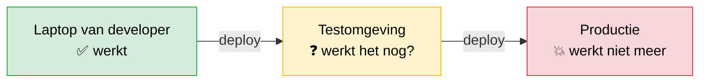
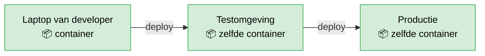
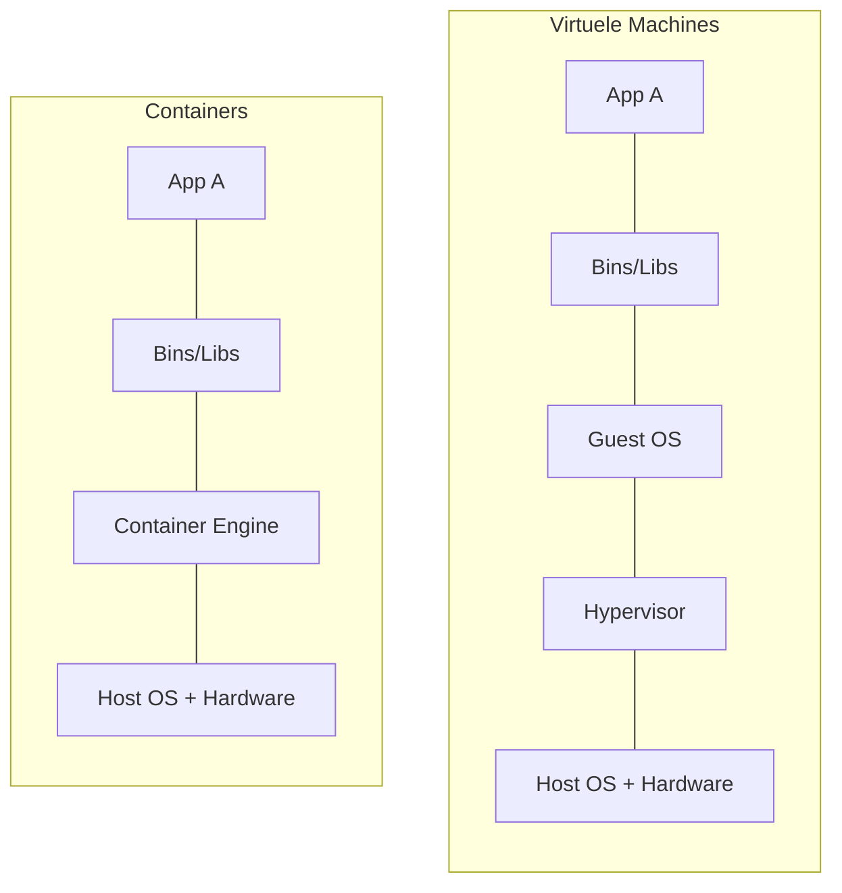
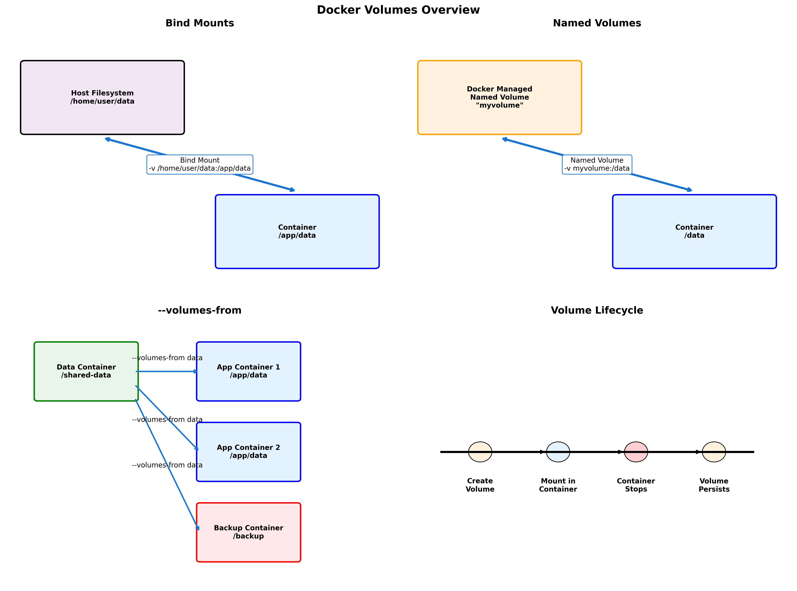
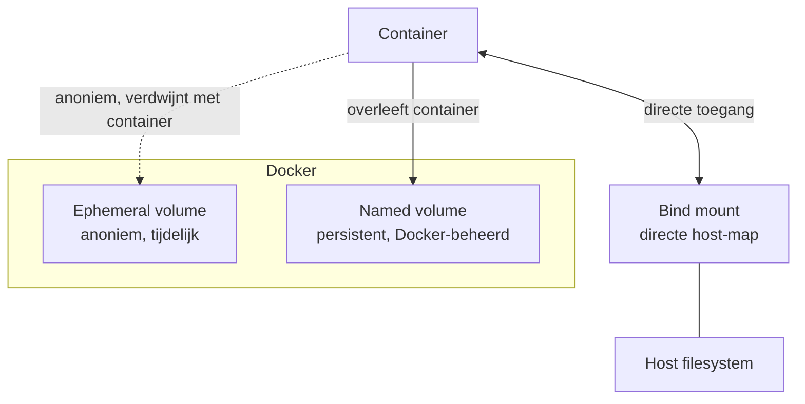
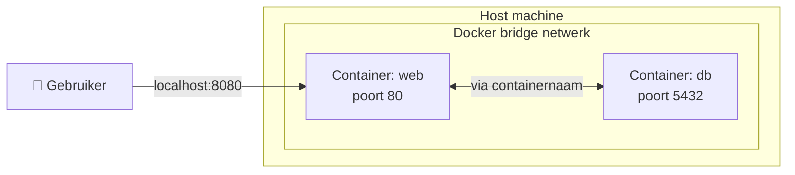
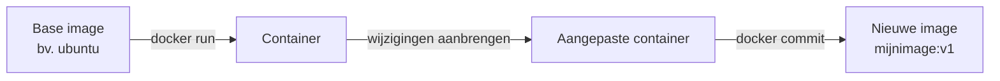
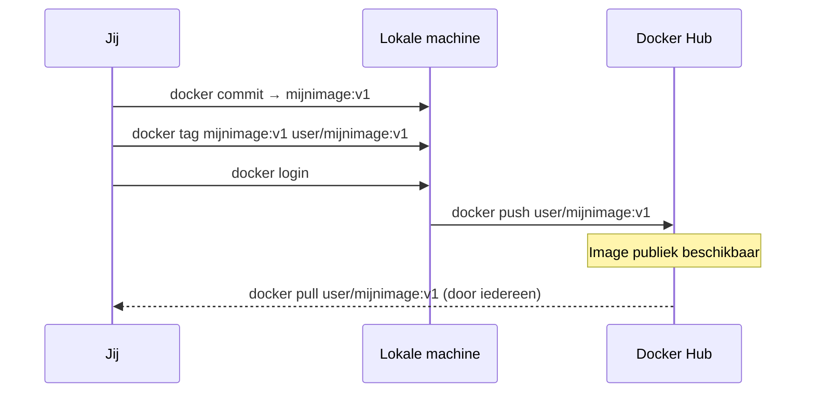
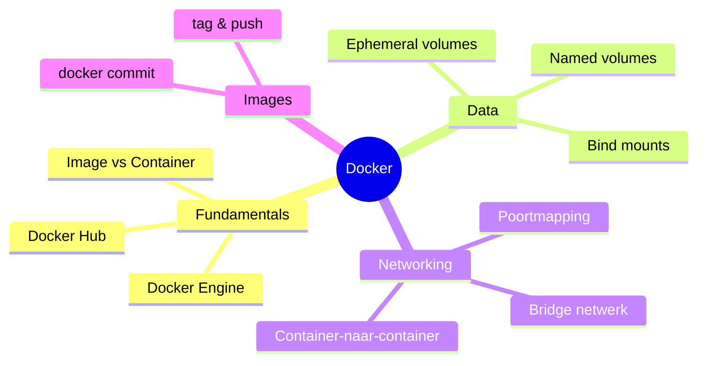

# Les 1 – Docker (DevOps)

## 📋 Inhoud

1. [Introductie & Motivatie](#1-introductie--motivatie)
2. [Docker Fundamentals](#2-docker-fundamentals)
3. [Basiscommando's en Opties](#3-basiscommandos-en-opties)
4. [Data en Volumes](#4-data-en-volumes)
5. [Networking en Poorten](#5-networking-en-poorten)
6. [Eigen Images met `docker commit`](#6-eigen-images-met-docker-commit)
7. [Publiceren naar Docker Hub](#7-publiceren-naar-docker-hub)
8. [Practica (Labs)](#8-practica-labs)
9. [Samenvatting & Cheatsheet](#9-samenvatting--cheatsheet)
10. [Extra Tips en Best Practices](#10-extra-tips-en-best-practices)

---

## 1. Introductie & Motivatie

**DevOps** = samenwerking tussen development en operations, met als doel snellere en betrouwbaardere releases. **Containerisatie met Docker** is een van de belangrijkste hulpmiddelen daarvoor.

> [!NOTE]
> **Het probleem:** *"It works on my machine!"* — een applicatie draait lokaal perfect, maar faalt in test of productie door verschillen in OS, libraries of configuratie.


```mermaid
graph LR
    A[Laptop van developer<br/>✅ werkt] -->|deploy| B[Testomgeving<br/>❓ werkt het nog?]
    B -->|deploy| C[Productie<br/>💥 werkt niet meer]
    style A fill:#d4edda,stroke:#28a745,color:#000
    style B fill:#fff3cd,stroke:#ffc107,color:#000
    style C fill:#f8d7da,stroke:#dc3545,color:#000
```

**De oplossing:** containers bundelen een applicatie met al haar afhankelijkheden in één uniforme, reproduceerbare eenheid — ze werken overal hetzelfde, ongeacht de onderliggende infrastructuur.


```mermaid
graph LR
    A[Laptop van developer<br/>📦 container] -->|deploy| B[Testomgeving<br/>📦 zelfde container]
    B -->|deploy| C[Productie<br/>📦 zelfde container]
    style A fill:#d4edda,stroke:#28a745,color:#000
    style B fill:#d4edda,stroke:#28a745,color:#000
    style C fill:#d4edda,stroke:#28a745,color:#000
```

---

## 2. Docker Fundamentals

| Begrip | Betekenis |
|---|---|
| **Docker** | Platform voor containerisatie |
| **Image** | Het blueprint/sjabloon waaruit containers gestart worden |
| **Container** | Een draaiende instantie van een image: code + afhankelijkheden + runtime |
| **Docker Engine** | De runtime die containers uitvoert en beheert |
| **Docker Hub** | Centrale registry om images te delen |

### Containers vs Virtuele Machines


```mermaid
graph TB
    subgraph VM["Virtuele Machines"]
        direction TB
        VM1[App A] --- VM2[Bins/Libs]
        VM2 --- VM3[Guest OS]
        VM3 --- VM4[Hypervisor]
        VM4 --- VM5[Host OS + Hardware]
    end
    subgraph CT["Containers"]
        direction TB
        C1[App A] --- C2[Bins/Libs]
        C2 --- C3[Container Engine]
        C3 --- C4[Host OS + Hardware]
    end
```

| | Containers | Virtuele Machines |
|---|---|---|
| **Kernel** | Gedeeld met de host | Elk hun eigen (guest OS) |
| **Grootte** | Lichtgewicht (MB's) | Groot (GB's) |
| **Opstarttijd** | Seconden | Minuten |
| **Isolatie** | Proces-niveau | Volledige hardware-emulatie |
| **Overhead** | Laag | Hoog |

> [!TIP]
> **Onthoud het zo:** containers = lichtgewicht, snel, portable. VM's = zwaarder, trager, maar sterker geïsoleerd.

---

## 3. Basiscommando's en Opties

### `docker run` — opties

| Optie | Betekenis |
|---|---|
| `-it` | Interactive terminal (bruikbaar bij bash) |
| `--rm` | Verwijder container automatisch zodra hij stopt |
| `--name mycontainer` | Geef de container een duidelijke naam |
| `-d` | Run in **detached mode** (achtergrond) |
| `-p 8080:80` | Map poort **8080 van host** naar **80 in container** |
| `-v /host:/container` | Volume (host ↔ container) |

```bash
# Tijdelijke Ubuntu container, automatisch verwijderd na gebruik
docker run -it --rm ubuntu bash

# Container met vaste naam
docker run -it --name mijncontainer ubuntu bash
```

### Detached mode en attach

| Actie | Commando |
|---|---|
| Detach van een draaiende container | `Ctrl+P` `Ctrl+Q` |
| Terug attachen | `docker attach <container>` |

> [!WARNING]
> Als je een shell verlaat met `exit` of `Ctrl+D` **stopt de container** — dat is geen detach, maar een shutdown.

### Containers beheren

```bash
docker ps                    # actieve containers
docker ps -a                 # alle containers (ook gestopt)
docker stop <id|naam>        # stop container
docker rm <id|naam>          # verwijder container
docker inspect <id|naam>     # volledige JSON-details (IP, mounts, netwerk, ...)
```

> [!TIP]
> Je hoeft nooit de volledige container-ID te typen — een uniek stukje ervan (bv. `abc123`) volstaat. Heb je `--name` gebruikt, dan werkt die naam net zo goed.

---

## 4. Data en Volumes

Bestanden in een container bestaan enkel zolang de container leeft — een nieuwe container start altijd van een schone lei.




```mermaid
graph TB
    H[Host filesystem]
    subgraph Docker
        E[Ephemeral volume<br/>anoniem, tijdelijk]
        N[Named volume<br/>persistent, Docker-beheerd]
    end
    B[Bind mount<br/>directe host-map]
    C1[Container]

    C1 -.anoniem, verdwijnt met container.-> E
    C1 -->|overleeft container| N
    C1 <-->|directe toegang| B
    B --- H
```

| Type | Persistent? | Wanneer gebruiken? |
|---|---|---|
| **Ephemeral (anoniem)** | ❌ verdwijnt met de container | Zelden — meestal per ongeluk |
| **Named volume** | ✅ overleeft `docker rm` | Productiedata (Docker-beheerd, portable) |
| **Bind mount** | ✅ (leeft op de host) | Development — live code sync |
| **Volumes-from** | Erft van een "donor"-container | Data delen tussen containers |

```bash
# Ephemeral volume
docker run -v /data ubuntu

# Named volume
docker volume create mijnvolume
docker run -v mijnvolume:/data ubuntu
docker volume ls
docker volume inspect mijnvolume

# Bind mount (links = host, rechts = container)
docker run -v /home/user/data:/app/data ubuntu
```

### `--volumes-from`: volumes delen tussen containers

Een "donor"-container definieert volumes; andere containers "erven" ze allemaal in één keer — handig voor data-only containers en backups. De donor hoeft niet te draaien om de volumes te delen.

```bash
# 1. Data-only container (bevat geen applicatie, enkel volumes)
docker create -v /shared-data --name datacontainer busybox

# 2. Andere containers hergebruiken de volumes van datacontainer
docker run -d --volumes-from datacontainer --name webapp nginx
docker run -d --volumes-from datacontainer --name database postgres

# 3. Backup van de gedeelde data
docker run --rm --volumes-from datacontainer \
  -v $(pwd):/backup busybox \
  tar czf /backup/backup.tar.gz /shared-data
```

> [!NOTE]
> **Best practice:** gebruik **named volumes** in de donor-container in plaats van anonieme volumes — anders verdwijnt de data zodra je `docker rm datacontainer` uitvoert, óók al hadden andere containers de volumes geërfd via `--volumes-from`.

#### Troubleshooting cheatsheet

| Probleem | Oorzaak | Oplossing |
|---|---|---|
| Volume niet zichtbaar in container | Verkeerd pad of volume niet aangemaakt | `docker inspect <container>` → check `Mounts`; `docker volume ls` |
| Data verdwenen na `docker rm` op de donor | Anonieme volumes i.p.v. named volumes gebruikt | Gebruik `docker volume create` + `-v naam:/pad` in de donor |
| Permission denied bij gedeeld volume | Verschillende user-ID's tussen containers | Draai beide containers met hetzelfde `--user uid:gid` |
| Conflicterende volumes bij meerdere `--volumes-from` | Twee donors met hetzelfde pad | De laatste `--volumes-from` wint — gebruik unieke paden |
| Trage opstart met veel `--volumes-from` | Te veel losse donor-containers | Consolideer volumes in één donor-container |

### Volume lifecycle & best practices

| Bij `docker rm` van de container | Wat gebeurt er? |
|---|---|
| Bind mount | Data blijft (staat op de host) |
| Ephemeral volume | Data verdwijnt |
| Named volume | Data blijft, tenzij `docker volume rm` |
| Volumes-from | Blijft zolang minstens één container ernaar verwijst |

> [!TIP]
> **Vuistregel:** named volumes voor productie, bind mounts voor development, en `docker volume prune` om ongebruikte volumes op te ruimen.

---

## 5. Networking en Poorten

Containers draaien standaard in een **bridge netwerk** en kunnen elkaar bereiken via hun containernaam.


```mermaid
graph LR
    subgraph Host["Host machine"]
        subgraph Bridge["Docker bridge netwerk"]
            C1[Container: web<br/>poort 80]
            C2[Container: db<br/>poort 5432]
            C1 <-->|via containernaam| C2
        end
    end
    U[👤 Gebruiker] -->|localhost:8080| C1
```

```bash
docker run -d -p 8080:80 nginx
# 8080 = hostpoort  → http://localhost:8080
# 80   = containerpoort waar nginx luistert
```

### Communicatie tussen containers

```bash
docker network create mijnnet
docker run -dit --name c1 --network mijnnet ubuntu
docker run -dit --name c2 --network mijnnet ubuntu
docker exec -it c1 ping c2
```

---

## 6. Eigen Images met `docker commit`


```mermaid
graph LR
    A[Base image<br/>bv. ubuntu] -->|docker run| B[Container]
    B -->|wijzigingen aanbrengen| C[Aangepaste container]
    C -->|docker commit| D[Nieuwe image<br/>mijnimage:v1]
```

```bash
# 1. Start een container en wijzig iets
docker run -it ubuntu bash
echo "Hallo Docker" > /hallo.txt
exit

# 2. Sla de wijziging op als nieuwe image
docker commit <container_id> mijnimage:v1

# 3. Controleer
docker images
docker run -it mijnimage:v1 bash
cat /hallo.txt
```

---

## 7. Publiceren naar Docker Hub


```mermaid
sequenceDiagram
    participant Jij
    participant Local as Lokale machine
    participant Hub as Docker Hub

    Jij->>Local: docker commit → mijnimage:v1
    Jij->>Local: docker tag mijnimage:v1 user/mijnimage:v1
    Jij->>Local: docker login
    Local->>Hub: docker push user/mijnimage:v1
    Note over Hub: Image publiek beschikbaar
    Hub-->>Jij: docker pull user/mijnimage:v1 (door iedereen)
```

```bash
docker login
docker tag mijnimage:v1 gebruikersnaam/mijnimage:v1
docker push gebruikersnaam/mijnimage:v1
```

Bekijk je image op [hub.docker.com](https://hub.docker.com).

| | Lokale images | Cloud images (Docker Hub) |
|---|---|---|
| **Opslag** | Eigen machine (`build`/`pull`/`commit`) | Publieke/gedeelde repository |
| **Toegang** | Enkel jij | Iedereen kan pullen |
| **Wijzigen** | Vrij | Enkel de eigenaar kan pushen |

---

## 8. Practica (Labs)

- [ ] Installeer Docker op je host of VM.
- [ ] Run 2 Ubuntu containers en ping elkaar.
- [ ] Run 2 containers en verstuur berichten via netcat (direct & via poort mapping).
- [ ] Maak een bestand in een container, gebruik `docker commit` en controleer of het bestand bewaard blijft.
- [ ] Run een container met een **volume** en schrijf data naar de host. Controleer na verwijderen van de container.
- [ ] Voeg een derde container toe als relay voor berichten (met netcat).
- [ ] Start een container en voeg een extra proces toe vanuit een andere terminal (bv. `top`).
- [ ] Zoek een image op Docker Hub en run deze lokaal.

Zie [oefeningen.md](oefeningen.md) voor de volledige, uitgewerkte labs.

---

## 9. Samenvatting & Cheatsheet


```mermaid
mindmap
  root((Docker))
    Fundamentals
      Image vs Container
      Docker Engine
      Docker Hub
    Data
      Ephemeral volumes
      Named volumes
      Bind mounts
    Networking
      Bridge netwerk
      Poortmapping
      Container-naar-container
    Images
      docker commit
      tag & push
```

| Commando | Doel |
|---|---|
| `docker run -it --rm --name x -d -p 8080:80 -v vol:/data image` | Container starten met de belangrijkste opties |
| `docker ps [-a]` | (Alle) containers tonen |
| `docker stop/rm <naam>` | Container stoppen/verwijderen |
| `docker volume create/ls/inspect` | Volumes beheren |
| `docker network create` | Eigen netwerk aanmaken |
| `docker commit <container> naam:tag` | Container → image |
| `docker login / tag / push` | Publiceren naar Docker Hub |

**Volgende les:** Dockerfile en Docker Compose.

---

## 10. Extra Tips en Best Practices

### Meer commando's

```bash
docker pull ubuntu:latest         # image ophalen
docker rmi <image_id>             # image verwijderen
docker logs [-f] <container_id>   # logs bekijken (real-time met -f)
docker exec -it <container> bash  # shell openen in lopende container
docker run -e MY_VAR=value ubuntu # environment variable meegeven
```

> [!IMPORTANT]
> **Best practices:**
> - Voer containers niet als root uit — gebruik `--user`.
> - Scan images op vulnerabilities (Trivy, Docker Scout).
> - Gebruik kleine base images (bv. Alpine) om images klein te houden.
> - Ruim regelmatig op: `docker container/image/volume prune`.

### In een DevOps-context

- **CI/CD**: consistente build-omgevingen via Docker.
- **Microservices**: elke service in zijn eigen container, geïsoleerd.
- **Scaling**: combineer met Kubernetes voor orchestratie (volgende lessen).
