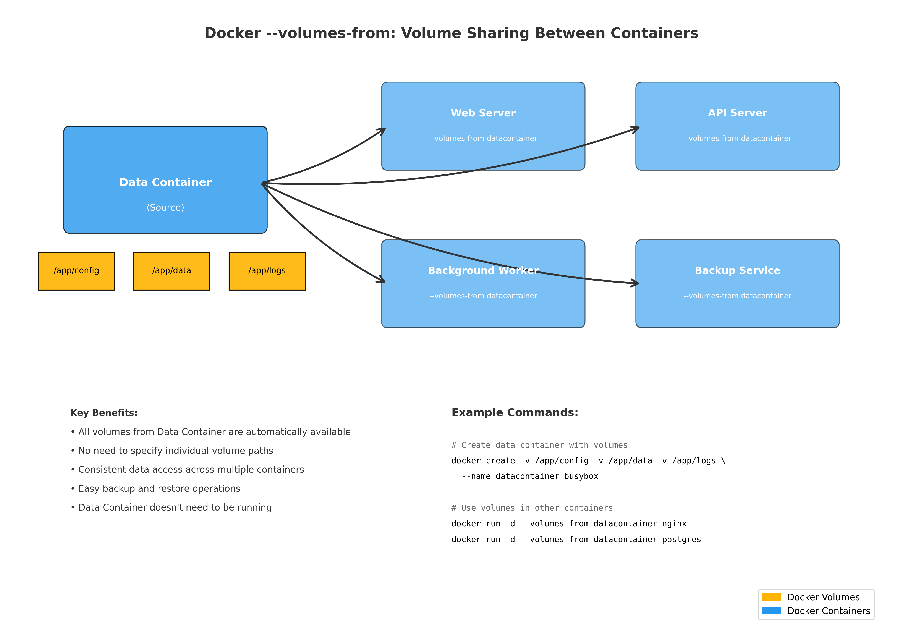

# Les 1 – Docker (DevOps) – Uitgebreide Cursus

## 1. Introductie & Motivatie

### DevOps en Docker
- DevOps = samenwerking tussen development en operations.  
- Doel: snellere en betrouwbaardere softwareontwikkeling en releases.  
- Containerisatie met Docker is een essentieel hulpmiddel in DevOps.  

### Probleemstelling
- Klassiek probleem: *“It works on my machine!”*  
- Applicaties draaien lokaal maar falen in test of productie.  
- Oorzaken: verschillen in OS, libraries, configuratie.  

### Oplossing
- Containers zorgen voor een uniforme, reproduceerbare omgeving.  
- Applicaties werken overal hetzelfde, ongeacht infrastructuur.  

---

## 2. Docker Fundamentals

### Wat is Docker?
- Docker is een platform voor **containerisatie**.  
- **Container**: standaard eenheid van software met code, afhankelijkheden en runtime.  
- **Image**: het blueprint (sjabloon) waaruit containers worden gestart.  
- **Docker Engine**: de runtime die containers uitvoert en beheert.  
- **Docker Hub**: centrale repository om images te delen.  

### Containers vs Virtuele Machines

**Containers**  
- Delen de kernel van het host-besturingssysteem.  
- Lichtgewicht, typisch enkele MB’s.  
- Starten in seconden.  
- Minder overhead.  

**Virtuele Machines (VM’s)**  
- Emuleren volledige hardware en besturingssysteem.  
- Groot (GB’s).  
- Trager op te starten.  
- Sterkere isolatie, maar hogere kost.  

**Samengevat**  
- Containers = lichtgewicht, snel, efficiënt en portable.  
- VM’s = zwaarder, trager, maar volledig geïsoleerd.  

---

## 3. Basiscommando’s en Opties

### `docker run` (container starten)
Belangrijkste opties:  
- `-it`: interactive terminal (gebruiksvriendelijk bij bash).  
- `--rm`: verwijder container automatisch zodra hij stopt.  
- `--name mycontainer`: geef container een duidelijke naam.  
- `-d`: run in **detached mode** (achtergrond).  
- `-p 8080:80`: map poort **8080 van host** naar **80 in container**.  
- `-v /host/path:/container/path`: volume (host ↔ container).  

### Voorbeelden
- Een tijdelijke Ubuntu container starten en direct verwijderen na gebruik:  
  ```bash
  docker run -it --rm ubuntu bash
  ```  
- Een container met vaste naam starten:  
  ```bash
  docker run -it --name mijncontainer ubuntu bash
  ```  

### Detached Mode en Attach
- **Detach van een container**: Wanneer je in een interactive container zit (bijv. na `docker run -it ubuntu bash`), druk **Ctrl+P+Q** om te detach. De container blijft draaien in de achtergrond zonder te stoppen.  
- **Attach terug aan een detached container**: Gebruik `docker attach <container_id>` om terug te keren naar de terminal van de container. Dit werkt alleen als de container nog draait.  
  Voorbeeld:  
  ```bash
  docker attach mijncontainer
  ```  
  Let op: Attach sluit de container af als je de shell verlaat met `exit` of Ctrl+D.  

### Containers beheren
- Lijst actieve containers:  
  ```bash
  docker ps
  ```  
- Lijst alle containers (ook gestopt):  
  ```bash
  docker ps -a
  ```  
- Stop container:  
  ```bash
  docker stop <id|naam>
  ```  
- Verwijder container:  
  ```bash
  docker rm <id|naam>
  ```  

### Container ID en Namen
- Docker kent elke container een unieke ID toe, maar je hoeft niet de volledige ID te gebruiken. Een deel van de ID is voldoende, zolang het uniek is binnen de actieve containers.
- Als je een container een naam hebt gegeven met de optie `--name`, kun je die naam gebruiken in plaats van de ID.
- Voorbeelden:
  - Stop een container met deel van ID:  
    ```bash
    docker stop abc123
    ```  
    (in plaats van de volledige ID zoals `abc123def456`)
  - Stop met naam:  
    ```bash
    docker stop mijncontainer
    ```  
  - Verwijder met deel van ID:  
    ```bash
    docker rm def456
    ```  

### Inspectie
- Gedetailleerde info over een container of image:  
  ```bash
  docker inspect <id|naam>
  ```  
  Toont JSON met: IP-adres, mounts, netwerkconfiguratie, gebruikte image, etc.  

---

## 4. Data en Volumes

### Data in containers
- Bestanden in containers bestaan zolang de container leeft.  
- Nieuwe container starten = schone slate (geen data van vorige container).  


### Types volumes

#### 1. **Ephemeral (anonieme) volumes**  
   - Worden aangemaakt zonder naam.  
   - Verdwijnen automatisch als de container verwijderd wordt.  
   - Voorbeeld:
     ```bash
     docker run -v /data ubuntu
     # Docker maakt automatisch een anoniem volume aan
     ```

#### 2. **Named volumes**  
   - Persistente opslag beheerd door Docker.  
   - Overleven het verwijderen van containers.
   - Voorbeeld:  
     ```bash
     docker volume create mijnvolume
     docker run -v mijnvolume:/data ubuntu
     
     # Bekijk alle volumes
     docker volume ls
     
     # Inspecteer een specifiek volume
     docker volume inspect mijnvolume
     ```  

#### 3. **Bind mounts**  
   - Mappen van de host koppelen aan container.  
   - Directe toegang tot host filesystem.
   - Voorbeeld:  
     ```bash
     docker run -v /home/user/data:/app/data ubuntu
     ```  
   - **Links van :** = host path, **rechts van :** = container path.  

#### 4. **Volumes-from containers**
   - Delen van volumes tussen containers via `--volumes-from`.
   - Zeer krachtig voor data containers en backup strategieën.




### --volumes-from in detail

Het `--volumes-from` mechanisme is een van de krachtigste features van Docker voor data management. Het laat je **alle volumes** van een container hergebruiken in een andere container. Dit verschilt fundamenteel van het mounten van individuele volumes.

**Hoe het werkt:**
- Een "donor" container definieert één of meerdere volumes
- Andere containers kunnen deze volumes "erven" met `--volumes-from`
- Alle volumes van de donor worden automatisch beschikbaar
- De donor container hoeft niet te draaien om volumes te delen

**Waarom --volumes-from gebruiken:**
- **Data containers**: Containers die alleen data bevatten (data-only containers)
- **Backup strategieën**: Eenvoudig backups maken van complexe volume setups
- **Shared storage**: Meerdere containers dezelfde data laten gebruiken
- **Microservices**: Gemeenschappelijke configuratie of data delen
- **Development**: Consistent data delen tussen development containers

#### Praktisch voorbeeld: Data container pattern

**Stap 1: Maak een data container**
```bash
# Data container met volumes (hoeft niet te draaien)
docker create -v /shared-data --name datacontainer busybox

# Of maak een draaiende data container
docker run -d -v /shared-data --name datacontainer busybox tail -f /dev/null
```

**Stap 2: Gebruik de volumes in andere containers**
```bash
# Web applicatie die de data gebruikt
docker run -d --volumes-from datacontainer --name webapp nginx

# Database die data deelt
docker run -d --volumes-from datacontainer --name database postgres

# Backup container
docker run --rm --volumes-from datacontainer \
  -v $(pwd):/backup busybox \
  tar czf /backup/backup.tar.gz /shared-data
```

#### Scenario 1: Database met gedeelde configuratie

**Het probleem:** Je hebt meerdere database containers die dezelfde configuratie en init scripts moeten delen.

```bash
# 1. Maak een configuratie container
docker create \
  -v /etc/mysql/conf.d \
  -v /docker-entrypoint-initdb.d \
  --name mysql-config \
  busybox

# 2. Voeg configuratie bestanden toe
docker run --rm \
  --volumes-from mysql-config \
  -v $(pwd)/mysql-config:/source \
  busybox sh -c "cp -r /source/* /etc/mysql/conf.d/"

docker run --rm \
  --volumes-from mysql-config \
  -v $(pwd)/init-scripts:/source \
  busybox sh -c "cp -r /source/* /docker-entrypoint-initdb.d/"

# 3. Start primary database
docker run -d \
  --volumes-from mysql-config \
  -v mysql-primary-data:/var/lib/mysql \
  --name mysql-primary \
  -e MYSQL_ROOT_PASSWORD=rootpass \
  mysql:8.0

# 4. Start replica database (zelfde configuratie!)
docker run -d \
  --volumes-from mysql-config \
  -v mysql-replica-data:/var/lib/mysql \
  --name mysql-replica \
  -e MYSQL_ROOT_PASSWORD=rootpass \
  mysql:8.0

# 5. Backup beide databases met dezelfde configuratie
docker run --rm \
  --volumes-from mysql-config \
  --volumes-from mysql-primary \
  -v $(pwd)/backups:/backup \
  mysql:8.0 \
  mysqldump --all-databases > /backup/primary-backup.sql
```

#### Scenario 2: Microservices met gedeelde assets

**Het probleem:** Meerdere microservices hebben toegang nodig tot dezelfde static assets (afbeeldingen, CSS, JS).

```bash
# 1. Assets container
docker create \
  -v /app/static \
  -v /app/uploads \
  -v /app/cache \
  --name assets-container \
  busybox

# 2. Upload assets (bijvoorbeeld via build pipeline)
docker run --rm \
  --volumes-from assets-container \
  -v $(pwd)/frontend/dist:/source \
  busybox sh -c "cp -r /source/* /app/static/"

# 3. Frontend service
docker run -d \
  --volumes-from assets-container \
  --name frontend \
  -p 3000:3000 \
  node:alpine sh -c "
    npm install -g http-server && 
    http-server /app/static -p 3000
  "

# 4. API service (heeft toegang tot uploads)
docker run -d \
  --volumes-from assets-container \
  --name api \
  -p 4000:4000 \
  my-api-image

# 5. CDN/Cache service
docker run -d \
  --volumes-from assets-container \
  --name cdn \
  -p 8080:80 \
  nginx
```

#### Scenario 3: Development environment met hot reloading

**Het probleem:** Development team wil code wijzigingen direct zien zonder rebuilds.

```bash
# 1. Source code container
docker create \
  -v /app/src \
  -v /app/node_modules \
  -v /app/logs \
  --name dev-workspace \
  busybox

# 2. Mount lokale source code
docker run --rm \
  --volumes-from dev-workspace \
  -v $(pwd)/src:/source \
  busybox sh -c "cp -r /source/* /app/src/"

# 3. Development server met hot reloading
docker run -d \
  --volumes-from dev-workspace \
  --name dev-server \
  -p 3000:3000 \
  node:alpine sh -c "
    cd /app/src && 
    npm install && 
    npm run dev
  "

# 4. Test runner (parallel)
docker run -d \
  --volumes-from dev-workspace \
  --name test-runner \
  node:alpine sh -c "
    cd /app/src && 
    npm install && 
    npm run test:watch
  "

# 5. File watcher voor automatic code sync
docker run -d \
  --volumes-from dev-workspace \
  -v $(pwd)/src:/host-src \
  --name file-sync \
  alpine sh -c "
    apk add inotify-tools && 
    while inotifywait -r -e modify,create,delete /host-src; do
      cp -r /host-src/* /app/src/
    done
  "

# 6. Log aggregator
docker run -d \
  --volumes-from dev-workspace \
  --name log-viewer \
  -p 9999:8080 \
  alpine sh -c "
    apk add python3 && 
    python3 -m http.server 8080 --directory /app/logs
  "
```

#### Scenario 4: Backup en Disaster Recovery

**Het probleem:** Je hebt een complexe applicatie met meerdere data volumes die consistent gebackupt moeten worden.

```bash
# 1. Productie application setup
docker create \
  -v /app/database \
  -v /app/uploads \
  -v /app/config \
  -v /app/logs \
  --name production-data \
  busybox

# Productie containers
docker run -d \
  --volumes-from production-data \
  --name webapp \
  my-webapp:prod

docker run -d \
  --volumes-from production-data \
  --name database \
  postgres:13

# 2. Automated backup system
docker run -d \
  --volumes-from production-data \
  -v /backup-storage:/backups \
  --name backup-service \
  alpine sh -c "
    while true; do
      DATE=\$(date +%Y%m%d-%H%M%S)
      echo 'Starting backup at \$DATE'
      
      # Database dump
      pg_dump -h database -U postgres dbname > /backups/db-\$DATE.sql
      
      # Files backup
      tar czf /backups/files-\$DATE.tar.gz /app/uploads /app/config
      
      # Keep only last 7 days
      find /backups -type f -mtime +7 -delete
      
      echo 'Backup completed at \$DATE'
      sleep 3600  # Every hour
    done
  "

# 3. Disaster recovery test
docker create \
  -v /app/database \
  -v /app/uploads \
  -v /app/config \
  -v /app/logs \
  --name recovery-test \
  busybox

# Restore latest backup
docker run --rm \
  --volumes-from recovery-test \
  -v /backup-storage:/backups \
  alpine sh -c "
    LATEST_DB=\$(ls -t /backups/db-*.sql | head -1)
    LATEST_FILES=\$(ls -t /backups/files-*.tar.gz | head -1)
    
    # Restore database
    cat \$LATEST_DB | psql -h recovery-database -U postgres dbname
    
    # Restore files
    tar xzf \$LATEST_FILES -C /
  "
```

#### Scenario 5: CI/CD Pipeline met shared cache

**Het probleem:** Build pipeline moet dependency cache delen tussen builds voor snelheid.

```bash
# 1. Shared cache container
docker create \
  -v /cache/npm \
  -v /cache/maven \
  -v /cache/docker \
  -v /build-artifacts \
  --name build-cache \
  busybox

# 2. NPM build stage
docker run --rm \
  --volumes-from build-cache \
  -v $(pwd):/source \
  node:alpine sh -c "
    cd /source
    npm config set cache /cache/npm
    npm install
    npm run build
    cp -r dist/* /build-artifacts/
  "

# 3. Java build stage (parallel mogelijk)
docker run --rm \
  --volumes-from build-cache \
  -v $(pwd)/api:/source \
  maven:alpine sh -c "
    cd /source
    mvn -Dmaven.repo.local=/cache/maven package
    cp target/*.jar /build-artifacts/
  "

# 4. Docker build stage
docker run --rm \
  --volumes-from build-cache \
  -v /var/run/docker.sock:/var/run/docker.sock \
  -v $(pwd):/source \
  docker:alpine sh -c "
    cd /source
    docker build --cache-from /cache/docker -t myapp:latest .
    docker save myapp:latest > /build-artifacts/myapp.tar
  "

# 5. Test stage
docker run --rm \
  --volumes-from build-cache \
  -v $(pwd):/source \
  alpine sh -c "
    cd /source
    # Run tests using artifacts from /build-artifacts/
    ./run-integration-tests.sh /build-artifacts/
  "
```

#### Advanced Pattern: Multi-tier application met --volumes-from

**Het scenario:** Een complete 3-tier applicatie waarbij elke tier zijn eigen data volumes heeft, maar bepaalde volumes gedeeld worden.

```bash
# 1. Shared configuration container
docker create \
  -v /shared/config \
  -v /shared/secrets \
  -v /shared/logs \
  --name app-shared \
  busybox

# 2. Database tier containers
docker create \
  -v /data/postgres \
  -v /data/redis \
  --name db-data \
  busybox

# 3. Application tier containers  
docker create \
  -v /app/uploads \
  -v /app/sessions \
  -v /app/cache \
  --name app-data \
  busybox

# 4. Frontend tier containers
docker create \
  -v /web/static \
  -v /web/templates \
  --name web-data \
  busybox

# 5. Start PostgreSQL (gebruikt eigen + shared volumes)
docker run -d \
  --volumes-from db-data \
  --volumes-from app-shared \
  --name postgres \
  -e POSTGRES_DB=myapp \
  postgres:13

# 6. Start Redis (gebruikt eigen + shared volumes) 
docker run -d \
  --volumes-from db-data \
  --volumes-from app-shared \
  --name redis \
  redis:alpine

# 7. Start API server (gebruikt app + shared volumes)
docker run -d \
  --volumes-from app-data \
  --volumes-from app-shared \
  --name api \
  -p 3000:3000 \
  my-api-image

# 8. Start background workers (zelfde volumes als API)
docker run -d \
  --volumes-from app-data \
  --volumes-from app-shared \
  --name worker \
  my-worker-image

# 9. Start web server (gebruikt web + app volumes voor uploads)
docker run -d \
  --volumes-from web-data \
  --volumes-from app-data \
  --volumes-from app-shared \
  --name nginx \
  -p 80:80 \
  nginx

# 10. Monitoring container (alleen shared logs)
docker run -d \
  --volumes-from app-shared \
  --name monitoring \
  -p 9090:9090 \
  prom/prometheus

# 11. Backup container (toegang tot ALLE data)
docker run -d \
  --volumes-from db-data \
  --volumes-from app-data \
  --volumes-from web-data \
  --volumes-from app-shared \
  -v $(pwd)/backups:/backup \
  --name backup \
  alpine sh -c "
    while true; do
      DATE=\$(date +%Y%m%d-%H%M%S)
      
      # Complete application backup
      tar czf /backup/complete-\$DATE.tar.gz \
        /data /app /web /shared
      
      # Cleanup old backups (keep 30 days)
      find /backup -name '*.tar.gz' -mtime +30 -delete
      
      sleep 86400  # Daily backup
    done
  "
```

#### Volume inheritance en dependency management

**Het probleem:** Complexe dependency chains waarbij containers afhankelijk zijn van meerdere volume providers.

```bash
# 1. Base infrastructure container
docker create \
  -v /infra/certificates \
  -v /infra/keys \
  -v /infra/monitoring \
  --name infra-base \
  busybox

# 2. Application base container (erft van infra)
docker run -d \
  --volumes-from infra-base \
  -v /app/config \
  -v /app/data \
  --name app-base \
  busybox tail -f /dev/null

# 3. Service A (erft van beide)
docker run -d \
  --volumes-from infra-base \
  --volumes-from app-base \
  -v /service-a/specific \
  --name service-a \
  my-service-a:latest

# 4. Service B (erft van beide)
docker run -d \
  --volumes-from infra-base \
  --volumes-from app-base \
  -v /service-b/specific \
  --name service-b \
  my-service-b:latest

# 5. Gateway service (erft van alle drie!)
docker run -d \
  --volumes-from infra-base \
  --volumes-from app-base \
  --volumes-from service-a \
  --volumes-from service-b \
  --name gateway \
  -p 80:80 \
  nginx

# Check volume inheritance
docker inspect gateway | jq '.[0].Mounts'
# Toont alle geërfde volumes van alle --volumes-from containers
```

#### Dynamic volume sharing met labels

**Het probleem:** Je wilt containers automatisch volumes laten delen gebaseerd op labels.

```bash
# 1. Maak containers met labels
docker create \
  -v /shared/team-a \
  --label team=a \
  --label environment=production \
  --name team-a-data \
  busybox

docker create \
  -v /shared/team-b \
  --label team=b \
  --label environment=production \
  --name team-b-data \
  busybox

# 2. Script om containers automatisch te connecteren op basis van labels
cat > connect-volumes.sh << 'EOF'
#!/bin/bash

TEAM=$1
ENVIRONMENT=$2

# Find all data containers for team/environment
DATA_CONTAINERS=$(docker ps -a \
  --filter "label=team=$TEAM" \
  --filter "label=environment=$ENVIRONMENT" \
  --format "{{.Names}}")

VOLUMES_FROM_ARGS=""
for container in $DATA_CONTAINERS; do
  VOLUMES_FROM_ARGS="$VOLUMES_FROM_ARGS --volumes-from $container"
done

echo "Starting application with volumes from: $DATA_CONTAINERS"

# Start application with all matching volumes
docker run -d $VOLUMES_FROM_ARGS \
  --name app-$TEAM-$ENVIRONMENT \
  my-application:latest
EOF

chmod +x connect-volumes.sh

# 3. Gebruik het script
./connect-volumes.sh a production
./connect-volumes.sh b production
```

#### Hands-on oefening: Volume sharing

**Scenario**: Maak een shared volume systeem voor een blog applicatie.

```bash
# Stap 1: Data container voor content
docker run -d -v /blog/content -v /blog/uploads \
  --name blogdata \
  busybox tail -f /dev/null

# Stap 2: Voeg wat content toe
docker exec blogdata sh -c "
  echo 'Welkom op mijn blog!' > /blog/content/index.html
  echo 'Dit is mijn eerste post' > /blog/content/post1.html
  mkdir -p /blog/uploads
"

# Stap 3: Web server
docker run -d --volumes-from blogdata \
  --name blogweb \
  -p 8080:80 \
  nginx

# Stap 4: Content management systeem
docker run -it --volumes-from blogdata \
  --name cms \
  alpine sh

# In de CMS container kun je nu bestanden bewerken:
# echo 'Nieuwe content!' > /blog/content/nieuws.html
# ls -la /blog/content/

# Stap 5: Backup maken
docker run --rm --volumes-from blogdata \
  -v $(pwd):/backup \
  busybox \
  tar czf /backup/blog-backup.tar.gz /blog

# Stap 6: Restore testen
docker run --rm \
  -v $(pwd):/backup \
  -v /tmp/restore:/restore \
  busybox \
  tar xzf /backup/blog-backup.tar.gz -C /restore
```

#### Volume troubleshooting met --volumes-from

**Veelvoorkomende problemen en oplossingen:**

**1. Volume niet zichtbaar in container**
```bash
# Check volume mounts
docker inspect containername | grep -A 10 '"Mounts"'

# Verify volume exists
docker volume ls
docker volume inspect volumename

# Check source container volumes
docker inspect source-container | jq '.[0].Config.Volumes'

# Test volume access
docker exec target-container ls -la /expected/path
```

**2. Volumes-from werkt niet tussen containers**
```bash
# Check if source container exists and has volumes
docker ps -a --filter "name=source-container"
docker inspect source-container | jq '.[0].Config.Volumes'

# Verify target container can see volumes
docker exec target-container mount | grep volume

# Check if source container is stopped vs removed
docker ps -a --filter "name=source-container" --format "table {{.Names}}\t{{.Status}}"

# Even stopped containers can share volumes!
docker run --rm --volumes-from stopped-container alpine ls -la /shared
```

**3. Permission problemen bij --volumes-from**
```bash
# Check ownership in both containers
docker exec source-container ls -la /shared/path
docker exec target-container ls -la /shared/path

# Problem: Different user IDs
# Solution 1: Fix in target container
docker exec -u root target-container chown -R 1000:1000 /shared/path

# Solution 2: Run target container with correct user
docker run --volumes-from source-container -u 1000:1000 target-image

# Solution 3: Use same base image/user for consistency
docker run --volumes-from source-container --user $(id -u):$(id -g) target-image
```

**4. Data verdwenen na source container verwijdering**
```bash
# Problem: Source container was removed with docker rm
# Solution: Use named volumes in source container instead

# Bad practice:
docker create -v /data --name datacontainer busybox
docker rm datacontainer  # Volumes gone!

# Good practice:
docker volume create mydata
docker create -v mydata:/data --name datacontainer busybox
docker rm datacontainer  # Named volume survives!

# Recovery: Check if data is in anonymous volumes
docker volume ls -f dangling=true
docker volume inspect <volume-id>
```

**5. Conflicting volumes tussen meerdere --volumes-from**
```bash
# Problem: Multiple containers with same volume paths
docker create -v /app/config --name config1 busybox
docker create -v /app/config --name config2 busybox

# Result: Last one wins
docker run --volumes-from config1 --volumes-from config2 alpine ls /app
# Only sees config2's volume

# Solution: Use different paths
docker create -v /app/config/service1 --name config1 busybox
docker create -v /app/config/service2 --name config2 busybox

# Or use symbolic links
docker run --volumes-from config1 --name app alpine sh -c "
  ln -s /app/config /etc/service1-config
"
```

**6. Debugging volume inheritance chain**
```bash
# Complex scenario: Container A -> Container B -> Container C
docker create -v /level1 --name container-a busybox
docker run -d --volumes-from container-a -v /level2 --name container-b busybox tail -f /dev/null
docker run -d --volumes-from container-b -v /level3 --name container-c busybox tail -f /dev/null

# Check what volumes container-c actually has
docker inspect container-c | jq '.[0].Mounts[] | {Source, Destination, Type}'

# Trace the inheritance
echo "=== Container A volumes ==="
docker inspect container-a | jq '.[0].Config.Volumes'

echo "=== Container B volumes (inherited + own) ==="
docker inspect container-b | jq '.[0].Mounts[] | {Source, Destination}'

echo "=== Container C volumes (full inheritance) ==="
docker inspect container-c | jq '.[0].Mounts[] | {Source, Destination}'
```

**7. Performance problems met veel --volumes-from**
```bash
# Problem: Too many volume mounts slow down container startup
docker run \
  --volumes-from data1 \
  --volumes-from data2 \
  --volumes-from data3 \
  --volumes-from data4 \
  --volumes-from data5 \
  alpine echo "This can be slow!"

# Solution 1: Consolidate volumes in fewer containers
docker create -v /data1 -v /data2 -v /data3 --name consolidated busybox
docker run --volumes-from consolidated alpine echo "Faster!"

# Solution 2: Use bind mounts for frequently accessed data
docker run -v /host/fast-data:/data alpine echo "Direct host access"

# Benchmark volume access speed
time docker run --rm \
  --volumes-from many-volumes \
  alpine sh -c "find /volumes -type f | wc -l"
```

**8. Volume cleanup bij --volumes-from setup**
```bash
# Problem: Orphaned volumes when containers are removed improperly

# Check for orphaned volumes
docker volume ls -f dangling=true

# Clean up specific volume chain
CONTAINERS="datacontainer webapp database backup"
for container in $CONTAINERS; do
  echo "Stopping $container..."
  docker stop $container 2>/dev/null || true
  echo "Removing $container..."
  docker rm $container 2>/dev/null || true
done

# Clean up named volumes (BE CAREFUL!)
docker volume ls --format "table {{.Name}}\t{{.Driver}}\t{{.Scope}}"
echo "Do you want to remove these volumes? [y/N]"
read answer
if [ "$answer" = "y" ]; then
  docker volume prune -f
fi

# Safe cleanup script
cat > cleanup-volumes.sh << 'EOF'
#!/bin/bash
set -e

echo "=== Volume cleanup analysis ==="

# Find containers using volumes
echo "Containers with volumes:"
docker ps -a --format "table {{.Names}}\t{{.Mounts}}"

# Find unused volumes
echo -e "\nUnused volumes:"
docker volume ls -f dangling=true

# Find volumes by container
echo -e "\nVolumes by container:"
for container in $(docker ps -a --format "{{.Names}}"); do
  echo "Container: $container"
  docker inspect $container | jq -r '.[0].Mounts[]? | "  \(.Source) -> \(.Destination)"'
done

echo -e "\n=== Cleanup recommendations ==="
echo "1. Review unused volumes above"
echo "2. Stop containers: docker stop \$(docker ps -q)"
echo "3. Remove containers: docker rm \$(docker ps -aq)"
echo "4. Remove volumes: docker volume prune"
EOF

chmod +x cleanup-volumes.sh
./cleanup-volumes.sh
```

### Belangrijke aandachtspunten

#### Volume lifecycle
- Bij verwijderen container:  
  - Data in bind mounts blijft bestaan (want op host).  
  - Ephemeral volumes verdwijnen.  
  - Named volumes blijven bestaan tenzij expliciet verwijderd (`docker volume rm`).
  - Volumes-from containers houden hun volumes tot alle references weg zijn.

#### Performance overwegingen
- **Bind mounts**: Snelste performance, direct host access
- **Named volumes**: Geoptimaliseerd door Docker, portable
- **tmpfs mounts**: Geheugen storage, verliest data bij restart
  ```bash
  docker run --tmpfs /app/temp image  # Tijdelijke snelle storage
  ```

#### Security overwegingen
- Bij bind mounts kunnen **conflicten** ontstaan:  
  - Bestanden op host overschrijven bestanden in container.  
  - Container ziet altijd de versie van de host.
- Container processen kunnen host bestanden wijzigen via bind mounts
- Gebruik named volumes voor productie (beter geïsoleerd)

#### Best practices
1. **Gebruik named volumes** voor productie data
2. **Bind mounts** alleen voor development
3. **Data containers** voor shared volumes tussen services
4. **Regular backups** van kritieke volumes
5. **Volume labels** voor documentatie:
   ```bash
   docker volume create --label purpose=database --label env=production dbvolume
   ```

### Praktische volume commando's

**Volume management:**
```bash
# Alle volumes tonen
docker volume ls

# Volume details
docker volume inspect volumename

# Volume aanmaken met opties
docker volume create --driver local \
  --opt type=nfs \
  --opt o=addr=192.168.1.100,rw \
  --opt device=:/path/to/dir \
  nfsvolume

# Container volumes inspecteren
docker inspect container | jq '.[].Mounts'

# Disk usage van volumes
docker system df -v
```

**Backup en restore workflows:**
```bash
# Backup script
#!/bin/bash
CONTAINER_NAME=$1
VOLUME_NAME=$2
BACKUP_NAME="backup-$(date +%Y%m%d-%H%M%S).tar.gz"

docker run --rm \
  --volumes-from $CONTAINER_NAME \
  -v $(pwd):/backup \
  busybox \
  tar czf /backup/$BACKUP_NAME /data

echo "Backup created: $BACKUP_NAME"

# Restore script
#!/bin/bash
BACKUP_FILE=$1
NEW_CONTAINER=$2

docker run --rm \
  -v $NEW_CONTAINER-data:/data \
  -v $(pwd):/backup \
  busybox \
  tar xzf /backup/$BACKUP_FILE -C /
```  

---

## 5. Networking en Poorten

### Standaard netwerk
- Containers draaien standaard in een **bridge netwerk**.  
- Containers binnen dit netwerk kunnen elkaar bereiken via container name.  

### Poorten mappen
- `-p hostpoort:containerpoort`  
- Links: poortnummer van **host**.  
- Rechts: poortnummer binnen de **container**.  

**Voorbeeld:**  
```bash
docker run -d -p 8080:80 nginx
```
- `8080` = hostpoort → toegankelijk via `http://localhost:8080`.  
- `80` = containerpoort waar nginx luistert.  

### Communicatie tussen containers
- Containers kunnen elkaar pingen binnen hetzelfde netwerk.  
- Voorbeeld:  
  ```bash
  docker network create mijnnet
  docker run -dit --name c1 --network mijnnet ubuntu
  docker run -dit --name c2 --network mijnnet ubuntu
  docker exec -it c1 ping c2
  ```  

### Demo met netcat
- Container 1 luistert op poort 1234:  
  ```bash
  docker run -it --rm --name server ubuntu bash
  apt update && apt install -y netcat
  nc -lp 1234
  ```  
- Container 2 stuurt bericht:  
  ```bash
  docker run -it --rm --network container:server ubuntu bash
  apt update && apt install -y netcat
  echo "Hallo van c2" | nc localhost 1234
  ```  

---

## 6. Eigen Images met `docker commit`

### Container aanpassen en opslaan
- Start een container en maak wijzigingen, bv. een bestand toevoegen:  
  ```bash
  docker run -it ubuntu bash
  echo "Hallo Docker" > /hallo.txt
  exit
  ```

### Nieuwe image maken via commit
- Sla de gewijzigde container op als nieuwe image:  
  ```bash
  docker commit <container_id> mijnimage:v1
  ```

### Controleren
- Lijst images bekijken:  
  ```bash
  docker images
  ```  
- Nieuwe container starten van de image:  
  ```bash
  docker run -it mijnimage:v1 bash
  cat /hallo.txt
  ```

---

## 7. Publiceren naar Docker Hub

### Aanmelden
```bash
docker login
```

### Image taggen
```bash
docker tag mijnimage:v1 gebruikersnaam/mijnimage:v1
```

### Pushen naar Docker Hub
```bash
docker push gebruikersnaam/mijnimage:v1
```

### Controleren
- Bekijk je image op [https://hub.docker.com](https://hub.docker.com).

### Volledige Flow voor Publiceren
1. **Start met een base image**: Pull een bestaande image, bv. `docker pull ubuntu`.
2. **Run en wijzig container**: Start een container, maak aanpassingen (zie sectie 6 over `docker commit`).
3. **Commit de wijzigingen**: Sla de aangepaste container op als nieuwe image: `docker commit <container_id> mijnimage:v1`.
4. **Tag de image**: Geef de image een tag voor Docker Hub: `docker tag mijnimage:v1 gebruikersnaam/mijnimage:v1`.
5. **Login en push**: Meld aan met `docker login`, push met `docker push gebruikersnaam/mijnimage:v1`.
6. **Verifiëren**: Anderen kunnen nu `docker pull gebruikersnaam/mijnimage:v1` gebruiken.

### Verschil Lokale vs Cloud Images
- **Lokale images**: Opgeslagen op je eigen machine na `docker build`, `docker pull` of `docker commit`. Alleen jij hebt toegang, tenzij je ze deelt.
- **Cloud images op Docker Hub**: Gedeelde images in de publieke repository. Iedereen kan ze pullen, maar alleen de eigenaar kan pushen/updaten. Gebruik voor distributie van aangepaste images naar teams of publiek.  

---

## 8. Practica (Labs)

1. Installeer Docker op je host of VM.  
2. Run 2 Ubuntu containers en ping elkaar.  
3. Run 2 containers en verstuur berichten via netcat (direct & via poort mapping).  
4. Maak een bestand in een container, gebruik `docker commit` en controleer of het bestand bewaard blijft.  
5. Run een container met een **volume** en schrijf data naar de host. Controleer na verwijderen van de container.  
6. Voeg een derde container toe als relay voor berichten (met netcat).  
7. Start een container en voeg een extra proces toe vanuit een andere terminal (bv. `top`).  
8. Zoek een image op Docker Hub en run deze lokaal.  

---

## 9. Samenvatting

- Docker = standaard voor containerisatie.  
- Containers zijn lichtgewicht, snel, portable en veilig.  
- Belangrijkste opties bij `docker run`: `-it`, `--rm`, `--name`, `-d`, `-p`, `-v`.  
- Dataopslag kan via ephemeral volumes, named volumes of bind mounts.  
- Networking: standaard bridge, poortmapping en container-naar-container communicatie.  
- `docker commit` laat je aangepaste images opslaan.  
- Images kunnen gepubliceerd worden naar Docker Hub.  
- Volgende les: **Dockerfile** en **Docker Compose**.

---

## 10. Extra Tips en Best Practices

### Meer Docker Commando’s
- **Images beheren**:  
  - Pull een image van Docker Hub: `docker pull ubuntu:latest`  
  - Verwijder een image: `docker rmi <image_id>`  
  - Lijst alle images: `docker images`  

- **Container logs bekijken**:  
  - Bekijk logs van een container: `docker logs <container_id>`  
  - Volg logs in real-time: `docker logs -f <container_id>`  

- **Exec in een lopende container**:  
  - Open een shell in een lopende container: `docker exec -it <container_id> bash`  

- **Environment variables**:  
  - Stel env vars in bij run: `docker run -e MY_VAR=value ubuntu`  

### Best Practices
- **Beveiliging**:  
  - Voer containers niet als root uit tenzij noodzakelijk. Gebruik `--user` optie.  
  - Scan images op vulnerabilities met tools zoals Docker Scan of Trivy.  

- **Performance**:  
  - Gebruik kleine base images (bijv. Alpine Linux) om container grootte te minimaliseren.  
  - Vermijd grote layers in images door commando’s te combineren in Dockerfile (volgende les).  

- **Opschoning**:  
  - Verwijder ongebruikte containers: `docker container prune`  
  - Verwijder ongebruikte images: `docker image prune`  
  - Verwijder ongebruikte volumes: `docker volume prune`  

- **Troubleshooting**:  
  - Controleer container status: `docker ps -a`  
  - Inspecteer container details: `docker inspect <container_id>`  
  - Bekijk systeem resources: `docker stats`  

### Voorbeelden in DevOps Context
- **CI/CD Pipeline**: Gebruik Docker om consistente build environments te creëren.  
- **Microservices**: Iedere service in een eigen container voor isolatie.  
- **Scaling**: Combineer met tools zoals Kubernetes voor orchestration (geavanceerd).  

Deze extra’s helpen je om Docker effectiever te gebruiken in praktijkscenario’s.  
