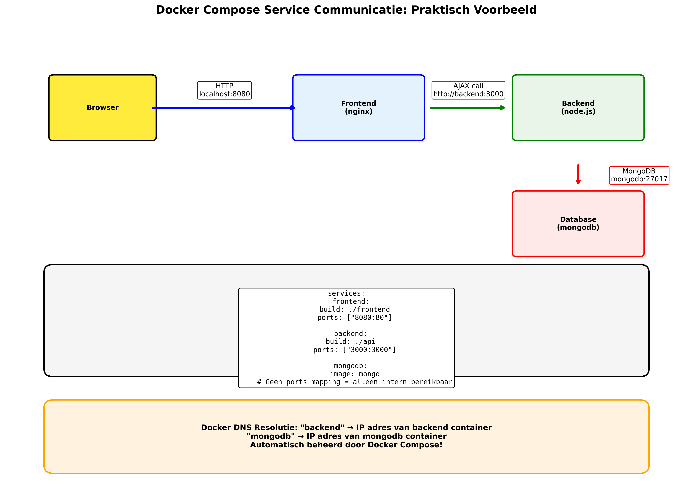

# 3 - Van simpele website naar Docker Compose

## Inleiding: Het verhaal van een groeiende applicatie

Stel je voor: je werkt bij een startup en je begint met een simpele website. In het begin is alles eenvoudig - gewoon een HTML-pagina met wat statische content. Maar zoals elke succesvolle applicatie groeit je project uit tot iets veel complexers.

**De reis die we gaan maken:**
1. **Statische website** - Een eenvoudige HTML-pagina die je lokaal kunt openen
2. **Docker run met volumes** - Je ontdekt Docker voor snel prototypen
3. **Dockerfile** - Je leert images maken, maar raakt gefrustreerd door beperkingen
4. **Handmatige multi-container setup** - Je applicatie groeit, maar het beheer wordt een nachtmerrie
5. **Docker Compose** - De oplossing die je sanity teruggeeft

**Waarom dit verhaal zo belangrijk is:**
- Je ervaart echte pijnpunten voordat je de oplossing leert
- Je begrijpt WAAROM bepaalde tools bestaan
- Je ziet hoe moderne software ontwikkeling evolueert
- Je krijgt praktische hands-on ervaring met elke stap

Dit is geen droge theorie - dit is de echte wereld van software ontwikkeling, waar problemen je dwingen tot betere oplossingen.

---

## Fase 1: De eenvoudige start - Statische website

### Het begin: Een simpele HTML-pagina

In de map `compose-files/1-fe/` vinden we onze uitgangssituatie: een eenvoudige HTML-pagina met een hardgecodeerde lijst voedsel.

```html
<!DOCTYPE html>
<html lang="en">
<head>
  <meta charset="UTF-8">
  <meta name="viewport" content="width=, initial-scale=1.0">
  <title>Document</title>
</head>
<body>
  <p>List of foods from API: </p>
  <ul id="list">
    <li> Apple </li>
    <li> Orange </li>
    <li> Banana </li>
    <li> Kiwi </li>
  </ul>
</body>
</html>
```

**Het probleem:** Deze pagina is volledig statisch. In de echte wereld willen we:
- Data uit databases kunnen halen
- API's die dynamische content serveren  
- Infrastructure die kan schalen
- Een deployment die professioneel is

### Stap 1: Snel prototypen met `docker run`

Voor snelle ontwikkeling kunnen we de officiele `nginx` image gebruiken en onze HTML als volume mounten:

```bash
cd compose-files/1-fe
docker run \
  --rm \
  -p 8080:80 \
  -v "$(pwd)/index.html:/usr/share/nginx/html/index.html:ro" \
  nginx:1.27-alpine
```

**Uitleg van de parameters:**
- `--rm`: Verwijder container automatisch na stoppen
- `-p 8080:80`: Publiceer nginx poort 80 naar host poort 8080
- `-v ...:ro`: Mount bestand read-only in de container
- `nginx:1.27-alpine`: Lichtgewicht nginx variant

**Voordelen van deze aanpak:**
- ✅ Onmiddellijk resultaat: website draait op http://localhost:8080
- ✅ Ontwikkelvriendelijk: wijzig HTML en refresh browser
- ✅ Geen image-build proces nodig
- ✅ Ideaal voor experimenten en snelle iteraties

**Waarom dit niet voldoende is:**
- ❌ **Niet distribueerbaar**: Content zit buiten de container
- ❌ **Ontwikkel-only**: Kan niet naar productie of klanten
- ❌ **Fragiel**: Afhankelijk van lokale bestanden
- ❌ **Niet reproduceerbaar**: Werkt alleen op deze machine

> "Je kunt deze setup niet naar een collega sturen - ze hebben de exacte bestandsstructuur nodig"

### Stap 2: Een distributeerbare image bouwen met Dockerfile

**Het probleem herkennen:**
Om onze applicatie naar productie of klanten te kunnen sturen, hebben we een self-contained image nodig. Een `docker run` met volumes werkt alleen op de lokale machine waar de bestanden aanwezig zijn.

> "Je kunt een volume mount niet naar een productie server sturen!"

**Drie manieren om een distributeerbare image te maken:**

#### Methode 1: Handmatige container modificatie (NIET aanbevolen)
```bash
# Start een basis container
docker run -it --name temp-container nginx:1.27-alpine sh

# In de container: handmatig bestanden kopiëren
# (in een andere terminal)
docker cp index.html temp-container:/usr/share/nginx/html/

# Stop de container en commit de wijzigingen
docker stop temp-container
docker commit temp-container my-website:1.0

# Test de nieuwe image
docker run -p 8080:80 my-website:1.0
```

**Problemen met handmatige method:**
- ❌ **Niet reproduceerbaar**: Niemand weet welke stappen zijn uitgevoerd
- ❌ **Geen versie controle**: Wijzigingen zijn niet gedocumenteerd
- ❌ **Foutgevoelig**: Makkelijk om stappen te vergeten
- ❌ **Team unfriendly**: Andere developers kunnen het niet repliceren
- ❌ **Grote images**: Intermediate layers worden niet geoptimaliseerd

#### Methode 2: De Dockerfile manier (AANBEVOLEN)

**Wat is een Dockerfile:**
Een Dockerfile is een tekst bestand met instructies om automatisch een Docker image te bouwen. Het is een script dat stap voor stap beschrijft hoe je image er uit moet zien.

In `compose-files/1-fe/Dockerfile` zien we een eenvoudig voorbeeld:

```dockerfile
# Gebruik een officiële image als basis
FROM nginx:1.27-alpine

# Kopieer lokale bestanden naar de image
COPY index.html /usr/share/nginx/html/index.html

# Documenteer welke poort de service gebruikt
EXPOSE 80

# Specificeer het standaard commando
CMD ["nginx", "-g", "daemon off;"]
```

**Dockerfile instructies uitgelegd:**

1. **FROM** - De basis image:
```dockerfile
FROM nginx:1.27-alpine
# - nginx: officiële nginx web server
# - 1.27: specifieke versie (reproduceerbaar)
# - alpine: lichtgewicht Linux distributie (~5MB vs ~100MB)
```

2. **COPY** - Bestanden toevoegen:
```dockerfile
COPY index.html /usr/share/nginx/html/index.html
# - Kopieert vanuit build context (huidige directory)
# - Naar absolute pad in de container
# - Alternatief: ADD (heeft extra features zoals URL download)
```

3. **EXPOSE** - Poort documentatie:
```dockerfile
EXPOSE 80
# - Documenteert dat deze container luistert op poort 80
# - Publiceert NIET automatisch (je hebt nog steeds -p nodig)
# - Belangrijke metadata voor andere developers
```

4. **CMD** - Standaard commando:
```dockerfile
CMD ["nginx", "-g", "daemon off;"]
# - Wordt uitgevoerd wanneer container start
# - "daemon off" zorgt ervoor dat nginx in foreground draait
# - Alternatief: ENTRYPOINT (minder flexibel maar meer controle)
```

**Het Docker Build proces:**

```bash
# Navigeer naar de directory met Dockerfile
cd compose-files/1-fe

# Bouw de image met een tag
docker build -t fe-static:latest .

# Wat gebeurt er:
# 1. Docker leest Dockerfile
# 2. Elke instructie wordt een layer
# 3. Layers worden gecached voor hergebruik
# 4. Eindresultaat: een nieuwe image

# Start de container
docker run --rm -p 8081:80 fe-static:latest
```

**Docker Layer System - Hoe images echt werken:**

```dockerfile
# Elke instructie = een nieuwe layer
FROM nginx:1.27-alpine    # Layer 1: basis nginx systeem
COPY index.html /usr/...  # Layer 2: onze HTML file
EXPOSE 80                 # Layer 3: metadata toevoegen
CMD ["nginx", "-g"...]    # Layer 4: startup commando
```

**Visualisatie van layers:**
```
┌─────────────────────────┐
│ Layer 4: CMD instruction│
├─────────────────────────┤
│ Layer 3: EXPOSE 80      │
├─────────────────────────┤
│ Layer 2: COPY index.html│
├─────────────────────────┤
│ Layer 1: nginx:1.27     │ ← Gedeeld met andere nginx images
└─────────────────────────┘
```

**Voordelen van het layer systeem:**
- ✅ **Caching**: Ongewijzigde layers worden hergebruikt
- ✅ **Storage efficiency**: Gemeenschappelijke layers worden gedeeld
- ✅ **Snelle rebuilds**: Alleen gewijzigde layers worden opnieuw gebouwd
- ✅ **Incremental updates**: Alleen nieuwe layers hoeven gedownload

**Best practices voor Dockerfile optimalisatie:**

```dockerfile
# SLECHT: Elke wijziging rebuildt alles
FROM nginx:1.27-alpine
COPY . /usr/share/nginx/html/
EXPOSE 80
CMD ["nginx", "-g", "daemon off;"]

# BETER: Vaak wijzigende bestanden als laatste
FROM nginx:1.27-alpine
EXPOSE 80
CMD ["nginx", "-g", "daemon off;"]
COPY index.html /usr/share/nginx/html/  # Deze wijzigt vaak
```

**Build en test de image:**

```bash
# Navigeer naar de juiste directory
cd compose-files/1-fe

# Bouw de image (met build context = huidige directory)
docker build -t fe-static:latest .

# Controleer dat de image bestaat
docker images | grep fe-static

# Start de container
docker run --rm -p 8081:80 fe-static:latest

# Test in browser: http://localhost:8081
# Vergelijk met origineel op: http://localhost:8080 (volume mount versie)
```

**Image distributie:**

```bash
# Tag voor registry
docker tag fe-static:latest myregistry.com/fe-static:v1.0

# Push naar registry (Docker Hub, Private registry, etc.)
docker push myregistry.com/fe-static:v1.0

# Op een andere machine: pull en run
docker pull myregistry.com/fe-static:v1.0
docker run -p 80:80 myregistry.com/fe-static:v1.0
```

**Voordelen van deze Dockerfile aanpak:**
- ✅ **Distribueerbaar**: Alles zit in de image
- ✅ **Reproduceerbaar**: Image werkt overal waar Docker draait
- ✅ **Versioned**: Je kunt verschillende versies taggen
- ✅ **Productie-klaar**: Kan naar registry en deployment pipeline

**Nieuwe beperkingen die ontstaan:**
- ❌ **Langzame ontwikkeling**: Elke HTML-wijziging vereist rebuild
- ❌ **Statisch**: Nog steeds geen mogelijkheid voor dynamische content
- ❌ **Eenvoudig**: Echte applicaties hebben databases, API's, etc.

> "Nu kunnen we ons werk wel delen, maar het is nog steeds een statische website"

---

## Fase 2: Complexiteit neemt toe - Dynamische content

### De realiteit van moderne webapplicaties

Moderne applicaties bestaan zelden uit één container. Kijk naar de uitbreiding in `2-fe-be/`:


**Frontend** (`2-fe-be/frontend/`):
- Aangepaste HTML die data ophaalt via JavaScript
- Maakt AJAX calls naar een backend API
- Nog steeds geserveerd door nginx

```html
<!-- Het verschil: dynamische lijst in plaats van hardcoded -->
<ul id="list"></ul>

<script type="text/javascript">
async function createList() {
    const url = "http://localhost:3000";
    try {
      const response = await fetch(url);
      const json = await response.json();
      
      for (let i of json) {
        ul = document.getElementById("list");
        li = document.createElement("li");
        li.innerHTML = i.color + " " + i.name;
        ul.appendChild(li);
      }
    } catch (error) {
      console.error(error.message);
    }
}
createList();
</script>
```

**Backend** (`2-fe-be/api/`):
- Node.js Express server
- Praat met MongoDB database
- Serveert API endpoints voor de frontend

```javascript
// server.js - Een echte API!
const express = require('express')
const mongoose = require('mongoose')
const cors = require('cors')

// Database connectie met retry logic
let connectWithRetry = function() {
  return mongoose.connect(process.env.MONGO_URI || 'mongodb://localhost:27017/foodsdb')
      .then(() => console.log('Connected to MongoDB!'))
      .catch ((error) => {
        console.error('Failed to connect to mongo - retrying in 1 sec', error);
        setTimeout(connectWithRetry, 1000);
      }); 
};

// API endpoint
app.get("/", async (req, res) => {
  const foods = await Food.find();
  res.send(foods);
});
```

**Database**:
- MongoDB voor data persistentie
- Moet toegankelijk zijn voor de backend
- Data moet bewaard blijven tussen restarts

### Het handmatige container management probleem

**Stel je voor dat je dit handmatig moet beheren:**

```bash
# Stap 1: Maak een custom network 
docker network create foodapp-network

# Stap 2: Start de database
docker run -d \
  --name mongodb \
  --network foodapp-network \
  -v dbdata:/data/db \
  mongo

# Stap 3: Bouw de backend image
docker build -t foodapp-backend ./2-fe-be/api

# Stap 4: Start de backend (moet wachten op database)
docker run -d \
  --name backend \
  --network foodapp-network \
  -p 3000:3000 \
  -e PORT=3000 \
  -e MONGO_URI=mongodb://mongodb:27017/foodsdb \
  foodapp-backend

# Stap 5: Bouw de frontend image  
docker build -t foodapp-frontend ./2-fe-be/frontend

# Stap 6: Start de frontend
docker run -d \
  --name frontend \
  --network foodapp-network \
  -p 8080:80 \
  foodapp-frontend
```

### Uitleg van de handmatige parameters - Waarom zo complex?

#### Netwerk management (`--network`)

**Waarom custom networks nodig zijn:**
```bash
docker network create foodapp-network
--network foodapp-network
```
- **Probleem**: Containers kunnen standaard niet met elkaar praten
- **Oplossing**: Custom networks bieden automatische DNS resolution tussen containers
- **Vervangt `--link`**: De oudere `--link` parameter is deprecated

**De oude `--link` methode (DEPRECATED) - Een historische les:**

Voordat Docker's moderne netwerk systeem bestond, gebruikten ontwikkelaars de `--link` parameter:

```bash
# OUDE MANIER - niet meer aanbevolen sinds Docker 1.9
docker run -d --name mongodb mongo
docker run -d --name backend --link mongodb:mongodb backend-image
```

**Hoe `--link` werkte:**
```bash
# De --link syntax: --link <container_name>:<alias>
docker run -d --name database mongo
docker run -d --name api --link database:db api-image

# In de api container werd dan automatisch:
# - Een DNS entry toegevoegd: db → IP van database container
# - Environment variabelen gemaakt: DB_PORT_27017_TCP_ADDR=172.17.0.2
# - Host file entries: 172.17.0.2 db database
```

**Waarom --link uiteindelijk faalde:**

1. **Startup Order Dependencies:**
```bash
# Als je dit deed:
docker run -d --name api --link database:db api-image
docker run -d --name database mongo  # Fout! Database moet eerst bestaan

# Je kreeg: Error: No such container: database
```

2. **Unidirectionele verbindingen:**
```bash
# Database kan niet terug praten met API
docker run -d --name db mongo
docker run -d --name api --link db:database api-image
# api kan db bereiken, maar db kan api NIET bereiken
```

3. **Complexe netwerk topologieën:**
```bash
# Met --link wordt dit al snel een nachtmerrie:
# frontend → backend → database
# frontend → cache
# backend → cache
# backend → message-queue
# Elke nieuwe verbinding vereist herstart van afhankelijke containers!
```

4. **Container recreatie problemen:**
```bash
# Als database container stopt en opnieuw start:
docker stop database
docker rm database
docker run -d --name database mongo

# Dan breekt de link! API container moet ook opnieuw gestart worden
# omdat de IP van database is veranderd
```

**Problemen met `--link` samengevat:**
- ❌ **Fragiel**: Links breken bij container restarts
- ❌ **Startup dependencies**: Containers moeten in specifieke volgorde starten
- ❌ **Unidirectioneel**: Alleen eenrichtingsverkeer
- ❌ **Niet schaalbaar**: Complexe netwerken worden onhandelbaar
- ❌ **Inflexibel**: Geen controle over netwerk topologie
- ❌ **Legacy**: Niet compatibel met moderne Docker features

**De moderne oplossing: User-defined networks**
```bash
# Modern Docker networking (vanaf 1.9)
docker network create app-network

# Alle containers in hetzelfde netwerk kunnen elkaar bereiken
docker run -d --name database --network app-network mongo
docker run -d --name api --network app-network api-image
docker run -d --name frontend --network app-network frontend-image

# Automatische DNS: api kan 'database' bereiken, database kan 'api' bereiken
```

#### Environment variables (`-e`)

```bash
-e PORT=3000
-e MONGO_URI=mongodb://mongodb:27017/foodsdb
```

**Waarom environment variables:**
- **Configuratie**: Externe configuratie zonder code aanpassingen
- **Connection strings**: `mongodb://mongodb:27017` gebruikt container hostname
- **Flexibiliteit**: Verschillende omgevingen (dev/test/prod) met andere waarden
- **Security**: Gevoelige data (passwords) niet in code

#### Volume management (`-v`)

```bash
-v dbdata:/data/db
```

**Named volumes vs bind mounts:**
- **Named volume**: `dbdata:/data/db` - Docker beheert de data persistent
- **Bind mount**: `/host/path:/container/path` - Direct host filesystem access
- **Waarom named volumes**: Portabel tussen verschillende hosts

#### Port mapping (`-p`)

```bash
-p 3000:3000  # Host port 3000 -> Container port 3000
-p 8080:80    # Host port 8080 -> Container port 80
```

**Security door selective exposure:**
- **Externe toegang**: Alleen gemapte poorten zijn bereikbaar van buitenaf
- **Internal services**: Database heeft geen `-p` dus alleen intern bereikbaar
- **Format**: `host_port:container_port`

### Praktische problemen met handmatige orchestratie

#### 1. Startup volgorde problemen
```bash
# Backend start voordat database klaar is
$ docker logs backend
MongoNetworkError: failed to connect to server [mongodb:27017]
```

#### 2. Cleanup complexiteit
```bash
# Alles handmatig stoppen en opruimen - foutgevoelig!
docker stop frontend backend mongodb
docker rm frontend backend mongodb
docker network rm foodapp-network
docker volume rm dbdata  # Dit verwijdert je DATA!
```

#### 3. Development cycle frustratie
```bash
# Elke code wijziging vereist:
docker stop backend
docker rm backend
docker build -t foodapp-backend ./2-fe-be/api
docker run -d --name backend --network foodapp-network \
  -p 3000:3000 \
  -e PORT=3000 \
  -e MONGO_URI=mongodb://mongodb:27017/foodsdb \
  foodapp-backend
```

#### 4. Environment inconsistentie
- Ontwikkelaar A vergeet `-e MONGO_URI` parameter → backend crash
- Ontwikkelaar B gebruikt andere poort mapping → frontend kan niet verbinden
- Productie team gebruikt andere netwerk configuratie → mysterious failures
- Niemand weet meer welke exacte commando's nodig zijn

**De kernproblemen:**
- 🔥 **Foutgevoelig**: Verkeerde volgorde = crashes
- 🔥 **Command-line horror**: Lange, complexe commando's die niemand onthoudt
- 🔥 **Inconsistente omgevingen**: Elke ontwikkelaar doet het anders
- 🔥 **Niet herhaalbaar**: Verschillende setups voor dev/test/prod
- 🔥 **Moeilijk te onderhouden**: Updates vereisen vele handmatige stappen
- 🔥 **Geen dependency management**: Services starten in verkeerde volgorde
- 🔥 **Documentatie nightmare**: Setup instructies zijn nooit up-to-date

> "We hebben een tool nodig die dit allemaal automatiseert en betrouwbaar maakt!"

---

## Fase 3: De Docker Compose revolutie

### Wat is Docker Compose echt?

Docker Compose is veel meer dan alleen een "tool voor multi-container apps". Het is een fundamentele verschuiving in hoe we over applicatie deployment denken.

**Filosofie van Docker Compose:**
- **Infrastructure as Code**: Je infrastructuur wordt code die je kunt versionen
- **Declaratieve configuratie**: Je beschrijft het eindresultaat, niet de stappen ernaartoe
- **Reproduceerbare omgevingen**: Identieke setup voor development, testing, en productie
- **Service-oriented thinking**: Applicaties als een collectie van samenhangende services


**Kernprincipes die je leven eenvoudiger maken:**

1. **Eén commando regel alles:**
```bash
# Van 6+ complexe docker commando's naar:
docker compose up
```

2. **Automatische resource management:**
- Netwerken worden automatisch aangemaakt en opgeruimd
- Volumes blijven bewaard tussen restarts
- Containers krijgen betekenisvolle namen
- Dependencies worden automatisch opgelost

3. **Development-friendly defaults:**
- Automatische rebuild detectie
- Live log aggregatie van alle services
- Graceful shutdown van hele stack
- Hot-reloading support

4. **Environment consistency:**
- Exact dezelfde setup voor elk team lid
- Geen "works on my machine" problemen meer
- Makkelijke omschakeling tussen omgevingen

### Docker Compose vs alternatieven

**Waarom niet gewoon bash scripts?**

```bash
#!/bin/bash
# start-app.sh - de handmatige manier
docker network create app-net
docker run -d --name db --network app-net -v dbdata:/data/db mongo
sleep 10  # Hoop dat database klaar is...
docker run -d --name api --network app-net -e MONGO_URI=mongodb://db:27017/app api-image
docker run -d --name web --network app-net -p 80:80 web-image
```

**Problemen met scripts:**
- ❌ Geen dependency management
- ❌ Foutafhandeling is complex
- ❌ Cleanup is handmatig werk
- ❌ Geen herstart policies
- ❌ Moeilijk te debuggen
- ❌ Platform afhankelijk (bash vs PowerShell vs...)

**Docker Compose oplossing:**
```yaml
# compose.yml - declaratief en elegant
services:
  db:
    image: mongo
    volumes:
      - dbdata:/data/db
  
  api:
    build: ./api
    depends_on:
      - db
    environment:
      - MONGO_URI=mongodb://db:27017/app
  
  web:
    build: ./web
    ports:
      - "80:80"

volumes:
  dbdata:
```

**Voordelen van YAML configuratie:**
- ✅ **Zelf-documenterend**: Configuration is documentatie
- ✅ **Version control friendly**: Makkelijk te tracken en reviewen
- ✅ **Cross-platform**: Werkt identiek op Windows, Mac, Linux
- ✅ **IDE support**: Syntax highlighting, autocompletion, validation
- ✅ **Composable**: Override files voor verschillende omgevingen

### De magische transformatie - Van 6 commando's naar 1

**Van dit (handmatig):**
```bash
docker network create foodapp-network
docker run -d --name mongodb --network foodapp-network -v dbdata:/data/db mongo
docker build -t foodapp-backend ./2-fe-be/api
docker run -d --name backend --network foodapp-network -p 3000:3000 -e PORT=3000 -e MONGO_URI=mongodb://mongodb:27017/foodsdb foodapp-backend
docker build -t foodapp-frontend ./2-fe-be/frontend
docker run -d --name frontend --network foodapp-network -p 8080:80 foodapp-frontend
```

**Naar dit (Docker Compose):**
```bash
docker compose up
```

### Analyse van onze `compose.yml`

Bekijk het bestand `2-fe-be/compose.yml`:

```yaml
services:
  backend:
    build: ./api
    ports: 
      - 3000:3000
    environment:
      - PORT=3000
      - MONGO_URI=mongodb://mongodb:27017/foodsdb
    depends_on:
      - mongodb

  frontend:
    build: ./frontend
    ports: 
      - 8080:80

  mongodb:
    image: mongo
    volumes:
      - dbdata:/data/db

volumes:
  dbdata:
```

### Service-by-service uitleg

#### 1. Backend Service
```yaml
backend:
  build: ./api                    # Bouwt image van ./api/Dockerfile
  ports:
    - 3000:3000                  # Publiceert API naar localhost:3000
  environment:
    - PORT=3000                  # Node.js app luistert op poort 3000
    - MONGO_URI=mongodb://mongodb:27017/foodsdb  # Database connectie
  depends_on:
    - mongodb                    # Start pas na MongoDB
```

**Het mooie van service names:**
- `mongodb://mongodb:27017` → Docker Compose zorgt voor DNS resolution
- Geen IP-adressen nodig
- Automatische service discovery

#### 2. Frontend Service
```yaml
frontend:
  build: ./frontend              # Bouwt image van ./frontend/Dockerfile
  ports:
    - 8080:80                   # Publiceert website naar localhost:8080
```

**Eenvoudig en clean:**
- Geen environment variables nodig
- Geen depends_on (frontend werkt ook zonder backend)
- Standaard netwerk werkt perfect

#### 3. Database Service
```yaml
mongodb:
  image: mongo                   # Gebruikt officiële MongoDB image
  volumes:
    - dbdata:/data/db           # Persistent data opslag
```

**Security door design:**
- Geen `ports` mapping → alleen intern bereikbaar
- Automatisch onderdeel van het container netwerk
- Data blijft bewaard via named volume

#### 4. Named Volume
```yaml
volumes:
  dbdata:                       # Docker managed persistent storage
```

### Docker Compose magie onder de motorkap

#### Automatische netwerk creatie
```bash
# Compose maakt automatisch een netwerk
$ docker network ls
NETWORK ID     NAME                 DRIVER    SCOPE
a1b2c3d4e5f6   2-fe-be_default     bridge    local
```

#### Service discovery met DNS
```bash
# Test vanuit backend container
$ docker compose exec backend nslookup mongodb
Server:         127.0.0.11
Address:        127.0.0.11#53

Name:   mongodb
Address: 172.18.0.3
```

#### Automatische container naming
```bash
$ docker compose ps
NAME              COMMAND                  SERVICE      STATUS
2-fe-be-backend-1   "docker-entrypoint.s…"   backend      Up
2-fe-be-frontend-1  "/docker-entrypoint.…"   frontend     Up
2-fe-be-mongodb-1   "docker-entrypoint.s…"   mongodb      Up
```

### Service name resolution - Het netwerk-magic uitgelegd

Een van de meest elegante features van Docker Compose is automatische service discovery. Dit lost een groot probleem op dat je hebt bij handmatige container management.

#### Het probleem met IP-gebaseerde communicatie

**Voorheen (problematisch):**
```javascript
// Hardcoded IP - breekt bij elke restart
const mongoUri = "mongodb://172.17.0.3:27017/foodsdb";

// Problems:
// - Container krijgt nieuw IP bij restart
// - IP adressen zijn niet voorspelbaar
// - Configuratie moet aangepast worden per omgeving
// - Debugging is een nachtmerrie
```

**Handmatige netwerk setup (omslachtig):**
```bash
# Stap 1: Maak netwerk
docker network create foodapp-network

# Stap 2: Start containers in netwerk
docker run -d --name mongodb --network foodapp-network mongo

# Stap 3: Zoek IP van database
docker inspect mongodb | grep IPAddress
# "IPAddress": "172.18.0.2"

# Stap 4: Gebruik IP in backend configuratie (breekbaar!)
docker run -d --name backend --network foodapp-network \
  -e MONGO_URI=mongodb://172.18.0.2:27017/foodsdb backend-image
```

#### De Docker Compose oplossing: Service Names as Hostnames


**Docker Compose automatische magie:**
```yaml
services:
  backend:
    build: ./api
    environment:
      - MONGO_URI=mongodb://mongodb:27017/foodsdb  # Service naam!
    depends_on:
      - mongodb
  
  mongodb:
    image: mongo
    volumes:
      - dbdata:/data/db

volumes:
  dbdata:
```

**Hoe dit werkt onder de motorkap:**

1. **Automatische netwerk creatie:**
```bash
# Compose maakt automatisch een netwerk
$ docker network ls
NETWORK ID     NAME                 DRIVER    SCOPE
a1b2c3d4e5f6   2-fe-be_default     bridge    local

$ docker network inspect 2-fe-be_default
# Toont alle containers in dit netwerk
```

2. **Ingebouwde DNS server:**
```bash
# Elke container krijgt DNS configuratie
$ docker compose exec backend cat /etc/resolv.conf
nameserver 127.0.0.11
options ndots:0

# 127.0.0.11 is Docker's interne DNS server
```

3. **Service naam registratie:**
```bash
# Test DNS resolution vanuit backend container
$ docker compose exec backend nslookup mongodb
Server:         127.0.0.11
Address:        127.0.0.11#53

Name:   mongodb
Address: 172.20.0.3

# 'mongodb' wordt automatisch geresolv'd naar actueel IP
```

#### Praktische voorbeelden van service communicatie

**Backend praat met MongoDB:**
```javascript
// In server.js - gebruik service naam
const mongoUri = process.env.MONGO_URI || 'mongodb://mongodb:27017/foodsdb';
mongoose.connect(mongoUri)
  .then(() => console.log('Connected to MongoDB!'))
  .catch(err => console.error('Connection failed:', err));

// Docker Compose zorgt ervoor dat 'mongodb' altijd werkt
// Zelfs na herstart, schaling, of IP wijzigingen
```

**Frontend praat met Backend (twee scenarios):**

1. **Browser-to-Backend** (via browser):
```javascript
// Frontend JavaScript in browser
const apiUrl = "http://localhost:3000";  // Via host port mapping
fetch(apiUrl)
  .then(response => response.json())
  .then(data => console.log(data));

// Browser draait BUITEN Docker network
// Moet via publieke poort (localhost:3000)
```

2. **Container-to-Container** (server-side rendering):
```javascript
// Als frontend server-side API calls zou maken
const apiUrl = "http://backend:3000";    // Via service naam
fetch(apiUrl)
  .then(response => response.json())
  .then(data => renderPage(data));

// Containers draaien IN hetzelfde Docker netwerk
// Kunnen direct via service naam communiceren
```

#### Testing van service names - Hands-on debugging

**Stap 1: Start de compose stack**
```bash
cd compose-files/2-fe-be
docker compose up -d
```

**Stap 2: Test DNS resolution**
```bash
# Vanuit backend container
docker compose exec backend nslookup mongodb
# Returns:
# Name: mongodb
# Address: 172.20.0.3

# Vanuit mongodb container  
docker compose exec mongodb nslookup backend
# Returns:
# Name: backend
# Address: 172.20.0.2

# Alle services kunnen elkaar bereiken!
```

**Stap 3: Test HTTP communicatie tussen services**
```bash
# Backend kan MongoDB bereiken
docker compose exec backend ping mongodb -c 3

# Backend kan frontend bereiken (HTTP)
docker compose exec backend curl http://frontend:80
# Haalt de HTML pagina op van de frontend service

# Frontend kan backend bereiken (API)
docker compose exec frontend curl http://backend:3000
# Haalt JSON data op van de backend API
```

**Stap 4: Inspect netwerk details**
```bash
# Zie alle containers in het netwerk
docker network inspect 2-fe-be_default

# Output toont:
# - Alle verbonden containers
# - Hun IP adressen  
# - Network configuratie
# - Service aliassen
```

#### Service discovery dieper uitgelegd



**Automatische features:**

1. **Bidirectionele communicatie:**
```yaml
services:
  frontend:
    build: ./frontend
    # Kan 'backend' en 'mongodb' bereiken
  
  backend:
    build: ./api  
    # Kan 'frontend' en 'mongodb' bereiken
  
  mongodb:
    image: mongo
    # Kan 'frontend' en 'backend' bereiken
```

2. **Service aliassen:**
```yaml
services:
  database:
    image: mongo
    networks:
      app_network:
        aliases:
          - db
          - mongodb
          - mongo-server
          
# Nu werken alle namen: database, db, mongodb, mongo-server
```

3. **Cross-service environment variables:**
```yaml
services:
  backend:
    environment:
      - DATABASE_HOST=mongodb    # Service naam
      - DATABASE_PORT=27017      # Standaard MongoDB poort
      - API_FRONTEND_URL=http://frontend:80
    
  frontend:
    environment:
      - API_BACKEND_URL=http://backend:3000
```

#### Real-world scenario: Microservices communicatie

```yaml
services:
  user-service:
    build: ./user-service
    environment:
      - DATABASE_URL=mongodb://user-db:27017/users
      - AUTH_SERVICE_URL=http://auth-service:8080
  
  auth-service:
    build: ./auth-service
    environment:
      - USER_SERVICE_URL=http://user-service:3000
      - REDIS_URL=redis://cache:6379
  
  api-gateway:
    build: ./api-gateway
    ports:
      - "80:80"
    environment:
      - USER_SERVICE_URL=http://user-service:3000
      - AUTH_SERVICE_URL=http://auth-service:8080
  
  user-db:
    image: mongo
    
  cache:
    image: redis:alpine
```

**Voordelen van service name resolution:**
- ✅ **Zero configuration**: Werkt automatisch uit de doos
- ✅ **Dynamic**: IP wijzigingen zijn transparant
- ✅ **Readable**: Code is zelf-documenterend
- ✅ **Maintainable**: Geen hardcoded IP adressen
- ✅ **Scalable**: Werkt met service replicatie
- ✅ **Environment agnostic**: Zelfde code voor dev/test/prod

### De volledige stack starten

#### Stap 1: Navigeer naar de juiste directory
```bash
cd compose-files/2-fe-be
```

#### Stap 2: Start alle services
```bash
docker compose up --build
```

**Wat gebeurt er automatisch:**
1. Docker bouwt images voor `backend` en `frontend`
2. MongoDB container start eerst (vanwege `depends_on`)
3. Backend wacht op MongoDB en probeert connectie met retry logic
4. Frontend start als laatste
5. Alle services kunnen met elkaar praten via service names
6. Data wordt bewaard in een named volume

#### Stap 3: Test de applicatie
- Open http://localhost:8080 (frontend)
- Controleer of data wordt geladen via de API
- Backend API is bereikbaar op http://localhost:3000

### Essential Compose commando's voor dagelijks gebruik

Docker Compose biedt een uitgebreid set commando's voor het beheren van je applicatie stack. Hier zijn de belangrijkste commando's die je dagelijks zult gebruiken.

#### Basis lifecycle management

**Opstarten en afsluiten:**
```bash
# Start alle services in foreground (zie logs live)
docker compose up

# Start in background (detached mode)
docker compose up -d

# Forceer rebuild van alle images voordat je start
docker compose up --build

# Start alleen specifieke services
docker compose up frontend backend
# (database start automatisch mee vanwege depends_on)

# Stop alle services (containers blijven bestaan)
docker compose stop

# Stop en verwijder containers, netwerken (volumes blijven)
docker compose down

# Nuclear option: verwijder ALLES inclusief volumes (DATA VERLIES!)
docker compose down -v --rmi all
```

#### Development workflow commando's

**Live development:**
```bash
# Rebuild en herstart specifieke service
docker compose up --build frontend

# Herstart een service zonder rebuild
docker compose restart backend

# Force recreate containers (voor configuratie wijzigingen)
docker compose up --force-recreate
```

**Scaling voor load testing:**
```bash
# Start 3 instances van backend service
docker compose up --scale backend=3

# Let op: scaling werkt alleen zonder conflicterende poort mappings
# Gebruik load balancer of alleen internal networking
```

#### Monitoring en debugging

**Status en logs:**
```bash
# Bekijk status van alle services
docker compose ps

# Gedetailleerde status met resource usage
docker compose ps -a

# Bekijk logs van alle services
docker compose logs

# Follow logs live van alle services
docker compose logs -f

# Logs van specifieke service
docker compose logs backend
docker compose logs -f frontend --tail=50

# Logs vanaf bepaalde tijd
docker compose logs --since="2h" backend
```

**Container inspectie:**
```bash
# Ga in een draaiende container (interactieve shell)
docker compose exec backend bash
docker compose exec mongodb mongosh

# Run een one-off commando in service
docker compose exec backend node --version
docker compose exec backend npm list

# Start een nieuwe container voor debugging
docker compose run --rm backend bash
# --rm zorgt voor automatische cleanup
```

#### Configuration en validatie

**Configuratie management:**
```bash
# Valideer configuratie zonder starten
docker compose config

# Toon resulterende configuratie (na environment substitution)
docker compose config --format yaml

# Valideer en toon alleen errors
docker compose config --quiet

# Gebruik verschillende compose files
docker compose -f compose.yml -f compose.override.yml config
```

**Environment management:**
```bash
# Gebruik custom .env file
docker compose --env-file .env.production up

# Override environment variables
MONGO_URI=mongodb://prod-db:27017/app docker compose up
```

#### Image en volume management

**Image operations:**
```bash
# Download/update images zonder starten
docker compose pull

# Force rebuild van alle images
docker compose build

# Rebuild specifieke service
docker compose build backend

# Build met verschillende argumenten
docker compose build --build-arg NODE_ENV=production
```

**Volume operations:**
```bash
# Backup database volume
docker compose exec mongodb mongodump --out /data/backup

# Restore database
docker compose exec mongodb mongorestore /data/backup

# Inspect volumes
docker volume ls | grep $(basename $(pwd))
docker volume inspect $(basename $(pwd))_dbdata
```

#### Advanced operations

**Service dependencies:**
```bash
# Start services in dependency order
docker compose up --wait
# Wacht tot alle services healthy zijn

# Start tot specifiek punt in dependency tree
docker compose up backend
# Start backend en alle dependencies (mongodb)
```

**Network debugging:**
```bash
# Inspect automatisch aangemaakte netwerk
docker network inspect $(basename $(pwd))_default

# Test connectivity tussen services
docker compose exec backend ping mongodb
docker compose exec backend telnet frontend 80
```

#### Production-ready commando's

**Health monitoring:**
```bash
# Check service health status
docker compose ps --format "table {{.Name}}\t{{.Status}}\t{{.Health}}"

# Wait voor services om healthy te worden
docker compose up --wait --wait-timeout 60
```

**Resource management:**
```bash
# Bekijk resource usage
docker compose top

# Cleanup van stopped containers en unused networks
docker compose down --remove-orphans

# Update services met nieuwe images
docker compose pull && docker compose up -d
```

#### Troubleshooting commando's

**Common debugging scenarios:**

1. **Service start problemen:**
```bash
# Check waarom service niet start
docker compose logs backend

# Start service interactief voor debugging
docker compose run --rm backend bash
```

2. **Network connectivity issues:**
```bash
# Test DNS resolution
docker compose exec backend nslookup mongodb

# Test port connectivity
docker compose exec backend nc -zv mongodb 27017

# Check iptables/firewall
docker compose exec backend netstat -tlnp
```

3. **Volume/data problemen:**
```bash
# Check volume mounts
docker compose exec backend mount | grep /data

# Check file permissions
docker compose exec backend ls -la /data/

# Reset volumes (DESTRUCTIVE!)
docker compose down -v
docker compose up --build
```

#### Best practices voor dagelijks gebruik

**Development workflow:**
```bash
# Dagelijkse startup routine
docker compose pull    # Update base images
docker compose up --build -d    # Start met rebuild
docker compose logs -f    # Monitor startup

# Einde van dag cleanup
docker compose down    # Stop en cleanup
# Volumes blijven voor morgen
```

**Debugging workflow:**
```bash
# Problem investigation
docker compose ps      # Check service status
docker compose logs backend    # Check specific logs
docker compose exec backend bash    # Interactive debugging
docker compose restart backend     # Quick fix attempt
```

**Production deployment:**
```bash
# Zero-downtime deployment
docker compose pull
docker compose up --no-deps -d backend    # Update only backend
docker compose up --no-deps -d frontend   # Update only frontend

# Rollback scenario  
docker compose down
docker compose up -d --scale backend=0    # Stop all backend instances
docker compose pull previous-image
docker compose up -d    # Start with previous version
```

---

## Fase 4: Geavanceerde concepten en best practices

### Environment files voor configuratie

#### Het probleem met hardcoded waarden
```yaml
# Niet flexibel - hardcoded waarden
services:
  backend:
    environment:
      - NODE_ENV=development
      - MONGO_URI=mongodb://mongodb:27017/foodsdb
      - API_PORT=3000
```

#### De oplossing: .env files
```bash
# .env bestand
NODE_ENV=development
MONGO_URI=mongodb://mongodb:27017/foodsdb
API_PORT=3000
WEB_PORT=8080
DB_NAME=foodsdb
```

```yaml
# compose.yml met environment variabelen
services:
  backend:
    build: ./api
    ports:
      - "${API_PORT}:3000"
    environment:
      - NODE_ENV=${NODE_ENV}
      - MONGO_URI=${MONGO_URI}
    env_file:
      - .env
```

### Override files voor verschillende omgevingen

#### Development configuratie (compose.override.yml)
```yaml
# Automatisch geladen in development
services:
  backend:
    volumes:
      - ./api:/app              # Live code reloading
      - /app/node_modules       # Prevent overwriting node_modules
    environment:
      - DEBUG=true
      - NODE_ENV=development
```

#### Production configuratie (compose.prod.yml)
```yaml
# Voor productie: docker compose -f compose.yml -f compose.prod.yml up
services:
  backend:
    restart: unless-stopped
    deploy:
      resources:
        limits:
          memory: 512M
          cpus: '0.50'
    environment:
      - NODE_ENV=production
      - DEBUG=false
    healthcheck:
      test: ["CMD", "curl", "-f", "http://localhost:3000/health"]
      interval: 30s
      timeout: 10s
      retries: 3
```

### Healthchecks en dependency management

#### Probleem: Services starten te snel
```yaml
# Basis depends_on wacht alleen tot container start, niet tot service ready is
depends_on:
  - mongodb  # MongoDB container is gestart, maar database nog niet klaar
```

#### Oplossing: Healthchecks
```yaml
services:
  mongodb:
    image: mongo
    healthcheck:
      test: echo 'db.runCommand("ping").ok' | mongosh localhost:27017/test --quiet
      interval: 10s
      timeout: 5s
      retries: 5
      start_period: 40s

  backend:
    build: ./api
    depends_on:
      mongodb:
        condition: service_healthy  # Wacht tot MongoDB echt klaar is
    healthcheck:
      test: ["CMD", "curl", "-f", "http://localhost:3000/health"]
      interval: 30s
      timeout: 10s
      retries: 3
```

### Advanced networking en security

#### Multiple networks voor service isolation
```yaml
networks:
  frontend:
    driver: bridge
  backend:
    driver: bridge
    internal: true  # Geen externe toegang

services:
  frontend:
    build: ./frontend
    networks:
      - frontend
      
  backend:
    build: ./api
    networks:
      - frontend  # Kan praten met frontend
      - backend   # Kan praten met database
      
  mongodb:
    image: mongo
    networks:
      - backend   # Alleen toegankelijk vanuit backend network
```

**Security voordelen:**
- Database is niet bereikbaar vanuit frontend
- Externe netwerk toegang gecontroleerd
- Services geïsoleerd per functie

### Debugging en troubleshooting

#### Veelvoorkomende problemen

**1. Port conflicts:**
```bash
# Error: port already in use
ERROR: Ports are not available: exposing port 8080

# Oplossing: Verander poort mapping
services:
  frontend:
    ports:
      - "8081:80"  # Gebruik andere host poort
```

**2. Service connectivity issues:**
```bash
# Debug stappen:
# 1. Check of services draaien
docker compose ps

# 2. Check service logs
docker compose logs backend

# 3. Test DNS resolution
docker compose exec backend nslookup mongodb

# 4. Test network connectivity
docker compose exec backend ping mongodb

# 5. Test HTTP connectivity
docker compose exec backend curl http://frontend:80
```

**3. Volume permission problems:**
```bash
# Check volume ownership in container
docker compose exec mongodb ls -la /data/db

# Fix permissions if needed
docker compose exec mongodb chown -R mongodb:mongodb /data/db
```

### Best practices samengevat

#### Compose file organisatie
```yaml
# Volledige productie-ready compose.yml
services:
  backend:
    build: 
      context: ./api
      dockerfile: Dockerfile
    image: foodapp-backend:${VERSION:-latest}
    container_name: foodapp-backend
    restart: unless-stopped
    ports:
      - "${API_PORT:-3000}:3000"
    environment:
      - NODE_ENV=${NODE_ENV:-production}
      - MONGO_URI=mongodb://mongodb:27017/${DB_NAME:-foodsdb}
    env_file:
      - .env
    volumes:
      - api_logs:/var/log/app
    networks:
      - backend
    depends_on:
      mongodb:
        condition: service_healthy
    healthcheck:
      test: ["CMD", "curl", "-f", "http://localhost:3000/health"]
      interval: 30s
      timeout: 10s
      retries: 3
    deploy:
      resources:
        limits:
          memory: 512M
          cpus: '0.50'

networks:
  backend:
    driver: bridge
    name: foodapp-backend

volumes:
  dbdata:
    driver: local
    name: foodapp-mongodb-data
  api_logs:
    driver: local
```

#### Dockerfile optimalisaties

**Backend Dockerfile verbeteringen:**
```dockerfile
# Betere versie van api/Dockerfile
FROM node:18-alpine

WORKDIR /app

# Kopieer package files eerst voor betere caching
COPY package*.json ./
RUN npm ci --only=production

# Kopieer source code
COPY . .

# Security: maak non-root user
RUN addgroup -g 1001 -S nodejs && \
    adduser -S nodejs -u 1001 -G nodejs && \
    chown -R nodejs:nodejs /app

USER nodejs

EXPOSE 3000

# Health check endpoint (moet je in server.js implementeren)
HEALTHCHECK --interval=30s --timeout=3s --start-period=5s --retries=3 \
  CMD curl -f http://localhost:3000/health || exit 1

CMD ["node", "server.js"]
```

#### Development vs Production patterns

**Development:**
- Gebruik bind mounts voor live reloading
- Publiceer alle poorten voor debugging
- Gebruik descriptive container names
- Enable debug logging

**Production:**
- Named volumes voor persistentie
- Restart policies voor betrouwbaarheid
- Resource limits voor stabiliteit
- Healthchecks voor monitoring
- Geen development tools in images

---

## Conclusie: De transformatie naar moderne deployment

### De evolutie samengevat

**De reis die we hebben afgelegd:**

1. **Statische HTML**: Simpel maar niet dynamisch
2. **Docker run met volumes**: Snel prototypen maar niet distribueerbaar
3. **Dockerfile**: Distribueerbare images maar handmatige orchestratie
4. **Multi-container handmatig**: Complexe setup met vele pijnpunten
5. **Docker Compose**: Elegante, declaratieve oplossing

### Waarom Docker Compose zo revolutionair is

Docker Compose heeft de manier waarop we ontwikkelen en deployen fundamenteel veranderd:

**Van complexiteit naar simpliciteit:**
- **Was**: 6+ complexe docker commando's
- **Nu**: `docker compose up`

**Van inconsistentie naar betrouwbaarheid:**
- **Was**: "Works on my machine" problemen
- **Nu**: Identieke omgeving voor alle ontwikkelaars

**Van handmatige naar geautomatiseerde setup:**
- **Was**: Handmatige netwerk configuratie, volume management, service orchestratie
- **Nu**: Declaratieve configuratie die alles automatisch regelt

**Van foutgevoelig naar robust:**
- **Was**: Vergeten parameters, verkeerde startup volgorde, lost containers
- **Nu**: Dependency management, automatic restarts, service discovery

### De volgende stap in je Docker journey

Docker Compose is perfect voor:
- ✅ Lokale ontwikkeling
- ✅ Testing environments
- ✅ Kleine productie deployments
- ✅ Proof of concepts
- ✅ Leren van container orchestratie concepten

Voor grote, gedistribueerde systemen kijk je naar:
- **Kubernetes**: Enterprise container orchestratie
- **Docker Swarm**: Docker-native clustering
- **Cloud container services**: ECS, GKE, AKS

Maar de concepten die je hier hebt geleerd - service discovery, networking, volumes, health checks - vormen de basis voor alles wat daarna komt.

### Het belangrijkste inzicht

Je bent begonnen met een simpele HTML pagina en eindigt met een volledige, professionele applicatie stack. Docker Compose heeft dit mogelijk gemaakt zonder de complexiteit te verbergen - je begrijpt nog steeds wat er onder de motorkap gebeurt, maar je hoeft het niet meer handmatig te beheren.

**Dit is de kracht van goede abstractions: ze versimpelingen complexiteit zonder functionaliteit weg te nemen.**

---

## Hands-on Oefeningen

### Oefening 1: Basis setup
1. Navigeer naar `compose-files/2-fe-be/`
2. Start de stack: `docker compose up --build`
3. Test de applicatie op http://localhost:8080
4. Bekijk de logs: `docker compose logs`
5. Stop de stack: `docker compose down`

### Oefening 2: Service debugging
1. Start de stack in detached mode: `docker compose up -d`
2. Test service connectivity:
   ```bash
   docker compose exec backend nslookup mongodb
   docker compose exec backend curl http://frontend:80
   ```
3. Bekijk de MongoDB data:
   ```bash
   docker compose exec mongodb mongosh
   > use foodsdb
   > db.foods.find()
   ```

### Oefening 3: Environment configuratie
1. Maak een `.env` bestand met custom poorten
2. Pas de compose.yml aan om environment variables te gebruiken
3. Test met verschillende configuraties

### Oefening 4: Productie configuratie
1. Maak een `compose.prod.yml` met healthchecks
2. Start met: `docker compose -f compose.yml -f compose.prod.yml up`
3. Test de healthcheck status: `docker compose ps`

Deze oefeningen geven je praktische ervaring met alle concepten die we hebben besproken!