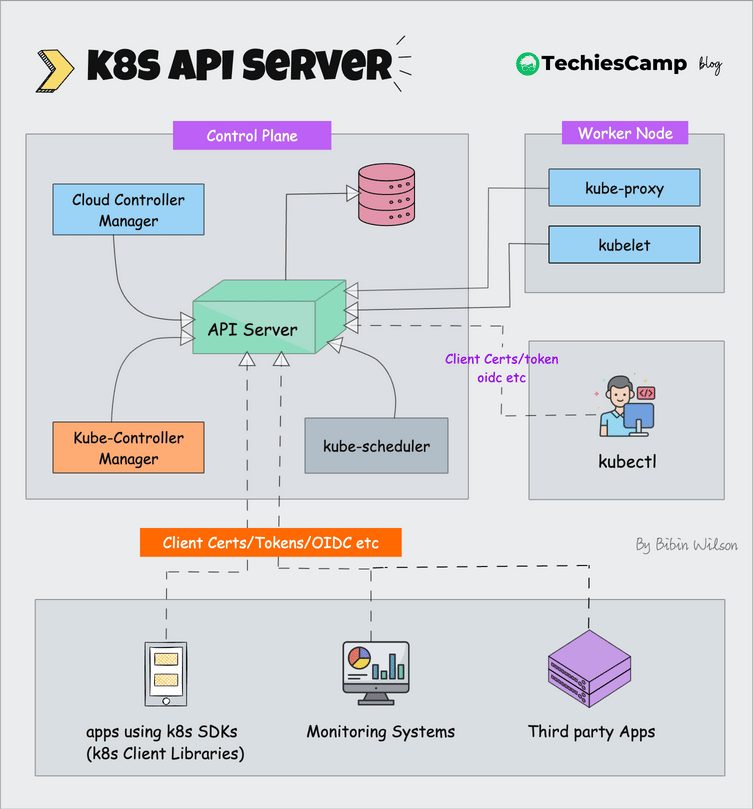

# Les 7: Kubernetes Fundamentals & Theory

## Kubernetes Architectuur Deep Dive


### Control Plane (Master Nodes)

#### **API Server (kube-apiserver)**

```
┌─────────────────┐
│   kubectl       │ ──┐
│   Dashboard     │   │
│   Applications  │   │ HTTPS/REST API
└─────────────────┘   │
                      ▼
┌─────────────────────────────────────┐
│           API Server                │
│  - Authentication & Authorization   │
│  - REST API endpoint                │
│  - Request validation               │
│  - etcd communication               │
└─────────────────────────────────────┘
```



**Functionaliteiten:**

- 🔐 **Authentication**: Wie mag toegang?
- 🛡️ **Authorization**: Wat mag je doen?
- ✅ **Validation**: Is de request geldig?
- 💾 **Persistence**: Schrijf naar etcd

#### **etcd - Cluster Database**

```
┌─────────────────────────────────────┐
│               etcd                  │
│  - Cluster state storage            │
│  - Configuration data               │
│  - Secrets & ConfigMaps             │
│  - Service discovery info           │
└─────────────────────────────────────┘
```

**Wat wordt opgeslagen:**

- Cluster configuratie en status
- Alle Kubernetes objecten (pods, services, etc.)
- Network policies en security policies
- Secrets en configuration data

#### **Scheduler (kube-scheduler)**

```
┌─────────────────────────────────────┐
│            Scheduler                │
│  - Pod placement decisions         │
│  - Resource requirements          │
│  - Node capacity evaluation       │
│  - Affinity/Anti-affinity rules   │
└─────────────────────────────────────┘
                    │
                    ▼
┌─────────────────────────────────────┐
│             Nodes                   │
│  Node 1: 2 CPU, 4GB RAM available │
│  Node 2: 4 CPU, 8GB RAM available │
│  Node 3: 1 CPU, 2GB RAM available │
└─────────────────────────────────────┘
```

#### **Controller Manager (kube-controller-manager)**

```
┌─────────────────────────────────────┐
│        Controller Manager           │
│  ┌─────────────────────────────────┐│
│  │   Deployment Controller         ││
│  │   ReplicaSet Controller         ││
│  │   Node Controller               ││
│  │   Service Controller            ││
│  │   Endpoint Controller           ││
│  └─────────────────────────────────┘│
└─────────────────────────────────────┘
```

### Worker Nodes (Data Plane)

#### **kubelet - Node Agent**

```
┌─────────────────────────────────────┐
│              kubelet                │
│  - Pod lifecycle management         │
│  - Container runtime communication  │
│  - Node status reporting            │
│  - Health checks execution          │
└─────────────────────────────────────┘
                    │
                    ▼
┌─────────────────────────────────────┐
│         Container Runtime           │
│  - Docker/containerd/CRI-O          │
│  - Image pulling & management       │
│  - Container execution              │
└─────────────────────────────────────┘
```

#### **kube-proxy - Network Proxy**

```
┌─────────────────────────────────────┐
│            kube-proxy               │
│  - Service load balancing           │
│  - Network rules management         │
│  - iptables/IPVS configuration      │
│  - ClusterIP implementation         │
└─────────────────────────────────────┘
```

---

## Core Kubernetes Objects

### Pods - Smallest Deployable Unit

#### **Pod Anatomie**

```yaml
apiVersion: v1
kind: Pod
metadata:
  name: nginx-pod
  labels:
    app: nginx
    tier: frontend
  annotations:
    description: "Simple nginx web server"
spec:
  containers:
    - name: nginx
      image: nginx:1.21
      ports:
        - containerPort: 80
          name: http
      resources:
        requests:
          memory: "64Mi"
          cpu: "250m"
        limits:
          memory: "128Mi"
          cpu: "500m"
      env:
        - name: ENV
          value: "production"
        - name: DATABASE_URL
          valueFrom:
            secretKeyRef:
              name: app-secrets
              key: database-url
      volumeMounts:
        - name: config-volume
          mountPath: /etc/nginx/nginx.conf
          subPath: nginx.conf
      livenessProbe:
        httpGet:
          path: /
          port: 80
        initialDelaySeconds: 30
        periodSeconds: 10
      readinessProbe:
        httpGet:
          path: /
          port: 80
        initialDelaySeconds: 5
        periodSeconds: 5
  volumes:
    - name: config-volume
      configMap:
        name: nginx-config
  restartPolicy: Always
  nodeSelector:
    disktype: ssd
```

#### **Multi-Container Pod Example**

```yaml
apiVersion: v1
kind: Pod
metadata:
  name: web-pod
spec:
  containers:
  # Main application container
  - name: web-app
    image: nginx:1.21
    ports:
    - containerPort: 80
    volumeMounts:
    - name: shared-data
      mountPath: /usr/share/nginx/html

  # Sidecar container for log processing
  - name: log-processor
    image: busybox
    command: ["sh", "-c"]
    args:
    - while true; do
        echo "$(date): Processing logs..." >> /shared/logs/app.log;
        sleep 60;
      done
    volumeMounts:
    - name: shared-data
      mountPath: /shared

  # Init container for setup
  initContainers:
  - name: init-setup
    image: busybox
    command: ["sh", "-c"]
    args:
    - echo "Initializing application..." > /shared/logs/init.log
    volumeMounts:
    - name: shared-data
      mountPath: /shared

  volumes:
  - name: shared-data
    emptyDir: {}
```

### Services - Network Abstraction

#### **ClusterIP Service (Default)**

```yaml
apiVersion: v1
kind: Service
metadata:
  name: nginx-clusterip
spec:
  type: ClusterIP # Internal cluster access only
  ports:
    - port: 80 # Service port
      targetPort: 80 # Container port
      protocol: TCP
  selector:
    app: nginx
```

#### **NodePort Service**

```yaml
apiVersion: v1
kind: Service
metadata:
  name: nginx-nodeport
spec:
  type: NodePort
  ports:
    - port: 80
      targetPort: 80
      nodePort: 30080 # External access via <NodeIP>:30080
  selector:
    app: nginx
```

#### **LoadBalancer Service**

```yaml
apiVersion: v1
kind: Service
metadata:
  name: nginx-loadbalancer
spec:
  type: LoadBalancer
  ports:
    - port: 80
      targetPort: 80
  selector:
    app: nginx
  # Cloud provider will provision external load balancer
```

#### **Headless Service**

```yaml
apiVersion: v1
kind: Service
metadata:
  name: nginx-headless
spec:
  clusterIP: None # No cluster IP assigned
  ports:
    - port: 80
  selector:
    app: nginx
# Returns individual Pod IPs instead of service IP
```

### Deployments - Declarative Pod Management

#### **Deployment Anatomie**

```yaml
apiVersion: apps/v1
kind: Deployment
metadata:
  name: nginx-deployment
  labels:
    app: nginx
spec:
  replicas: 3
  selector:
    matchLabels:
      app: nginx
  template:
    metadata:
      labels:
        app: nginx
    spec:
      containers:
        - name: nginx
          image: nginx:1.21
          ports:
            - containerPort: 80
  strategy:
    type: RollingUpdate
    rollingUpdate:
      maxUnavailable: 1
      maxSurge: 1
```

#### **Rolling Update Process**

```
Initial State (3 replicas):
[Pod1] [Pod2] [Pod3]

Rolling Update to new image:
[Pod1] [Pod2] [Pod3] [Pod4-new] ← Start new pod
[Pod1] [Pod2-new] [Pod3] [Pod4-new] ← Replace old pod
[Pod1-new] [Pod2-new] [Pod3] [Pod4-new] ← Replace old pod
[Pod1-new] [Pod2-new] [Pod3-new] ← Final state (remove extra)
```

### ConfigMaps - Configuration Data

#### **ConfigMap Creation**

```yaml
apiVersion: v1
kind: ConfigMap
metadata:
  name: app-config
data:
  # Key-value pairs
  database_host: "mysql.default.svc.cluster.local"
  database_port: "3306"
  log_level: "INFO"

  # File-like keys
  nginx.conf: |
    server {
        listen 80;
        server_name localhost;
        
        location / {
            root /usr/share/nginx/html;
            index index.html;
        }
        
        location /api {
            proxy_pass http://backend:3000;
        }
    }

  application.properties: |
    server.port=8080
    spring.datasource.url=jdbc:mysql://mysql:3306/mydb
    spring.datasource.username=${DB_USER}
    spring.datasource.password=${DB_PASSWORD}
```

#### **ConfigMap Usage in Pod**

```yaml
apiVersion: v1
kind: Pod
metadata:
  name: app-pod
spec:
  containers:
    - name: app
      image: myapp:latest
      # Environment variables from ConfigMap
      envFrom:
        - configMapRef:
            name: app-config
      # Specific environment variables
      env:
        - name: DATABASE_HOST
          valueFrom:
            configMapKeyRef:
              name: app-config
              key: database_host
      # Mount as files
      volumeMounts:
        - name: config-volume
          mountPath: /etc/nginx
        - name: app-config-volume
          mountPath: /app/config
  volumes:
    - name: config-volume
      configMap:
        name: app-config
        items:
          - key: nginx.conf
            path: nginx.conf
    - name: app-config-volume
      configMap:
        name: app-config
        items:
          - key: application.properties
            path: application.properties
```

### Secrets - Sensitive Data

#### **Secret Types**

```yaml
# Generic Secret
apiVersion: v1
kind: Secret
metadata:
  name: app-secrets
type: Opaque
data:
  username: YWRtaW4= # base64 encoded 'admin'
  password: MWYyZDFlMmU= # base64 encoded '1f2d1e2e'

---
# TLS Secret
apiVersion: v1
kind: Secret
metadata:
  name: tls-secret
type: kubernetes.io/tls
data:
  tls.crt: LS0tLS1CRUdJTi... # base64 encoded certificate
  tls.key: LS0tLS1CRUdJTi... # base64 encoded private key

---
# Docker Registry Secret
apiVersion: v1
kind: Secret
metadata:
  name: docker-registry-secret
type: kubernetes.io/dockerconfigjson
data:
  .dockerconfigjson: eyJhdXRocyI... # base64 encoded docker config
```

#### **Secret Usage**

```yaml
apiVersion: v1
kind: Pod
metadata:
  name: secret-test-pod
spec:
  containers:
    - name: app
      image: myapp:latest
      env:
        # Single secret value
        - name: DB_PASSWORD
          valueFrom:
            secretKeyRef:
              name: app-secrets
              key: password
      # All secret values as env vars
      envFrom:
        - secretRef:
            name: app-secrets
      # Mount secrets as files
      volumeMounts:
        - name: secret-volume
          mountPath: /etc/secrets
          readOnly: true
  volumes:
    - name: secret-volume
      secret:
        secretName: app-secrets
  # Use docker registry secret
  imagePullSecrets:
    - name: docker-registry-secret
```

### Namespaces - Resource Isolation

#### **Namespace Creation**

```yaml
apiVersion: v1
kind: Namespace
metadata:
  name: development
  labels:
    name: development
    environment: dev
---
apiVersion: v1
kind: Namespace
metadata:
  name: production
  labels:
    name: production
    environment: prod
```

#### **Resource Quotas per Namespace**

```yaml
apiVersion: v1
kind: ResourceQuota
metadata:
  name: dev-quota
  namespace: development
spec:
  hard:
    requests.cpu: "4"
    requests.memory: 8Gi
    limits.cpu: "8"
    limits.memory: 16Gi
    pods: "10"
    persistentvolumeclaims: "4"
    services: "5"
    secrets: "10"
    configmaps: "10"
```

---

## Labels en Selectors

### Label Strategy

#### **Recommended Labels**

```yaml
metadata:
  labels:
    # Application identification
    app.kubernetes.io/name: nginx
    app.kubernetes.io/instance: nginx-prod
    app.kubernetes.io/version: "1.21"
    app.kubernetes.io/component: web-server
    app.kubernetes.io/part-of: ecommerce-platform
    app.kubernetes.io/managed-by: helm

    # Environment and tier
    environment: production
    tier: frontend

    # Custom business labels
    team: platform
    cost-center: engineering
    backup-policy: daily
```

#### **Selector Examples**

```bash
# Get pods by single label
kubectl get pods -l app=nginx

# Multiple labels (AND)
kubectl get pods -l app=nginx,environment=production

# Set-based selectors
kubectl get pods -l 'environment in (production,staging)'
kubectl get pods -l 'tier notin (database)'
kubectl get pods -l version

# Label nodes for scheduling
kubectl label nodes node-1 disktype=ssd
kubectl label nodes node-2 instance-type=memory-optimized
```

### Advanced Selectors

```yaml
# In Deployment
spec:
  selector:
    matchLabels:
      app: nginx
    matchExpressions:
      - key: tier
        operator: In
        values: ["frontend", "web"]
      - key: environment
        operator: NotIn
        values: ["development"]
```

---

## Three-Tier Application Deployment

### Complete E-commerce Platform

#### **Tier 1: Frontend (React/Nginx)**

```yaml
# frontend-configmap.yaml
apiVersion: v1
kind: ConfigMap
metadata:
  name: frontend-config
  namespace: ecommerce
data:
  nginx.conf: |
    server {
        listen 80;
        server_name localhost;
        
        # Serve React static files
        location / {
            root /usr/share/nginx/html;
            try_files $uri $uri/ /index.html;
        }
        
        # Proxy API calls to backend
        location /api/ {
            proxy_pass http://backend:3000/;
            proxy_set_header Host $host;
            proxy_set_header X-Real-IP $remote_addr;
        }
        
        # Health check endpoint
        location /health {
            access_log off;
            return 200 "healthy\n";
            add_header Content-Type text/plain;
        }
    }

---
# frontend-deployment.yaml
apiVersion: apps/v1
kind: Deployment
metadata:
  name: frontend
  namespace: ecommerce
  labels:
    app.kubernetes.io/name: frontend
    app.kubernetes.io/component: web
    tier: frontend
spec:
  replicas: 3
  selector:
    matchLabels:
      app: frontend
  template:
    metadata:
      labels:
        app: frontend
        tier: frontend
    spec:
      containers:
        - name: nginx
          image: nginx:1.21-alpine
          ports:
            - containerPort: 80
          volumeMounts:
            - name: nginx-config
              mountPath: /etc/nginx/conf.d
            - name: static-content
              mountPath: /usr/share/nginx/html
          resources:
            requests:
              memory: "64Mi"
              cpu: "100m"
            limits:
              memory: "128Mi"
              cpu: "200m"
          livenessProbe:
            httpGet:
              path: /health
              port: 80
            initialDelaySeconds: 30
            periodSeconds: 10
          readinessProbe:
            httpGet:
              path: /health
              port: 80
            initialDelaySeconds: 5
            periodSeconds: 5
      # Init container to fetch static content
      initContainers:
        - name: content-fetcher
          image: busybox:1.35
          command: ["sh", "-c"]
          args:
            - |
              echo "<!DOCTYPE html>
              <html><head><title>E-commerce Frontend</title></head>
              <body><h1>Welcome to our E-commerce Platform</h1>
              <p>Frontend is running successfully!</p></body></html>" > /static/index.html
          volumeMounts:
            - name: static-content
              mountPath: /static
      volumes:
        - name: nginx-config
          configMap:
            name: frontend-config
        - name: static-content
          emptyDir: {}

---
# frontend-service.yaml
apiVersion: v1
kind: Service
metadata:
  name: frontend
  namespace: ecommerce
  labels:
    app: frontend
spec:
  type: LoadBalancer
  ports:
    - port: 80
      targetPort: 80
      name: http
  selector:
    app: frontend
```

#### **Tier 2: Backend (Node.js API)**

```yaml
# backend-secrets.yaml
apiVersion: v1
kind: Secret
metadata:
  name: backend-secrets
  namespace: ecommerce
type: Opaque
data:
  database-url: bW9uZ29kYjovL21vbmdvZGI6MjcwMTcvZWNvbW1lcmNl # mongodb://mongodb:27017/ecommerce
  jwt-secret: bXlfc3VwZXJfc2VjcmV0X2p3dF9rZXkxMjM= # my_super_secret_jwt_key123
  redis-url: cmVkaXM6Ly9yZWRpczozNjM3 # redis://redis:6379

---
# backend-configmap.yaml
apiVersion: v1
kind: ConfigMap
metadata:
  name: backend-config
  namespace: ecommerce
data:
  NODE_ENV: "production"
  LOG_LEVEL: "info"
  PORT: "3000"
  CORS_ORIGIN: "http://frontend"

---
# backend-deployment.yaml
apiVersion: apps/v1
kind: Deployment
metadata:
  name: backend
  namespace: ecommerce
  labels:
    app.kubernetes.io/name: backend
    app.kubernetes.io/component: api
    tier: backend
spec:
  replicas: 2
  selector:
    matchLabels:
      app: backend
  template:
    metadata:
      labels:
        app: backend
        tier: backend
    spec:
      containers:
        - name: api
          image: node:18-alpine
          command: ["sh", "-c"]
          args:
            - |
              cat > /app/server.js << 'EOF'
              const express = require('express');
              const app = express();
              const port = process.env.PORT || 3000;

              app.use(express.json());

              // Health check
              app.get('/health', (req, res) => {
                res.json({ status: 'healthy', timestamp: new Date().toISOString() });
              });

              // API routes
              app.get('/products', (req, res) => {
                res.json([
                  { id: 1, name: 'Product 1', price: 29.99 },
                  { id: 2, name: 'Product 2', price: 39.99 }
                ]);
              });

              app.get('/users', (req, res) => {
                res.json({ message: 'Users endpoint', database: process.env.DATABASE_URL });
              });

              app.listen(port, () => {
                console.log(`Backend API running on port ${port}`);
              });
              EOF

              cd /app && npm init -y && npm install express
              node server.js
          ports:
            - containerPort: 3000
          env:
            - name: DATABASE_URL
              valueFrom:
                secretKeyRef:
                  name: backend-secrets
                  key: database-url
            - name: JWT_SECRET
              valueFrom:
                secretKeyRef:
                  name: backend-secrets
                  key: jwt-secret
          envFrom:
            - configMapRef:
                name: backend-config
          resources:
            requests:
              memory: "128Mi"
              cpu: "200m"
            limits:
              memory: "256Mi"
              cpu: "500m"
          livenessProbe:
            httpGet:
              path: /health
              port: 3000
            initialDelaySeconds: 30
            periodSeconds: 10
          readinessProbe:
            httpGet:
              path: /health
              port: 3000
            initialDelaySeconds: 5
            periodSeconds: 5

---
# backend-service.yaml
apiVersion: v1
kind: Service
metadata:
  name: backend
  namespace: ecommerce
  labels:
    app: backend
spec:
  ports:
    - port: 3000
      targetPort: 3000
      name: http
  selector:
    app: backend
```

#### **Tier 3: Database (MongoDB)**

```yaml
# mongodb-pvc.yaml
apiVersion: v1
kind: PersistentVolumeClaim
metadata:
  name: mongodb-pvc
  namespace: ecommerce
spec:
  accessModes:
    - ReadWriteOnce
  resources:
    requests:
      storage: 10Gi

---
# mongodb-deployment.yaml
apiVersion: apps/v1
kind: Deployment
metadata:
  name: mongodb
  namespace: ecommerce
  labels:
    app.kubernetes.io/name: mongodb
    app.kubernetes.io/component: database
    tier: database
spec:
  replicas: 1
  selector:
    matchLabels:
      app: mongodb
  template:
    metadata:
      labels:
        app: mongodb
        tier: database
    spec:
      containers:
        - name: mongodb
          image: mongo:5.0
          ports:
            - containerPort: 27017
          env:
            - name: MONGO_INITDB_ROOT_USERNAME
              value: "admin"
            - name: MONGO_INITDB_ROOT_PASSWORD
              value: "password123"
            - name: MONGO_INITDB_DATABASE
              value: "ecommerce"
          volumeMounts:
            - name: mongodb-storage
              mountPath: /data/db
            - name: mongodb-init
              mountPath: /docker-entrypoint-initdb.d
          resources:
            requests:
              memory: "256Mi"
              cpu: "200m"
            limits:
              memory: "512Mi"
              cpu: "500m"
          livenessProbe:
            exec:
              command:
                - mongo
                - --eval
                - "db.adminCommand('ping')"
            initialDelaySeconds: 30
            periodSeconds: 10
          readinessProbe:
            exec:
              command:
                - mongo
                - --eval
                - "db.adminCommand('ping')"
            initialDelaySeconds: 5
            periodSeconds: 5
      volumes:
        - name: mongodb-storage
          persistentVolumeClaim:
            claimName: mongodb-pvc
        - name: mongodb-init
          configMap:
            name: mongodb-init-scripts

---
# mongodb-init-configmap.yaml
apiVersion: v1
kind: ConfigMap
metadata:
  name: mongodb-init-scripts
  namespace: ecommerce
data:
  init.js: |
    db = db.getSiblingDB('ecommerce');

    // Create collections
    db.createCollection('products');
    db.createCollection('users');
    db.createCollection('orders');

    // Insert sample data
    db.products.insertMany([
      { name: 'Laptop', price: 999.99, category: 'Electronics', stock: 50 },
      { name: 'Phone', price: 599.99, category: 'Electronics', stock: 100 },
      { name: 'Book', price: 19.99, category: 'Books', stock: 200 }
    ]);

    db.users.insertMany([
      { username: 'admin', email: 'admin@example.com', role: 'admin' },
      { username: 'user1', email: 'user1@example.com', role: 'customer' }
    ]);

    print('Database initialized successfully');

---
# mongodb-service.yaml
apiVersion: v1
kind: Service
metadata:
  name: mongodb
  namespace: ecommerce
  labels:
    app: mongodb
spec:
  ports:
    - port: 27017
      targetPort: 27017
      name: mongodb
  selector:
    app: mongodb
  clusterIP: None # Headless service
```

### Deployment Script

```bash
#!/bin/bash
# deploy-ecommerce.sh

echo "🚀 Deploying E-commerce Platform..."

# Create namespace
kubectl create namespace ecommerce

# Deploy Tier 3: Database
echo "📊 Deploying MongoDB (Database Tier)..."
kubectl apply -f mongodb-pvc.yaml
kubectl apply -f mongodb-init-configmap.yaml
kubectl apply -f mongodb-deployment.yaml
kubectl apply -f mongodb-service.yaml

# Wait for MongoDB to be ready
echo "⏳ Waiting for MongoDB to be ready..."
kubectl wait --for=condition=ready pod -l app=mongodb -n ecommerce --timeout=300s

# Deploy Tier 2: Backend
echo "🔧 Deploying Backend API..."
kubectl apply -f backend-secrets.yaml
kubectl apply -f backend-configmap.yaml
kubectl apply -f backend-deployment.yaml
kubectl apply -f backend-service.yaml

# Wait for Backend to be ready
echo "⏳ Waiting for Backend to be ready..."
kubectl wait --for=condition=ready pod -l app=backend -n ecommerce --timeout=300s

# Deploy Tier 1: Frontend
echo "🌐 Deploying Frontend..."
kubectl apply -f frontend-configmap.yaml
kubectl apply -f frontend-deployment.yaml
kubectl apply -f frontend-service.yaml

# Wait for Frontend to be ready
echo "⏳ Waiting for Frontend to be ready..."
kubectl wait --for=condition=ready pod -l app=frontend -n ecommerce --timeout=300s

# Get external IP
echo "🎉 Deployment complete!"
echo "Frontend URL:"
kubectl get svc frontend -n ecommerce -o jsonpath='{.status.loadBalancer.ingress[0].ip}'
echo ""

# Show all resources
echo "📋 All resources:"
kubectl get all -n ecommerce
```

---

## Testing en Validation

### Connectivity Tests

```bash
# Test database connectivity
kubectl exec -it deployment/backend -n ecommerce -- sh -c "
  wget -qO- http://mongodb:27017 || echo 'MongoDB connection test'
"

# Test backend API
kubectl exec -it deployment/frontend -n ecommerce -- sh -c "
  wget -qO- http://backend:3000/health
"

# Test frontend
FRONTEND_IP=$(kubectl get svc frontend -n ecommerce -o jsonpath='{.status.loadBalancer.ingress[0].ip}')
curl http://$FRONTEND_IP/health
```

### Service Discovery Verification

```bash
# DNS resolution tests
kubectl exec -it deployment/backend -n ecommerce -- nslookup mongodb
kubectl exec -it deployment/frontend -n ecommerce -- nslookup backend

# Service endpoint verification
kubectl get endpoints -n ecommerce
```

---

## Monitoring en Troubleshooting

### Resource Monitoring

```bash
# Resource usage per namespace
kubectl top pods -n ecommerce
kubectl top nodes

# Describe problematic pods
kubectl describe pod <pod-name> -n ecommerce

# Check events
kubectl get events -n ecommerce --sort-by=.metadata.creationTimestamp
```

### Log Analysis

```bash
# Application logs
kubectl logs -f deployment/frontend -n ecommerce
kubectl logs -f deployment/backend -n ecommerce
kubectl logs -f deployment/mongodb -n ecommerce

# Previous container logs (if crashed)
kubectl logs deployment/backend -n ecommerce --previous
```

### Network Troubleshooting

```bash
# Test pod-to-pod connectivity
kubectl exec -it deployment/frontend -n ecommerce -- nc -zv backend 3000
kubectl exec -it deployment/backend -n ecommerce -- nc -zv mongodb 27017

# Check service endpoints
kubectl get svc -n ecommerce -o wide
kubectl get endpoints -n ecommerce
```

---

## Samenvatting

### Kernconcepten Geleerd:

✅ **Kubernetes Architectuur** - Control plane en worker nodes  
✅ **Pod Lifecycle** - Van creation tot termination  
✅ **Service Discovery** - DNS-based service resolution  
✅ **Configuration Management** - ConfigMaps en Secrets  
✅ **Multi-tier Deployment** - Complete applicatie stack  
✅ **Resource Management** - Requests, limits, quotas  
✅ **Health Checking** - Liveness en readiness probes  
✅ **Storage** - PersistentVolumes en PersistentVolumeClaims

### Volgende Stappen:

In **Les 8** gaan we lokale development:

- Minikube setup en configuratie
- Development workflows
- Hot reloading en debugging
- Advanced troubleshooting technieken

### Best Practices:

- ✅ Gebruik labels consistent voor resource management
- ✅ Implement proper health checks
- ✅ Set resource limits om cluster stability te garanderen
- ✅ Use ConfigMaps voor configuration en Secrets voor gevoelige data
- ✅ Namespace isolation voor verschillende environments
- ✅ Monitor logs en metrics voor operational visibility
