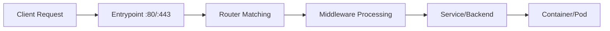

# Traefik: Moderne Reverse Proxy en Load Balancer

## Inleiding: Waarom Traefik?

### Het probleem met traditionele reverse proxies

**Traditionele aanpak met Nginx:**
```nginx
# nginx.conf - handmatige configuratie voor elke service
upstream backend1 {
    server 192.168.1.10:3000;
    server 192.168.1.11:3000;
}

upstream backend2 {
    server 192.168.1.20:4000;
}

server {
    listen 80;
    server_name api.example.com;
    
    location / {
        proxy_pass http://backend1;
    }
}

server {
    listen 80;
    server_name admin.example.com;
    
    location / {
        proxy_pass http://backend2;
    }
}
```

**Problemen:**
- ❌ **Handmatige configuratie** voor elke nieuwe service
- ❌ **Nginx reload** nodig bij wijzigingen
- ❌ **Geen auto-discovery** van nieuwe services
- ❌ **Complexe SSL-configuratie** per domein
- ❌ **Statische configuratie** die niet mee-evolueert

### Traefik: De moderne oplossing

**Wat is Traefik?**
- **Cloud-native reverse proxy** en load balancer
- **Automatische service discovery** via Docker labels, Kubernetes annotations, etc.
- **Dynamic configuration** zonder restarts
- **Built-in SSL/TLS** met automatische Let's Encrypt certificaten
- **Real-time dashboard** voor monitoring

**Voordelen van Traefik:**
- ✅ **Zero-downtime deployments**
- ✅ **Automatische configuratie** via service labels
- ✅ **HTTP/2 en gRPC support**
- ✅ **Middleware systeem** voor authentication, rate limiting, etc.
- ✅ **Multi-provider support** (Docker, Kubernetes, Consul, etc.)

## Traefik Architectuur

### Core Concepten

#### 1. **Providers**
Traefik ontdekt services via verschillende providers:

```yaml
# traefik.yml
providers:
  docker:
    exposedByDefault: false  # Alleen services met labels exposen
  kubernetes: {}
  file:
    directory: /etc/traefik/dynamic
    watch: true
```

#### 2. **Entrypoints**
Poorten waarop Traefik luistert:

```yaml
entryPoints:
  web:
    address: ":80"      # HTTP verkeer
  websecure:
    address: ":443"     # HTTPS verkeer
  admin:
    address: ":8080"    # Dashboard
```

#### 3. **Routers**
Definiëren welk verkeer naar welke service gaat:

```yaml
# Via Docker labels
labels:
  - "traefik.http.routers.webapp.rule=Host(`app.example.com`)"
  - "traefik.http.routers.webapp.entrypoints=websecure"
```

#### 4. **Services**
Backend servers die het verkeer afhandelen:

```yaml
labels:
  - "traefik.http.services.webapp.loadbalancer.server.port=3000"
```

#### 5. **Middleware**
Verwerking van requests voor ze naar de backend gaan:

```yaml
labels:
  - "traefik.http.middlewares.auth.basicauth.users=admin:$$2y$$10$$..."
  - "traefik.http.routers.webapp.middlewares=auth"
```

### Traefik Data Flow



## Praktische Implementatie

### Stap 1: Basisconfiguratie

**Directory structuur:**
```
traefik-setup/
├── docker-compose.yml
├── traefik.yml
├── acme.json              # SSL certificaten storage
└── apps/
    ├── webapp1/
    │   └── docker-compose.yml
    └── webapp2/
        └── docker-compose.yml
```

**Traefik hoofdconfiguratie (`traefik.yml`):**
```yaml
# Global configuratie
global:
  checkNewVersion: false
  sendAnonymousUsage: false

# API en Dashboard (alleen voor development!)
api:
  dashboard: true
  insecure: true  # ⚠️  Alleen voor development

# Entrypoints
entryPoints:
  web:
    address: ":80"
    # Automatisch redirect naar HTTPS
    http:
      redirections:
        entryPoint:
          to: websecure
          scheme: https
          permanent: true
  websecure:
    address: ":443"

# SSL Certificaten met Let's Encrypt
certificatesResolvers:
  letsencrypt:
    acme:
      email: jouw-email@example.com
      storage: /certificates/acme.json
      httpChallenge:
        entryPoint: web
  
  # Voor testing met staging certificaten
  letsencrypt-staging:
    acme:
      email: jouw-email@example.com
      storage: /certificates/acme-staging.json
      caServer: "https://acme-staging-v02.api.letsencrypt.org/directory"
      httpChallenge:
        entryPoint: web

# Providers
providers:
  docker:
    exposedByDefault: false  # Veiliger: alleen expliciet gemarkeerde services
    network: traefik-public  # Netwerk voor Traefik communicatie
  file:
    directory: /etc/traefik/dynamic
    watch: true

# Security: TLS configuratie
tls:
  options:
    default:
      minVersion: "VersionTLS12"
      cipherSuites:
        - "TLS_ECDHE_RSA_WITH_AES_128_GCM_SHA256"
        - "TLS_ECDHE_RSA_WITH_AES_256_GCM_SHA384"
```

### Stap 2: Traefik Container Setup

**Main docker-compose.yml:**
```yaml
version: '3.8'

services:
  traefik:
    image: traefik:v3.0
    container_name: traefik
    restart: unless-stopped
    
    # Poorten
    ports:
      - "80:80"       # HTTP
      - "443:443"     # HTTPS
      - "8080:8080"   # Dashboard (alleen development)
    
    # Volumes
    volumes:
      - ./traefik.yml:/etc/traefik/traefik.yml:ro
      - ./certificates:/certificates
      - /var/run/docker.sock:/var/run/docker.sock:ro  # Docker API toegang
    
    # Netwerk
    networks:
      - traefik-public
    
    # Environment variabelen (indien nodig voor DNS challenge)
    environment:
      - CF_DNS_API_TOKEN=${CLOUDFLARE_API_TOKEN}  # Voor Cloudflare DNS
    
    # Labels voor dashboard
    labels:
      - "traefik.enable=true"
      - "traefik.http.routers.dashboard.rule=Host(`traefik.localhost`)"
      - "traefik.http.routers.dashboard.tls=true"
      - "traefik.http.routers.dashboard.tls.certresolver=letsencrypt"

networks:
  traefik-public:
    external: true
```

### Stap 3: Services configureren

**Voorbeeld: Web applicatie (`apps/webapp1/docker-compose.yml`):**
```yaml
version: '3.8'

services:
  webapp:
    image: nginx:alpine
    container_name: webapp1
    restart: unless-stopped
    
    # Traefik labels voor automatische configuratie
    labels:
      # Enable Traefik
      - "traefik.enable=true"
      
      # HTTP Router (wordt automatisch geredirect naar HTTPS)
      - "traefik.http.routers.webapp1-http.rule=Host(`webapp1.example.com`)"
      - "traefik.http.routers.webapp1-http.entrypoints=web"
      
      # HTTPS Router
      - "traefik.http.routers.webapp1.rule=Host(`webapp1.example.com`)"
      - "traefik.http.routers.webapp1.entrypoints=websecure"
      - "traefik.http.routers.webapp1.tls=true"
      - "traefik.http.routers.webapp1.tls.certresolver=letsencrypt"
      
      # Service configuratie
      - "traefik.http.services.webapp1.loadbalancer.server.port=80"
      
      # Middleware toevoegen
      - "traefik.http.middlewares.webapp1-headers.headers.customrequestheaders.X-Forwarded-Proto=https"
      - "traefik.http.routers.webapp1.middlewares=webapp1-headers"
    
    # Volume voor content
    volumes:
      - ./html:/usr/share/nginx/html:ro
    
    # Netwerk
    networks:
      - traefik-public

networks:
  traefik-public:
    external: true
```

### Stap 4: Multi-service setup

**API Backend met database (`apps/api/docker-compose.yml`):**
```yaml
version: '3.8'

services:
  api:
    image: node:18-alpine
    container_name: api-backend
    restart: unless-stopped
    working_dir: /app
    command: npm start
    
    # Environment
    environment:
      - NODE_ENV=production
      - DATABASE_URL=mongodb://database:27017/myapp
    
    # Volumes
    volumes:
      - ./src:/app
    
    # Traefik labels
    labels:
      - "traefik.enable=true"
      
      # API routes
      - "traefik.http.routers.api.rule=Host(`api.example.com`)"
      - "traefik.http.routers.api.entrypoints=websecure"
      - "traefik.http.routers.api.tls=true"
      - "traefik.http.routers.api.tls.certresolver=letsencrypt"
      
      # Service configuratie
      - "traefik.http.services.api.loadbalancer.server.port=3000"
      
      # CORS middleware
      - "traefik.http.middlewares.api-cors.headers.accesscontrolallowmethods=GET,POST,PUT,DELETE,OPTIONS"
      - "traefik.http.middlewares.api-cors.headers.accesscontrolalloworigin=*"
      - "traefik.http.middlewares.api-cors.headers.accesscontrolmaxage=86400"
      - "traefik.http.routers.api.middlewares=api-cors"
    
    # Netwerken
    networks:
      - traefik-public
      - backend
    
    # Dependencies
    depends_on:
      - database

  database:
    image: mongo:6
    container_name: api-database
    restart: unless-stopped
    
    # Data persistence
    volumes:
      - mongodb_data:/data/db
    
    # Alleen backend netwerk (niet publiek toegankelijk)
    networks:
      - backend

volumes:
  mongodb_data:

networks:
  traefik-public:
    external: true
  backend:
    internal: true  # Alleen interne communicatie
```

## Geavanceerde Configuraties

### Load Balancing

**Round-robin met health checks:**
```yaml
services:
  webapp-1:
    image: myapp:latest
    labels:
      - "traefik.enable=true"
      - "traefik.http.routers.webapp.rule=Host(`app.example.com`)"
      - "traefik.http.services.webapp.loadbalancer.server.port=3000"
      - "traefik.http.services.webapp.loadbalancer.healthcheck.path=/health"
      - "traefik.http.services.webapp.loadbalancer.healthcheck.interval=30s"
    networks:
      - traefik-public

  webapp-2:
    image: myapp:latest
    labels:
      - "traefik.enable=true"
      - "traefik.http.routers.webapp.rule=Host(`app.example.com`)"
      - "traefik.http.services.webapp.loadbalancer.server.port=3000"
    networks:
      - traefik-public
```

### Path-based Routing

**Verschillende services op hetzelfde domein:**
```yaml
# Frontend app
labels:
  - "traefik.http.routers.frontend.rule=Host(`example.com`) && PathPrefix(`/`)"
  - "traefik.http.routers.frontend.priority=1"  # Lagere prioriteit

# API service
labels:
  - "traefik.http.routers.api.rule=Host(`example.com`) && PathPrefix(`/api`)"
  - "traefik.http.routers.api.priority=10"  # Hogere prioriteit
  - "traefik.http.middlewares.api-stripprefix.stripprefix.prefixes=/api"
  - "traefik.http.routers.api.middlewares=api-stripprefix"

# Admin panel
labels:
  - "traefik.http.routers.admin.rule=Host(`example.com`) && PathPrefix(`/admin`)"
  - "traefik.http.routers.admin.priority=5"
```

### Middleware Configuraties

**Authentication middleware:**
```yaml
# Basic Auth
labels:
  - "traefik.http.middlewares.auth.basicauth.users=admin:$$2y$$10$$hash..."
  - "traefik.http.routers.admin.middlewares=auth"

# Rate limiting
labels:
  - "traefik.http.middlewares.ratelimit.ratelimit.burst=10"
  - "traefik.http.middlewares.ratelimit.ratelimit.average=5"
  - "traefik.http.routers.api.middlewares=ratelimit"

# IP whitelist
labels:
  - "traefik.http.middlewares.ipwhitelist.ipwhitelist.sourcerange=192.168.1.0/24,10.0.0.0/8"
  - "traefik.http.routers.admin.middlewares=ipwhitelist"
```

**Custom headers middleware:**
```yaml
labels:
  # Security headers
  - "traefik.http.middlewares.security-headers.headers.customrequestheaders.X-Forwarded-Proto=https"
  - "traefik.http.middlewares.security-headers.headers.customresponseheaders.X-Content-Type-Options=nosniff"
  - "traefik.http.middlewares.security-headers.headers.customresponseheaders.X-Frame-Options=DENY"
  - "traefik.http.middlewares.security-headers.headers.customresponseheaders.X-XSS-Protection=1; mode=block"
  - "traefik.http.middlewares.security-headers.headers.customresponseheaders.Strict-Transport-Security=max-age=31536000; includeSubDomains"
  
  # Toepassen op router
  - "traefik.http.routers.webapp.middlewares=security-headers"
```

## SSL/TLS Certificaten

### Let's Encrypt HTTP Challenge

**Automatische certificaten met HTTP challenge:**
```yaml
# traefik.yml
certificatesResolvers:
  letsencrypt:
    acme:
      email: admin@example.com
      storage: /certificates/acme.json
      httpChallenge:
        entryPoint: web  # Port 80 moet publiek toegankelijk zijn

# Docker service labels
labels:
  - "traefik.http.routers.webapp.tls.certresolver=letsencrypt"
  - "traefik.http.routers.webapp.tls.domains[0].main=example.com"
  - "traefik.http.routers.webapp.tls.domains[0].sans=www.example.com,api.example.com"
```

### DNS Challenge (Aanbevolen voor wildcard certificaten)

**Cloudflare DNS challenge:**
```yaml
# traefik.yml
certificatesResolvers:
  cloudflare:
    acme:
      email: admin@example.com
      storage: /certificates/acme.json
      dnsChallenge:
        provider: cloudflare
        resolvers:
          - "1.1.1.1:53"
          - "8.8.8.8:53"

# docker-compose.yml
environment:
  - CF_DNS_API_TOKEN=your-cloudflare-api-token

# Service labels voor wildcard certificaat
labels:
  - "traefik.http.routers.webapp.tls.certresolver=cloudflare"
  - "traefik.http.routers.webapp.tls.domains[0].main=example.com"
  - "traefik.http.routers.webapp.tls.domains[0].sans=*.example.com"
```

### Custom SSL Certificaten

**Eigen certificaten gebruiken:**
```yaml
# traefik.yml
tls:
  stores:
    default:
      defaultCertificate:
        certFile: /certificates/cert.pem
        keyFile: /certificates/key.pem

# Of per domein
tls:
  certificates:
    - certFile: /certificates/example.com.crt
      keyFile: /certificates/example.com.key
      stores:
        - default
```

## Monitoring en Debugging

### Dashboard en API

**Dashboard toegang:**
```bash
# Lokaal development
http://localhost:8080

# Productie met authenticatie
labels:
  - "traefik.http.routers.dashboard.rule=Host(`traefik.example.com`)"
  - "traefik.http.routers.dashboard.service=api@internal"
  - "traefik.http.routers.dashboard.middlewares=auth"
```

**API endpoints:**
```bash
# Service status
curl http://localhost:8080/api/http/services

# Routers configuratie
curl http://localhost:8080/api/http/routers

# Middleware configuratie
curl http://localhost:8080/api/http/middlewares

# Health check
curl http://localhost:8080/ping
```

### Logging

**Uitgebreide logging configuratie:**
```yaml
# traefik.yml
log:
  level: INFO  # DEBUG, INFO, WARN, ERROR
  format: json
  filePath: /var/log/traefik/traefik.log

accessLog:
  format: json
  filePath: /var/log/traefik/access.log
  filters:
    statusCodes: ["400-499", "500-599"]  # Alleen errors loggen
  fields:
    headers:
      defaultMode: keep
      names:
        User-Agent: redact  # Sensitieve data verbergen
```

**Docker logging:**
```yaml
# docker-compose.yml
services:
  traefik:
    logging:
      driver: "json-file"
      options:
        max-size: "10m"
        max-file: "3"
```

### Troubleshooting

**Veelvoorkomende problemen:**

1. **Service niet bereikbaar:**
```bash
# Check of Traefik de service ziet
docker logs traefik 2>&1 | grep "service-name"

# Check netwerk connectiviteit
docker exec traefik ping service-container-name

# Verify labels
docker inspect container-name | jq '.[0].Config.Labels'
```

2. **SSL certificaat problemen:**
```bash
# Check certificaat status
curl -I https://example.com

# Let's Encrypt logs
docker logs traefik 2>&1 | grep -i acme

# Certificaat details
openssl s_client -connect example.com:443 -servername example.com
```

3. **Routing problemen:**
```bash
# Test routing rules
curl -H "Host: example.com" http://localhost/

# Check router prioriteit
curl http://localhost:8080/api/http/routers | jq '.[] | {name: .name, rule: .rule, priority: .priority}'
```

## Productie Deployment

### Security Best Practices

**1. Dashboard beveiliging:**
```yaml
# Productie: dashboard uitschakelen of beveiligen
api:
  dashboard: true
  insecure: false  # Dashboard alleen via HTTPS

# Met authenticatie
labels:
  - "traefik.http.routers.dashboard.rule=Host(`traefik.internal.com`)"
  - "traefik.http.routers.dashboard.service=api@internal"
  - "traefik.http.routers.dashboard.middlewares=auth"
  - "traefik.http.middlewares.auth.basicauth.users=admin:$$2y$$10$$..."
```

**2. Netwerk isolatie:**
```yaml
# Gescheiden netwerken
networks:
  traefik-public:
    external: true
  backend:
    internal: true    # Geen internet toegang
  database:
    internal: true    # Database isolatie
```

**3. Resource limits:**
```yaml
# docker-compose.yml
services:
  traefik:
    deploy:
      resources:
        limits:
          memory: 512M
          cpus: '0.5'
        reservations:
          memory: 256M
          cpus: '0.25'
```

### High Availability Setup

**Multiple Traefik instances:**
```yaml
# traefik-cluster/docker-compose.yml
version: '3.8'

services:
  traefik-1:
    image: traefik:v3.0
    hostname: traefik-1
    deploy:
      placement:
        constraints: [node.role == manager]
    volumes:
      - traefik-ssl:/certificates
    ports:
      - target: 80
        published: 80
        mode: host
      - target: 443
        published: 443
        mode: host
    networks:
      - traefik-public

  traefik-2:
    image: traefik:v3.0
    hostname: traefik-2
    deploy:
      placement:
        constraints: [node.role == worker]
    volumes:
      - traefik-ssl:/certificates
    networks:
      - traefik-public

volumes:
  traefik-ssl:
    driver: nfs  # Shared storage voor certificaten

networks:
  traefik-public:
    driver: overlay
    attachable: true
```

### Backup en Disaster Recovery

**Certificaten backup:**
```bash
#!/bin/bash
# backup-certs.sh

# Backup acme.json
cp /certificates/acme.json /backup/acme.json.$(date +%Y%m%d)

# Sync naar remote storage
rsync -av /backup/ backup-server:/backups/traefik/

# Cleanup oude backups (30 dagen)
find /backup -name "acme.json.*" -mtime +30 -delete
```

**Configuratie backup:**
```bash
#!/bin/bash
# backup-config.sh

# Docker compose files
tar -czf /backup/traefik-config-$(date +%Y%m%d).tar.gz \
  /opt/traefik/docker-compose.yml \
  /opt/traefik/traefik.yml \
  /opt/traefik/dynamic/
```

## Vergelijking met Alternatieven

### Traefik vs. Nginx

| Feature | Traefik | Nginx |
|---------|---------|--------|
| Auto-discovery | ✅ Automatisch | ❌ Handmatig |
| Dynamic config | ✅ Real-time | ❌ Reload nodig |
| SSL automation | ✅ Let's Encrypt | ⚠️ Externe tools |
| Dashboard | ✅ Built-in | ❌ Externe tools |
| Performance | ⚠️ Goed | ✅ Excellent |
| Learning curve | ✅ Makkelijk | ⚠️ Complex |

### Traefik vs. HAProxy

| Feature | Traefik | HAProxy |
|---------|---------|---------|
| Cloud-native | ✅ Yes | ⚠️ Needs tools |
| Load balancing | ✅ Good | ✅ Excellent |
| SSL termination | ✅ Excellent | ✅ Good |
| Configuration | ✅ Labels/annotations | ❌ Config files |
| Monitoring | ✅ Built-in | ⚠️ External |

### Traefik vs. Envoy

| Feature | Traefik | Envoy |
|---------|---------|--------|
| Ease of use | ✅ Simple | ❌ Complex |
| Service mesh | ⚠️ Basic | ✅ Advanced |
| Performance | ✅ Good | ✅ Excellent |
| Observability | ✅ Good | ✅ Excellent |
| Configuration | ✅ Declarative | ⚠️ Complex |

## Hands-on Oefeningen

### Oefening 1: Basis Setup

**Doel:** Traefik opzetten met een eenvoudige web applicatie

**Stappen:**
1. Maak de basis directory structuur
2. Configureer Traefik met dashboard
3. Deploy een Nginx container met Traefik labels
4. Test de automatische routing

**Verwachte bestanden in `/traefik-examples/config-minimal/`:**

### Oefening 2: Multi-service Setup

**Doel:** Meerdere services achter Traefik met verschillende domeinen

**Resultaat:**
- Frontend op `app.localhost`
- API op `api.localhost`
- Admin panel op `admin.localhost`
- Automatische SSL certificaten

**Bestanden in `/traefik-examples/config-with-labels/`:**

### Oefening 3: Production Setup

**Doel:** Production-ready configuratie met beveiliging

**Features:**
- Let's Encrypt certificaten
- Basic authentication voor admin
- Rate limiting voor API
- Security headers
- Monitoring en logging

**Bestanden in `/traefik-examples/config-all-in-dc/`:**

## Conclusie

Traefik biedt een moderne, cloud-native oplossing voor reverse proxy en load balancing met:

**Belangrijkste voordelen:**
- ✅ **Automatische service discovery** vermindert handmatig beheer
- ✅ **Dynamic configuration** zonder downtime
- ✅ **Built-in SSL automation** met Let's Encrypt
- ✅ **Middleware ecosystem** voor uitbreidbare functionaliteit
- ✅ **Excellent observability** met dashboard en metrics

**Wanneer Traefik gebruiken:**
- Docker/Container omgevingen
- Kubernetes clusters
- Microservices architectuur
- Rapid deployment cycles
- Teams die automation waarderen

**Wanneer alternatieven overwegen:**
- Zeer hoge performance vereisten (Nginx/HAProxy)
- Complexe legacy configuraties
- Service mesh vereisten (Envoy/Istio)
- Zeer grote schaal deployments

Traefik democratiseert reverse proxy configuratie door complexiteit weg te nemen en best practices automatisch toe te passen, waardoor development teams zich kunnen focussen op hun applicatie logica in plaats van infrastructuur beheer.

---

**Referenties:**
- [Traefik Documentation](https://doc.traefik.io/traefik/)
- [Traefik GitHub Repository](https://github.com/traefik/traefik)
- [Let's Encrypt Documentation](https://letsencrypt.org/docs/)
- [Docker Compose Reference](https://docs.docker.com/compose/)