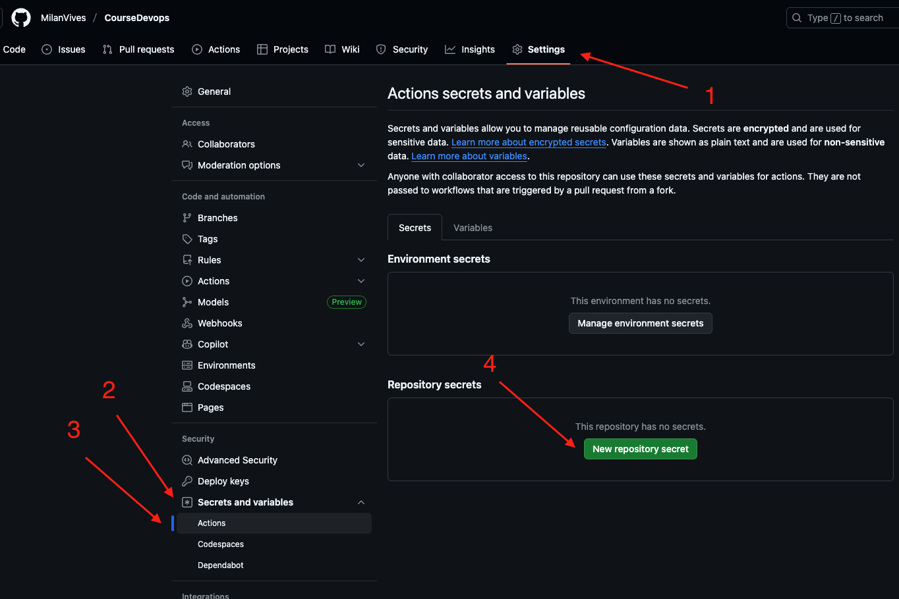

# GitHub Actions CI/CD Tutorial

## Inhoudstafel

1. [Inleiding tot CI/CD](#inleiding-tot-cicd)
2. [GitHub Actions Basics](#github-actions-basics)
3. [Verbinding met Docker Hub](#verbinding-met-docker-hub)
4. [Automatische Image Builds](#automatische-image-builds)
5. [Production Deployments](#production-deployments)
6. [Docker Compose Updates](#docker-compose-updates)
7. [Kubernetes & Helm Deployments](#kubernetes--helm-deployments)
8. [Advanced Workflows](#advanced-workflows)
9. [Best Practices](#best-practices)

---

## Inleiding tot CI/CD

### Wat is CI/CD?

**Continuous Integration (CI)** en **Continuous Deployment (CD)** zijn essentiële praktijken in moderne software ontwikkeling:

- **CI**: Automatisch code integreren, bouwen en testen bij elke wijziging
- **CD**: Automatisch uitrollen naar productie na succesvolle tests
- **Voordelen**: Snellere feedback, minder bugs, betrouwbare deployments

### Waarom GitHub Actions?

GitHub Actions is de native CI/CD oplossing van GitHub:

- **Geïntegreerd**: Direct in je repository
- **Krachtig**: YAML-based workflows
- **Flexibel**: Ondersteunt alle platforms
- **Gratis**: 2000 minuten per maand voor public repos

---

## GitHub Actions Basics

### Workflow Structuur

Een GitHub Actions workflow bestaat uit:

```
.github/
└── workflows/
    └── ci-cd.yml
```

### Basis Workflow Syntax

```yaml
name: CI/CD Pipeline

on:
  push:
    branches: [main, develop]
  pull_request:
    branches: [main]

jobs:
  build:
    runs-on: ubuntu-latest

    steps:
      - name: Checkout code
        uses: actions/checkout@v4

      - name: Run tests
        run: echo "Running tests..."
```

### Belangrijke Concepten

#### Triggers (`on`)

```yaml
on:
  push: # Bij elke push
  pull_request: # Bij PR's
  schedule: # Geplande runs
    - cron: "0 2 * * *" # Elke dag om 2:00
  workflow_dispatch: # Handmatige trigger
```

#### Jobs en Steps

```yaml
jobs:
  test:
    runs-on: ubuntu-latest
    steps:
      - uses: actions/checkout@v4
      - run: npm test

  deploy:
    needs: test # Wacht op test job
    runs-on: ubuntu-latest
    steps:
      - run: echo "Deploying..."
```

---

## Verbinding met Docker Hub

### Docker Hub Account Setup

1. **Account aanmaken** op [hub.docker.com](https://hub.docker.com)
2. **Access Token genereren**:
   - Docker Hub → Account Settings → Security
   - New Access Token → Beschrijving invullen

### GitHub Secrets Configureren

In je GitHub repository:

1. **Settings** → **Secrets and variables** → **Actions**
2. **New repository secret**:
   - `DOCKER_HUB_USERNAME`: je Docker Hub username
   - `DOCKER_HUB_ACCESS_TOKEN`: je access token



### Docker Login in Workflow

```yaml
- name: Login to Docker Hub
  uses: docker/login-action@v3
  with:
    username: ${{ secrets.DOCKER_HUB_USERNAME }}
    password: ${{ secrets.DOCKER_HUB_ACCESS_TOKEN }}
```

---

## Automatische Image Builds

### Eenvoudige Build Workflow

```yaml
name: Build and Push Docker Image

on:
  push:
    branches: [main]

jobs:
  build-and-push:
    runs-on: ubuntu-latest

    steps:
      - name: Checkout code
        uses: actions/checkout@v4

      - name: Set up Docker Buildx
        uses: docker/setup-buildx-action@v3

      - name: Login to Docker Hub
        uses: docker/login-action@v3
        with:
          username: ${{ secrets.DOCKER_HUB_USERNAME }}
          password: ${{ secrets.DOCKER_HUB_ACCESS_TOKEN }}

      - name: Build and push Docker image
        uses: docker/build-push-action@v5
        with:
          context: .
          file: ./Dockerfile
          push: true
          tags: |
            ${{ secrets.DOCKER_HUB_USERNAME }}/myapp:latest
            ${{ secrets.DOCKER_HUB_USERNAME }}/myapp:${{ github.sha }}
```

### Multi-platform Builds

```yaml
- name: Build and push Docker image
  uses: docker/build-push-action@v5
  with:
    context: .
    platforms: linux/amd64,linux/arm64
    push: true
    tags: |
      ${{ secrets.DOCKER_HUB_USERNAME }}/myapp:latest
      ${{ secrets.DOCKER_HUB_USERNAME }}/myapp:${{ github.sha }}
```

### Dynamische Tags

```yaml
- name: Extract metadata
  id: meta
  uses: docker/metadata-action@v5
  with:
    images: ${{ secrets.DOCKER_HUB_USERNAME }}/myapp
    tags: |
      type=ref,event=branch
      type=ref,event=pr
      type=sha
      type=raw,value=latest,enable={{is_default_branch}}

- name: Build and push
  uses: docker/build-push-action@v5
  with:
    context: .
    push: true
    tags: ${{ steps.meta.outputs.tags }}
    labels: ${{ steps.meta.outputs.labels }}
```

---

## Production Deployments

### Server Access Configureren

Voor deployment naar productie servers:

```yaml
# GitHub Secrets toevoegen:
# SERVER_HOST: je server IP/hostname
# SERVER_USER: SSH username
# SSH_PRIVATE_KEY: private SSH key
```

### SSH Deployment

```yaml
deploy-to-production:
  needs: build-and-push
  runs-on: ubuntu-latest
  if: github.ref == 'refs/heads/main'

  steps:
    - name: Deploy to server
      uses: appleboy/ssh-action@v1.0.0
      with:
        host: ${{ secrets.SERVER_HOST }}
        username: ${{ secrets.SERVER_USER }}
        key: ${{ secrets.SSH_PRIVATE_KEY }}
        script: |
          docker pull ${{ secrets.DOCKER_HUB_USERNAME }}/myapp:latest
          docker stop myapp || true
          docker rm myapp || true
          docker run -d --name myapp -p 80:3000 \
            ${{ secrets.DOCKER_HUB_USERNAME }}/myapp:latest
```

---

## Docker Compose Updates

### Docker Compose Deployment

Voor applicaties met meerdere services:

```yaml
deploy-compose:
  needs: build-and-push
  runs-on: ubuntu-latest

  steps:
    - name: Checkout code
      uses: actions/checkout@v4

    - name: Deploy with Docker Compose
      uses: appleboy/ssh-action@v1.0.0
      with:
        host: ${{ secrets.SERVER_HOST }}
        username: ${{ secrets.SERVER_USER }}
        key: ${{ secrets.SSH_PRIVATE_KEY }}
        script: |
          cd /opt/myapp
          git pull origin main
          docker-compose pull
          docker-compose up -d --force-recreate
```

### Environment-specific Deployments

```yaml
deploy-to-staging:
  needs: build-and-push
  runs-on: ubuntu-latest
  environment: staging

  steps:
    - name: Deploy to staging
      uses: appleboy/ssh-action@v1.0.0
      with:
        host: ${{ secrets.STAGING_HOST }}
        username: ${{ secrets.STAGING_USER }}
        key: ${{ secrets.SSH_PRIVATE_KEY }}
        script: |
          cd /opt/myapp-staging
          docker-compose -f docker-compose.staging.yml pull
          docker-compose -f docker-compose.staging.yml up -d

deploy-to-production:
  needs: [build-and-push, deploy-to-staging]
  runs-on: ubuntu-latest
  environment: production

  steps:
    - name: Deploy to production
      # ... productie deployment
```

---

## Kubernetes & Helm Deployments

### Kubernetes Setup

```yaml
deploy-to-k8s:
  needs: build-and-push
  runs-on: ubuntu-latest

  steps:
    - name: Checkout code
      uses: actions/checkout@v4

    - name: Configure kubectl
      uses: azure/k8s-set-context@v3
      with:
        method: kubeconfig
        kubeconfig: ${{ secrets.KUBE_CONFIG }}

    - name: Deploy to Kubernetes
      run: |
        # Update image tag in deployment
        sed -i "s|image: myapp:.*|image: ${{ secrets.DOCKER_HUB_USERNAME }}/myapp:${{ github.sha }}|" k8s/deployment.yaml

        # Apply manifests
        kubectl apply -f k8s/

        # Wait for rollout
        kubectl rollout status deployment/myapp
```

### Helm Deployment

```yaml
deploy-with-helm:
  needs: build-and-push
  runs-on: ubuntu-latest

  steps:
    - name: Checkout code
      uses: actions/checkout@v4

    - name: Configure kubectl
      uses: azure/k8s-set-context@v3
      with:
        method: kubeconfig
        kubeconfig: ${{ secrets.KUBE_CONFIG }}

    - name: Install Helm
      uses: azure/setup-helm@v3
      with:
        version: "v3.12.0"

    - name: Deploy with Helm
      run: |
        helm upgrade --install myapp ./helm-chart \
          --set image.repository=${{ secrets.DOCKER_HUB_USERNAME }}/myapp \
          --set image.tag=${{ github.sha }} \
          --namespace production \
          --create-namespace \
          --wait
```

### ArgoCD GitOps

Voor GitOps workflows met ArgoCD:

```yaml
update-gitops-repo:
  needs: build-and-push
  runs-on: ubuntu-latest

  steps:
    - name: Checkout GitOps repo
      uses: actions/checkout@v4
      with:
        repository: myorg/gitops-repo
        token: ${{ secrets.GITOPS_TOKEN }}

    - name: Update image tag
      run: |
        # Update Helm values file
        sed -i "s|tag: .*|tag: ${{ github.sha }}|" environments/production/values.yaml

        # Commit and push
        git config user.name "GitHub Actions"
        git config user.email "actions@github.com"
        git add .
        git commit -m "Update image tag to ${{ github.sha }}"
        git push
```

---

## Advanced Workflows

### Multi-Environment Pipeline

```yaml
name: Complete CI/CD Pipeline

on:
  push:
    branches: [main, develop]
  pull_request:
    branches: [main]

jobs:
  test:
    runs-on: ubuntu-latest
    steps:
      - uses: actions/checkout@v4
      - name: Run tests
        run: |
          npm install
          npm test
          npm run lint

  build:
    needs: test
    runs-on: ubuntu-latest
    if: github.event_name == 'push'

    outputs:
      image-tag: ${{ steps.meta.outputs.tags }}

    steps:
      - uses: actions/checkout@v4
      - name: Set up Docker Buildx
        uses: docker/setup-buildx-action@v3

      - name: Login to Docker Hub
        uses: docker/login-action@v3
        with:
          username: ${{ secrets.DOCKER_HUB_USERNAME }}
          password: ${{ secrets.DOCKER_HUB_ACCESS_TOKEN }}

      - name: Extract metadata
        id: meta
        uses: docker/metadata-action@v5
        with:
          images: ${{ secrets.DOCKER_HUB_USERNAME }}/myapp
          tags: |
            type=ref,event=branch
            type=sha
            type=raw,value=latest,enable={{is_default_branch}}

      - name: Build and push
        uses: docker/build-push-action@v5
        with:
          context: .
          push: true
          tags: ${{ steps.meta.outputs.tags }}
          cache-from: type=gha
          cache-to: type=gha,mode=max

  deploy-staging:
    needs: build
    if: github.ref == 'refs/heads/develop'
    runs-on: ubuntu-latest
    environment: staging

    steps:
      - name: Deploy to staging
        # ... staging deployment

  deploy-production:
    needs: build
    if: github.ref == 'refs/heads/main'
    runs-on: ubuntu-latest
    environment: production

    steps:
      - name: Deploy to production
        # ... production deployment
```

### Security Scanning

```yaml
security-scan:
  runs-on: ubuntu-latest
  steps:
    - uses: actions/checkout@v4

    - name: Run Trivy vulnerability scanner
      uses: aquasecurity/trivy-action@master
      with:
        image-ref: ${{ secrets.DOCKER_HUB_USERNAME }}/myapp:${{ github.sha }}
        format: "sarif"
        output: "trivy-results.sarif"

    - name: Upload Trivy scan results
      uses: github/codeql-action/upload-sarif@v2
      with:
        sarif_file: "trivy-results.sarif"
```

### Matrix Builds

```yaml
test-matrix:
  runs-on: ubuntu-latest
  strategy:
    matrix:
      node-version: [16, 18, 20]
      os: [ubuntu-latest, windows-latest, macos-latest]

  steps:
    - uses: actions/checkout@v4
    - name: Setup Node.js ${{ matrix.node-version }}
      uses: actions/setup-node@v4
      with:
        node-version: ${{ matrix.node-version }}
    - run: npm test
```

---

## Best Practices

### 1. Security

- **Gebruik GitHub Secrets** voor gevoelige data
- **Minimale permissions** voor tokens
- **Vulnerability scanning** in pipeline
- **Signed commits** waar mogelijk

```yaml
# Voorbeeld: Beveiligde workflow
- name: Login to registry
  uses: docker/login-action@v3
  with:
    username: ${{ secrets.REGISTRY_USERNAME }}
    password: ${{ secrets.REGISTRY_PASSWORD }}

- name: Build with security scan
  run: |
    docker build -t myapp .
    trivy image myapp
```

### 2. Performance Optimalisatie

- **Docker layer caching** gebruiken
- **Parallelle jobs** waar mogelijk
- **Artifacts** delen tussen jobs

```yaml
# Cache dependencies
- name: Cache Docker layers
  uses: actions/cache@v3
  with:
    path: /tmp/.buildx-cache
    key: ${{ runner.os }}-buildx-${{ github.sha }}
    restore-keys: |
      ${{ runner.os }}-buildx-
```

### 3. Monitoring en Debugging

- **Job status monitoring**
- **Notification setup**
- **Detailed logging**

```yaml
- name: Notify on failure
  if: failure()
  uses: 8398a7/action-slack@v3
  with:
    status: failure
    channel: "#deployments"
  env:
    SLACK_WEBHOOK_URL: ${{ secrets.SLACK_WEBHOOK }}
```

### 4. Branch Protection

Repository Settings configureren:

1. **Branch protection rules**
2. **Require PR reviews**
3. **Require status checks**
4. **Restrict pushes**

### 5. Environment Management

```yaml
production:
  environment:
    name: production
    url: https://myapp.com
  needs: build
  if: github.ref == 'refs/heads/main'
```

---

## Praktische Voorbeelden

### Volledig Node.js Project

```yaml
name: Node.js CI/CD

on:
  push:
    branches: [main, develop]
  pull_request:
    branches: [main]

env:
  NODE_VERSION: "18"
  REGISTRY: docker.io
  IMAGE_NAME: myusername/myapp

jobs:
  test:
    runs-on: ubuntu-latest
    steps:
      - uses: actions/checkout@v4

      - name: Setup Node.js
        uses: actions/setup-node@v4
        with:
          node-version: ${{ env.NODE_VERSION }}
          cache: "npm"

      - name: Install dependencies
        run: npm ci

      - name: Run tests
        run: |
          npm run test:unit
          npm run test:integration

      - name: Upload coverage
        uses: codecov/codecov-action@v3

  build-and-push:
    needs: test
    runs-on: ubuntu-latest
    if: github.event_name == 'push'

    steps:
      - uses: actions/checkout@v4

      - name: Set up Docker Buildx
        uses: docker/setup-buildx-action@v3

      - name: Login to Docker Hub
        uses: docker/login-action@v3
        with:
          registry: ${{ env.REGISTRY }}
          username: ${{ secrets.DOCKER_HUB_USERNAME }}
          password: ${{ secrets.DOCKER_HUB_ACCESS_TOKEN }}

      - name: Extract metadata
        id: meta
        uses: docker/metadata-action@v5
        with:
          images: ${{ env.REGISTRY }}/${{ env.IMAGE_NAME }}
          tags: |
            type=ref,event=branch
            type=sha,prefix={{branch}}-
            type=raw,value=latest,enable={{is_default_branch}}

      - name: Build and push Docker image
        uses: docker/build-push-action@v5
        with:
          context: .
          platforms: linux/amd64,linux/arm64
          push: true
          tags: ${{ steps.meta.outputs.tags }}
          labels: ${{ steps.meta.outputs.labels }}
          cache-from: type=gha
          cache-to: type=gha,mode=max

  deploy-staging:
    needs: build-and-push
    runs-on: ubuntu-latest
    if: github.ref == 'refs/heads/develop'
    environment: staging

    steps:
      - name: Deploy to staging
        uses: appleboy/ssh-action@v1.0.0
        with:
          host: ${{ secrets.STAGING_HOST }}
          username: ${{ secrets.STAGING_USER }}
          key: ${{ secrets.SSH_PRIVATE_KEY }}
          script: |
            docker pull ${{ env.REGISTRY }}/${{ env.IMAGE_NAME }}:develop-${{ github.sha }}
            docker stop myapp-staging || true
            docker rm myapp-staging || true
            docker run -d --name myapp-staging \
              -p 3001:3000 \
              -e NODE_ENV=staging \
              ${{ env.REGISTRY }}/${{ env.IMAGE_NAME }}:develop-${{ github.sha }}

  deploy-production:
    needs: build-and-push
    runs-on: ubuntu-latest
    if: github.ref == 'refs/heads/main'
    environment: production

    steps:
      - name: Deploy to production
        uses: appleboy/ssh-action@v1.0.0
        with:
          host: ${{ secrets.PRODUCTION_HOST }}
          username: ${{ secrets.PRODUCTION_USER }}
          key: ${{ secrets.SSH_PRIVATE_KEY }}
          script: |
            docker pull ${{ env.REGISTRY }}/${{ env.IMAGE_NAME }}:latest
            docker stop myapp || true
            docker rm myapp || true
            docker run -d --name myapp \
              -p 80:3000 \
              -e NODE_ENV=production \
              ${{ env.REGISTRY }}/${{ env.IMAGE_NAME }}:latest

            # Health check
            sleep 10
            curl -f http://localhost/health || exit 1
```

Deze tutorial biedt een complete gids voor het opzetten van professionele CI/CD pipelines met GitHub Actions, van eenvoudige builds tot complexe multi-environment deployments met Kubernetes en Helm.
