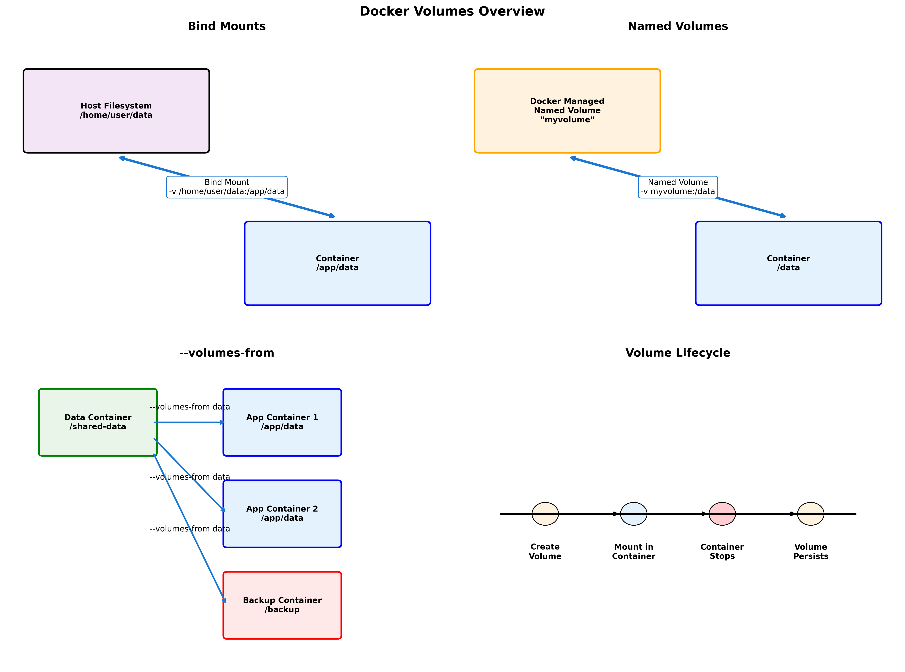
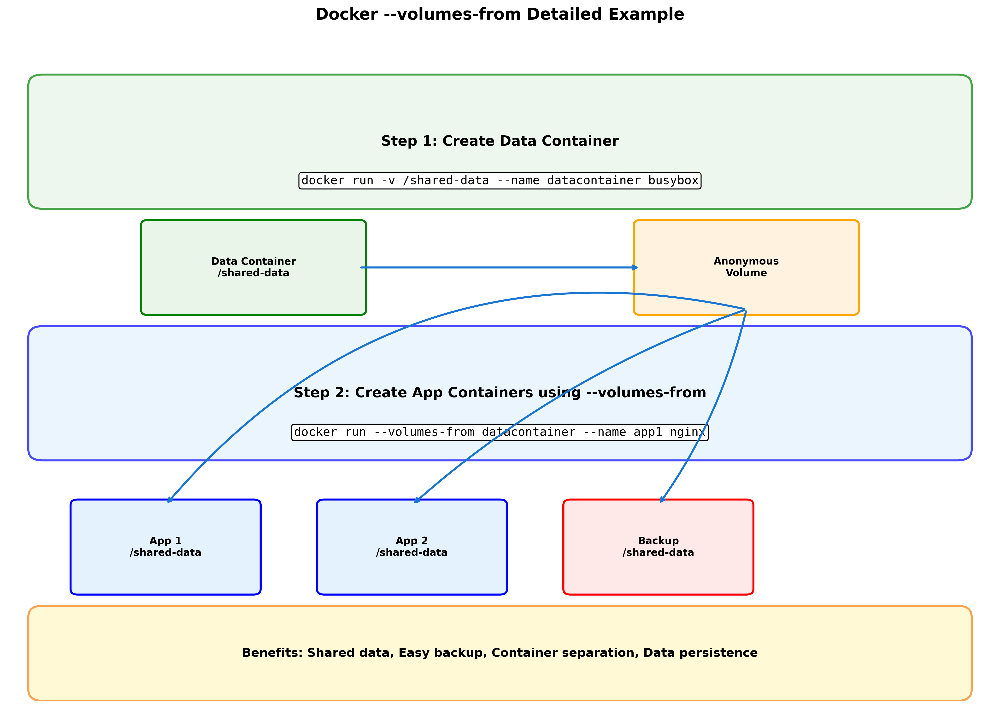

# Les 1 – Docker (DevOps) – Uitgebreide Cursus

## 1. Introductie & Motivatie

### DevOps en Docker
- DevOps = samenwerking tussen development en operations.  
- Doel: snellere en betrouwbaardere softwareontwikkeling en releases.  
- Containerisatie met Docker is een essentieel hulpmiddel in DevOps.  

### Probleemstelling
- Klassiek probleem: *“It works on my machine!”*  
- Applicaties draaien lokaal maar falen in test of productie.  
- Oorzaken: verschillen in OS, libraries, configuratie.  

### Oplossing
- Containers zorgen voor een uniforme, reproduceerbare omgeving.  
- Applicaties werken overal hetzelfde, ongeacht infrastructuur.  

---

## 2. Docker Fundamentals

### Wat is Docker?
- Docker is een platform voor **containerisatie**.  
- **Container**: standaard eenheid van software met code, afhankelijkheden en runtime.  
- **Image**: het blueprint (sjabloon) waaruit containers worden gestart.  
- **Docker Engine**: de runtime die containers uitvoert en beheert.  
- **Docker Hub**: centrale repository om images te delen.  

### Containers vs Virtuele Machines

**Containers**  
- Delen de kernel van het host-besturingssysteem.  
- Lichtgewicht, typisch enkele MB’s.  
- Starten in seconden.  
- Minder overhead.  

**Virtuele Machines (VM’s)**  
- Emuleren volledige hardware en besturingssysteem.  
- Groot (GB’s).  
- Trager op te starten.  
- Sterkere isolatie, maar hogere kost.  

**Samengevat**  
- Containers = lichtgewicht, snel, efficiënt en portable.  
- VM’s = zwaarder, trager, maar volledig geïsoleerd.  

---

## 3. Basiscommando’s en Opties

### `docker run` (container starten)
Belangrijkste opties:  
- `-it`: interactive terminal (gebruiksvriendelijk bij bash).  
- `--rm`: verwijder container automatisch zodra hij stopt.  
- `--name mycontainer`: geef container een duidelijke naam.  
- `-d`: run in **detached mode** (achtergrond).  
- `-p 8080:80`: map poort **8080 van host** naar **80 in container**.  
- `-v /host/path:/container/path`: volume (host ↔ container).  

### Voorbeelden
- Een tijdelijke Ubuntu container starten en direct verwijderen na gebruik:  
  ```bash
  docker run -it --rm ubuntu bash
  ```  
- Een container met vaste naam starten:  
  ```bash
  docker run -it --name mijncontainer ubuntu bash
  ```  

### Detached Mode en Attach
- **Detach van een container**: Wanneer je in een interactive container zit (bijv. na `docker run -it ubuntu bash`), druk **Ctrl+P+Q** om te detach. De container blijft draaien in de achtergrond zonder te stoppen.  
- **Attach terug aan een detached container**: Gebruik `docker attach <container_id>` om terug te keren naar de terminal van de container. Dit werkt alleen als de container nog draait.  
  Voorbeeld:  
  ```bash
  docker attach mijncontainer
  ```  
  Let op: Attach sluit de container af als je de shell verlaat met `exit` of Ctrl+D.  

### Containers beheren
- Lijst actieve containers:  
  ```bash
  docker ps
  ```  
- Lijst alle containers (ook gestopt):  
  ```bash
  docker ps -a
  ```  
- Stop container:  
  ```bash
  docker stop <id|naam>
  ```  
- Verwijder container:  
  ```bash
  docker rm <id|naam>
  ```  

### Container ID en Namen
- Docker kent elke container een unieke ID toe, maar je hoeft niet de volledige ID te gebruiken. Een deel van de ID is voldoende, zolang het uniek is binnen de actieve containers.
- Als je een container een naam hebt gegeven met de optie `--name`, kun je die naam gebruiken in plaats van de ID.
- Voorbeelden:
  - Stop een container met deel van ID:  
    ```bash
    docker stop abc123
    ```  
    (in plaats van de volledige ID zoals `abc123def456`)
  - Stop met naam:  
    ```bash
    docker stop mijncontainer
    ```  
  - Verwijder met deel van ID:  
    ```bash
    docker rm def456
    ```  

### Inspectie
- Gedetailleerde info over een container of image:  
  ```bash
  docker inspect <id|naam>
  ```  
  Toont JSON met: IP-adres, mounts, netwerkconfiguratie, gebruikte image, etc.  

---

## 4. Data en Volumes

### Data in containers
- Bestanden in containers bestaan zolang de container leeft.  
- Nieuwe container starten = schone slate (geen data van vorige container).  



### Types volumes

#### 1. **Ephemeral (anonieme) volumes**  
   - Worden aangemaakt zonder naam.  
   - Verdwijnen automatisch als de container verwijderd wordt.  
   - Voorbeeld:
     ```bash
     docker run -v /data ubuntu
     # Docker maakt automatisch een anoniem volume aan
     ```

#### 2. **Named volumes**  
   - Persistente opslag beheerd door Docker.  
   - Overleven het verwijderen van containers.
   - Voorbeeld:  
     ```bash
     docker volume create mijnvolume
     docker run -v mijnvolume:/data ubuntu
     
     # Bekijk alle volumes
     docker volume ls
     
     # Inspecteer een specifiek volume
     docker volume inspect mijnvolume
     ```  

#### 3. **Bind mounts**  
   - Mappen van de host koppelen aan container.  
   - Directe toegang tot host filesystem.
   - Voorbeeld:  
     ```bash
     docker run -v /home/user/data:/app/data ubuntu
     ```  
   - **Links van :** = host path, **rechts van :** = container path.  

#### 4. **Volumes-from containers**
   - Delen van volumes tussen containers via `--volumes-from`.
   - Zeer krachtig voor data containers en backup strategieën.



### --volumes-from in detail

Het `--volumes-from` mechanisme laat je volumes van een container gebruiken in een andere container. Dit is bijzonder nuttig voor:
- **Data containers**: Containers die alleen data bevatten
- **Backup strategieën**: Eenvoudig backups maken van volumes
- **Shared storage**: Meerdere containers dezelfde data laten gebruiken

#### Praktisch voorbeeld: Data container pattern

**Stap 1: Maak een data container**
```bash
# Data container met volumes (hoeft niet te draaien)
docker create -v /shared-data --name datacontainer busybox

# Of maak een draaiende data container
docker run -d -v /shared-data --name datacontainer busybox tail -f /dev/null
```

**Stap 2: Gebruik de volumes in andere containers**
```bash
# Web applicatie die de data gebruikt
docker run -d --volumes-from datacontainer --name webapp nginx

# Database die data deelt
docker run -d --volumes-from datacontainer --name database postgres

# Backup container
docker run --rm --volumes-from datacontainer \
  -v $(pwd):/backup busybox \
  tar czf /backup/backup.tar.gz /shared-data
```

#### Geavanceerd voorbeeld: Multi-container applicatie

```bash
# 1. Data container voor applicatie bestanden
docker create -v /app/data -v /app/logs --name appdata busybox

# 2. Web server die app data gebruikt
docker run -d --volumes-from appdata \
  --name webserver \
  -p 8080:80 \
  nginx

# 3. Log processor die logs leest
docker run -d --volumes-from appdata \
  --name logprocessor \
  alpine sh -c "tail -f /app/logs/*.log"

# 4. Backup service
docker run -d --volumes-from appdata \
  --name backup \
  -v $(pwd)/backups:/backup \
  alpine sh -c "
    while true; do
      tar czf /backup/app-backup-\$(date +%Y%m%d-%H%M%S).tar.gz /app/data
      sleep 3600  # Elk uur een backup
    done
  "
```

#### Hands-on oefening: Volume sharing

**Scenario**: Maak een shared volume systeem voor een blog applicatie.

```bash
# Stap 1: Data container voor content
docker run -d -v /blog/content -v /blog/uploads \
  --name blogdata \
  busybox tail -f /dev/null

# Stap 2: Voeg wat content toe
docker exec blogdata sh -c "
  echo 'Welkom op mijn blog!' > /blog/content/index.html
  echo 'Dit is mijn eerste post' > /blog/content/post1.html
  mkdir -p /blog/uploads
"

# Stap 3: Web server
docker run -d --volumes-from blogdata \
  --name blogweb \
  -p 8080:80 \
  nginx

# Stap 4: Content management systeem
docker run -it --volumes-from blogdata \
  --name cms \
  alpine sh

# In de CMS container kun je nu bestanden bewerken:
# echo 'Nieuwe content!' > /blog/content/nieuws.html
# ls -la /blog/content/

# Stap 5: Backup maken
docker run --rm --volumes-from blogdata \
  -v $(pwd):/backup \
  busybox \
  tar czf /backup/blog-backup.tar.gz /blog

# Stap 6: Restore testen
docker run --rm \
  -v $(pwd):/backup \
  -v /tmp/restore:/restore \
  busybox \
  tar xzf /backup/blog-backup.tar.gz -C /restore
```

#### Volume troubleshooting

**Veelvoorkomende problemen en oplossingen:**

1. **Volume niet zichtbaar in container**
   ```bash
   # Check volume mounts
   docker inspect containername | grep -A 10 '"Mounts"'
   
   # Verify volume exists
   docker volume ls
   docker volume inspect volumename
   ```

2. **Permission problemen**
   ```bash
   # Check ownership in container
   docker exec container ls -la /path/to/volume
   
   # Fix permissions (als root)
   docker exec -u root container chown -R user:group /path/to/volume
   ```

3. **Data verdwenen na restart**
   ```bash
   # Check of het een named volume is
   docker volume ls
   
   # Anonieme volumes zijn verdwenen, gebruik named volumes:
   docker run -v myvolume:/data image
   ```

4. **Volume cleanup**
   ```bash
   # Verwijder ongebruikte volumes
   docker volume prune
   
   # Verwijder specifiek volume (pas op: data weg!)
   docker volume rm volumename
   
   # Force verwijderen (zelfs als nog in gebruik)
   docker volume rm -f volumename
   ```

### Belangrijke aandachtspunten

#### Volume lifecycle
- Bij verwijderen container:  
  - Data in bind mounts blijft bestaan (want op host).  
  - Ephemeral volumes verdwijnen.  
  - Named volumes blijven bestaan tenzij expliciet verwijderd (`docker volume rm`).
  - Volumes-from containers houden hun volumes tot alle references weg zijn.

#### Performance overwegingen
- **Bind mounts**: Snelste performance, direct host access
- **Named volumes**: Geoptimaliseerd door Docker, portable
- **tmpfs mounts**: Geheugen storage, verliest data bij restart
  ```bash
  docker run --tmpfs /app/temp image  # Tijdelijke snelle storage
  ```

#### Security overwegingen
- Bij bind mounts kunnen **conflicten** ontstaan:  
  - Bestanden op host overschrijven bestanden in container.  
  - Container ziet altijd de versie van de host.
- Container processen kunnen host bestanden wijzigen via bind mounts
- Gebruik named volumes voor productie (beter geïsoleerd)

#### Best practices
1. **Gebruik named volumes** voor productie data
2. **Bind mounts** alleen voor development
3. **Data containers** voor shared volumes tussen services
4. **Regular backups** van kritieke volumes
5. **Volume labels** voor documentatie:
   ```bash
   docker volume create --label purpose=database --label env=production dbvolume
   ```

### Praktische volume commando's

**Volume management:**
```bash
# Alle volumes tonen
docker volume ls

# Volume details
docker volume inspect volumename

# Volume aanmaken met opties
docker volume create --driver local \
  --opt type=nfs \
  --opt o=addr=192.168.1.100,rw \
  --opt device=:/path/to/dir \
  nfsvolume

# Container volumes inspecteren
docker inspect container | jq '.[].Mounts'

# Disk usage van volumes
docker system df -v
```

**Backup en restore workflows:**
```bash
# Backup script
#!/bin/bash
CONTAINER_NAME=$1
VOLUME_NAME=$2
BACKUP_NAME="backup-$(date +%Y%m%d-%H%M%S).tar.gz"

docker run --rm \
  --volumes-from $CONTAINER_NAME \
  -v $(pwd):/backup \
  busybox \
  tar czf /backup/$BACKUP_NAME /data

echo "Backup created: $BACKUP_NAME"

# Restore script
#!/bin/bash
BACKUP_FILE=$1
NEW_CONTAINER=$2

docker run --rm \
  -v $NEW_CONTAINER-data:/data \
  -v $(pwd):/backup \
  busybox \
  tar xzf /backup/$BACKUP_FILE -C /
```  

---

## 5. Networking en Poorten

### Standaard netwerk
- Containers draaien standaard in een **bridge netwerk**.  
- Containers binnen dit netwerk kunnen elkaar bereiken via container name.  

### Poorten mappen
- `-p hostpoort:containerpoort`  
- Links: poortnummer van **host**.  
- Rechts: poortnummer binnen de **container**.  

**Voorbeeld:**  
```bash
docker run -d -p 8080:80 nginx
```
- `8080` = hostpoort → toegankelijk via `http://localhost:8080`.  
- `80` = containerpoort waar nginx luistert.  

### Communicatie tussen containers
- Containers kunnen elkaar pingen binnen hetzelfde netwerk.  
- Voorbeeld:  
  ```bash
  docker network create mijnnet
  docker run -dit --name c1 --network mijnnet ubuntu
  docker run -dit --name c2 --network mijnnet ubuntu
  docker exec -it c1 ping c2
  ```  

### Demo met netcat
- Container 1 luistert op poort 1234:  
  ```bash
  docker run -it --rm --name server ubuntu bash
  apt update && apt install -y netcat
  nc -lp 1234
  ```  
- Container 2 stuurt bericht:  
  ```bash
  docker run -it --rm --network container:server ubuntu bash
  apt update && apt install -y netcat
  echo "Hallo van c2" | nc localhost 1234
  ```  

---

## 6. Eigen Images met `docker commit`

### Container aanpassen en opslaan
- Start een container en maak wijzigingen, bv. een bestand toevoegen:  
  ```bash
  docker run -it ubuntu bash
  echo "Hallo Docker" > /hallo.txt
  exit
  ```

### Nieuwe image maken via commit
- Sla de gewijzigde container op als nieuwe image:  
  ```bash
  docker commit <container_id> mijnimage:v1
  ```

### Controleren
- Lijst images bekijken:  
  ```bash
  docker images
  ```  
- Nieuwe container starten van de image:  
  ```bash
  docker run -it mijnimage:v1 bash
  cat /hallo.txt
  ```

---

## 7. Publiceren naar Docker Hub

### Aanmelden
```bash
docker login
```

### Image taggen
```bash
docker tag mijnimage:v1 gebruikersnaam/mijnimage:v1
```

### Pushen naar Docker Hub
```bash
docker push gebruikersnaam/mijnimage:v1
```

### Controleren
- Bekijk je image op [https://hub.docker.com](https://hub.docker.com).

### Volledige Flow voor Publiceren
1. **Start met een base image**: Pull een bestaande image, bv. `docker pull ubuntu`.
2. **Run en wijzig container**: Start een container, maak aanpassingen (zie sectie 6 over `docker commit`).
3. **Commit de wijzigingen**: Sla de aangepaste container op als nieuwe image: `docker commit <container_id> mijnimage:v1`.
4. **Tag de image**: Geef de image een tag voor Docker Hub: `docker tag mijnimage:v1 gebruikersnaam/mijnimage:v1`.
5. **Login en push**: Meld aan met `docker login`, push met `docker push gebruikersnaam/mijnimage:v1`.
6. **Verifiëren**: Anderen kunnen nu `docker pull gebruikersnaam/mijnimage:v1` gebruiken.

### Verschil Lokale vs Cloud Images
- **Lokale images**: Opgeslagen op je eigen machine na `docker build`, `docker pull` of `docker commit`. Alleen jij hebt toegang, tenzij je ze deelt.
- **Cloud images op Docker Hub**: Gedeelde images in de publieke repository. Iedereen kan ze pullen, maar alleen de eigenaar kan pushen/updaten. Gebruik voor distributie van aangepaste images naar teams of publiek.  

---

## 8. Practica (Labs)

1. Installeer Docker op je host of VM.  
2. Run 2 Ubuntu containers en ping elkaar.  
3. Run 2 containers en verstuur berichten via netcat (direct & via poort mapping).  
4. Maak een bestand in een container, gebruik `docker commit` en controleer of het bestand bewaard blijft.  
5. Run een container met een **volume** en schrijf data naar de host. Controleer na verwijderen van de container.  
6. Voeg een derde container toe als relay voor berichten (met netcat).  
7. Start een container en voeg een extra proces toe vanuit een andere terminal (bv. `top`).  
8. Zoek een image op Docker Hub en run deze lokaal.  

---

## 9. Samenvatting

- Docker = standaard voor containerisatie.  
- Containers zijn lichtgewicht, snel, portable en veilig.  
- Belangrijkste opties bij `docker run`: `-it`, `--rm`, `--name`, `-d`, `-p`, `-v`.  
- Dataopslag kan via ephemeral volumes, named volumes of bind mounts.  
- Networking: standaard bridge, poortmapping en container-naar-container communicatie.  
- `docker commit` laat je aangepaste images opslaan.  
- Images kunnen gepubliceerd worden naar Docker Hub.  
- Volgende les: **Dockerfile** en **Docker Compose**.

---

## 10. Extra Tips en Best Practices

### Meer Docker Commando’s
- **Images beheren**:  
  - Pull een image van Docker Hub: `docker pull ubuntu:latest`  
  - Verwijder een image: `docker rmi <image_id>`  
  - Lijst alle images: `docker images`  

- **Container logs bekijken**:  
  - Bekijk logs van een container: `docker logs <container_id>`  
  - Volg logs in real-time: `docker logs -f <container_id>`  

- **Exec in een lopende container**:  
  - Open een shell in een lopende container: `docker exec -it <container_id> bash`  

- **Environment variables**:  
  - Stel env vars in bij run: `docker run -e MY_VAR=value ubuntu`  

### Best Practices
- **Beveiliging**:  
  - Voer containers niet als root uit tenzij noodzakelijk. Gebruik `--user` optie.  
  - Scan images op vulnerabilities met tools zoals Docker Scan of Trivy.  

- **Performance**:  
  - Gebruik kleine base images (bijv. Alpine Linux) om container grootte te minimaliseren.  
  - Vermijd grote layers in images door commando’s te combineren in Dockerfile (volgende les).  

- **Opschoning**:  
  - Verwijder ongebruikte containers: `docker container prune`  
  - Verwijder ongebruikte images: `docker image prune`  
  - Verwijder ongebruikte volumes: `docker volume prune`  

- **Troubleshooting**:  
  - Controleer container status: `docker ps -a`  
  - Inspecteer container details: `docker inspect <container_id>`  
  - Bekijk systeem resources: `docker stats`  

### Voorbeelden in DevOps Context
- **CI/CD Pipeline**: Gebruik Docker om consistente build environments te creëren.  
- **Microservices**: Iedere service in een eigen container voor isolatie.  
- **Scaling**: Combineer met tools zoals Kubernetes voor orchestration (geavanceerd).  

Deze extra’s helpen je om Docker effectiever te gebruiken in praktijkscenario’s.  
