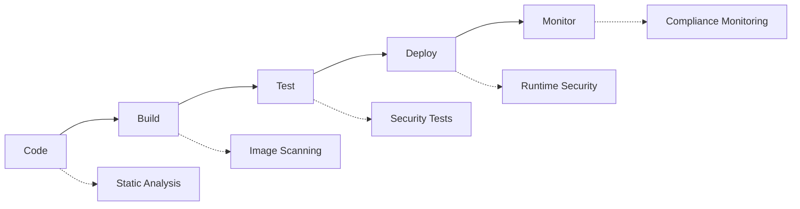

# Security & DevSecOps - Veiligheid in DevOps

## Inhoudsopgave

1. [Introductie tot DevSecOps](#introductie-tot-devsecops)
2. [Container Security Best Practices](#container-security-best-practices)
3. [Image Vulnerability Scanning](#image-vulnerability-scanning)
4. [Kubernetes Security](#kubernetes-security)
5. [Policy as Code met OPA](#policy-as-code-met-opa)
6. [Secrets Management](#secrets-management)
7. [Security Monitoring](#security-monitoring)
8. [Praktische Oefeningen](#praktische-oefeningen)

---

## Introductie tot DevSecOps

### Wat is DevSecOps?

DevSecOps is de praktijk van het integreren van security in elke fase van de software development lifecycle (SDLC). In plaats van security als een afterthought te behandelen, wordt het een gedeelde verantwoordelijkheid van development, operations en security teams.

### Traditionele Security vs DevSecOps

**Traditionele Security:**
- Security checks aan het eind van development
- Security als blocker in de deployment pipeline
- Lange feedback loops
- Security als apart team/silo

**DevSecOps:**
- Security vanaf het begin (shift left)
- Geautomatiseerde security checks
- Snelle feedback en remediation
- Security als gedeelde verantwoordelijkheid

### De DevSecOps Pipeline



---

## Container Security Best Practices

### 1. Base Image Security

**Gebruik minimale base images:**

```dockerfile
# Slecht - grote attack surface
FROM ubuntu:latest

# Goed - minimale image
FROM alpine:3.18

# Nog beter - distroless
FROM gcr.io/distroless/java:11
```

**Gebruik officiële images:**
```dockerfile
# Van officiële maintainers
FROM node:18-alpine
FROM postgres:15-alpine
FROM nginx:1.24-alpine
```

### 2. Dockerfile Security Best Practices

```dockerfile
# Gebruik specific versions, niet 'latest'
FROM node:18.17.1-alpine3.18

# Maak dedicated user aan
RUN addgroup -g 1001 -S nodejs && \
    adduser -S nextjs -u 1001

# Update packages en installeer alleen wat nodig is
RUN apk update && apk upgrade && \
    apk add --no-cache \
    libc6-compat && \
    rm -rf /var/cache/apk/*

# Kopieer files met juiste ownership
COPY --chown=nextjs:nodejs . .

# Switch naar non-root user
USER nextjs

# Expose alleen nodige poorten
EXPOSE 3000

# Gebruik HEALTHCHECK
HEALTHCHECK --interval=30s --timeout=3s --start-period=5s --retries=3 \
  CMD curl -f http://localhost:3000/health || exit 1
```

### 3. Container Runtime Security

**Security contexts in Kubernetes:**

```yaml
apiVersion: v1
kind: Pod
metadata:
  name: secure-pod
spec:
  securityContext:
    runAsNonRoot: true
    runAsUser: 1000
    fsGroup: 2000
  containers:
  - name: app
    image: myapp:latest
    securityContext:
      allowPrivilegeEscalation: false
      readOnlyRootFilesystem: true
      capabilities:
        drop:
        - ALL
        add:
        - NET_BIND_SERVICE
```

---

## Image Vulnerability Scanning

### 1. Trivy - Vulnerability Scanner

**Installatie:**
```bash
# macOS
brew install trivy

# Linux
sudo apt-get install wget apt-transport-https gnupg lsb-release
wget -qO - https://aquasecurity.github.io/trivy-repo/deb/public.key | sudo apt-key add -
echo "deb https://aquasecurity.github.io/trivy-repo/deb $(lsb_release -sc) main" | sudo tee -a /etc/apt/sources.list.d/trivy.list
sudo apt-get update
sudo apt-get install trivy
```

**Image scannen:**
```bash
# Scan een image
trivy image nginx:latest

# Alleen high en critical vulnerabilities
trivy image --severity HIGH,CRITICAL nginx:latest

# Output naar JSON
trivy image --format json nginx:latest > vulnerabilities.json

# Scan met exit code (voor CI/CD)
trivy image --exit-code 1 --severity HIGH,CRITICAL nginx:latest
```

**Filesystem scannen:**
```bash
# Scan project directory
trivy fs .

# Scan specifieke path
trivy fs /path/to/project

# Scan met configuratie file
trivy fs --config trivy.yaml .
```

### 2. Trivy in CI/CD Pipeline

**GitHub Actions voorbeeld:**

```yaml
name: Security Scan
on:
  push:
    branches: [ main ]
  pull_request:
    branches: [ main ]

jobs:
  security:
    runs-on: ubuntu-latest
    steps:
    - name: Checkout code
      uses: actions/checkout@v3
    
    - name: Run Trivy vulnerability scanner
      uses: aquasecurity/trivy-action@master
      with:
        image-ref: 'myapp:${{ github.sha }}'
        format: 'sarif'
        output: 'trivy-results.sarif'
    
    - name: Upload Trivy scan results
      uses: github/codeql-action/upload-sarif@v2
      with:
        sarif_file: 'trivy-results.sarif'
```

### 3. Snyk Integration

**Dockerfile scannen met Snyk:**
```bash
# Installeer Snyk CLI
npm install -g snyk

# Authenticeer
snyk auth

# Scan Dockerfile
snyk container test nginx:latest

# Scan en monitor
snyk container monitor nginx:latest
```

---

## Kubernetes Security

### 1. RBAC (Role-Based Access Control)

**Service Account aanmaken:**
```yaml
apiVersion: v1
kind: ServiceAccount
metadata:
  name: app-service-account
  namespace: production
```

**Role definieren:**
```yaml
apiVersion: rbac.authorization.k8s.io/v1
kind: Role
metadata:
  namespace: production
  name: pod-reader
rules:
- apiGroups: [""]
  resources: ["pods"]
  verbs: ["get", "watch", "list"]
- apiGroups: ["apps"]
  resources: ["deployments"]
  verbs: ["get", "list"]
```

**RoleBinding:**
```yaml
apiVersion: rbac.authorization.k8s.io/v1
kind: RoleBinding
metadata:
  name: read-pods
  namespace: production
subjects:
- kind: ServiceAccount
  name: app-service-account
  namespace: production
roleRef:
  kind: Role
  name: pod-reader
  apiGroup: rbac.authorization.k8s.io
```

### 2. Pod Security Standards

**Pod Security Policy (deprecated) vs Pod Security Standards:**

```yaml
apiVersion: v1
kind: Namespace
metadata:
  name: secure-namespace
  labels:
    pod-security.kubernetes.io/enforce: restricted
    pod-security.kubernetes.io/audit: restricted
    pod-security.kubernetes.io/warn: restricted
```

**Security Context voor Pods:**
```yaml
apiVersion: apps/v1
kind: Deployment
metadata:
  name: secure-app
spec:
  template:
    spec:
      securityContext:
        runAsNonRoot: true
        runAsUser: 1000
        fsGroup: 2000
        seccompProfile:
          type: RuntimeDefault
      containers:
      - name: app
        image: myapp:latest
        securityContext:
          allowPrivilegeEscalation: false
          readOnlyRootFilesystem: true
          capabilities:
            drop:
            - ALL
        resources:
          limits:
            memory: "512Mi"
            cpu: "500m"
          requests:
            memory: "256Mi"
            cpu: "250m"
```

### 3. Network Policies

**Default deny policy:**
```yaml
apiVersion: networking.k8s.io/v1
kind: NetworkPolicy
metadata:
  name: default-deny-all
  namespace: production
spec:
  podSelector: {}
  policyTypes:
  - Ingress
  - Egress
```

**Allow specific traffic:**
```yaml
apiVersion: networking.k8s.io/v1
kind: NetworkPolicy
metadata:
  name: allow-frontend-to-backend
  namespace: production
spec:
  podSelector:
    matchLabels:
      app: backend
  policyTypes:
  - Ingress
  ingress:
  - from:
    - podSelector:
        matchLabels:
          app: frontend
    ports:
    - protocol: TCP
      port: 8080
```

---

## Policy as Code met OPA

### 1. Open Policy Agent (OPA) Gatekeeper

**Installatie van Gatekeeper:**
```bash
kubectl apply -f https://raw.githubusercontent.com/open-policy-agent/gatekeeper/release-3.14/deploy/gatekeeper.yaml
```

**Constraint Template voor required labels:**
```yaml
apiVersion: templates.gatekeeper.sh/v1beta1
kind: ConstraintTemplate
metadata:
  name: k8srequiredlabels
spec:
  crd:
    spec:
      names:
        kind: K8sRequiredLabels
      validation:
        openAPIV3Schema:
          type: object
          properties:
            labels:
              type: array
              items:
                type: string
  targets:
    - target: admission.k8s.gatekeeper.sh
      rego: |
        package k8srequiredlabels
        
        violation[{"msg": msg}] {
          required := input.parameters.labels
          provided := input.review.object.metadata.labels
          missing := required[_]
          not provided[missing]
          msg := sprintf("Missing required label: %v", [missing])
        }
```

**Constraint gebruiken:**
```yaml
apiVersion: constraints.gatekeeper.sh/v1beta1
kind: K8sRequiredLabels
metadata:
  name: must-have-environment
spec:
  match:
    kinds:
      - apiGroups: ["apps"]
        kinds: ["Deployment"]
  parameters:
    labels: ["environment", "team", "version"]
```

### 2. Conftest voor lokale policy testing

**Installatie:**
```bash
# macOS
brew install conftest

# Linux
wget https://github.com/open-policy-agent/conftest/releases/download/v0.46.0/conftest_0.46.0_Linux_x86_64.tar.gz
tar xzf conftest_0.46.0_Linux_x86_64.tar.gz
sudo mv conftest /usr/local/bin
```

**Policy file (policy/security.rego):**
```rego
package main

import future.keywords.contains
import future.keywords.if
import future.keywords.in

# Deny containers running as root
deny[msg] {
    input.kind == "Deployment"
    container := input.spec.template.spec.containers[_]
    container.securityContext.runAsUser == 0
    msg := "Container should not run as root user"
}

# Require resource limits
deny[msg] {
    input.kind == "Deployment"
    container := input.spec.template.spec.containers[_]
    not container.resources.limits
    msg := "Container must have resource limits defined"
}

# Deny privileged containers
deny[msg] {
    input.kind == "Deployment"
    container := input.spec.template.spec.containers[_]
    container.securityContext.privileged == true
    msg := "Container should not run in privileged mode"
}
```

**Policy testen:**
```bash
# Test tegen Kubernetes manifest
conftest test deployment.yaml

# Test met specifieke policy directory
conftest test --policy policy/ deployment.yaml

# Output in JSON formaat
conftest test --output json deployment.yaml
```

---

## Secrets Management

### 1. Kubernetes Secrets Best Practices

**Secret aanmaken:**
```bash
# Via kubectl
kubectl create secret generic app-secret \
  --from-literal=database-password=supersecret \
  --from-literal=api-key=abc123

# Via YAML (base64 encoded)
kubectl apply -f - <<EOF
apiVersion: v1
kind: Secret
metadata:
  name: app-secret
data:
  database-password: c3VwZXJzZWNyZXQ=  # supersecret
  api-key: YWJjMTIz  # abc123
EOF
```

**Secret gebruiken in Pod:**
```yaml
apiVersion: v1
kind: Pod
metadata:
  name: app
spec:
  containers:
  - name: app
    image: myapp:latest
    env:
    - name: DATABASE_PASSWORD
      valueFrom:
        secretKeyRef:
          name: app-secret
          key: database-password
    volumeMounts:
    - name: secret-volume
      mountPath: /etc/secrets
      readOnly: true
  volumes:
  - name: secret-volume
    secret:
      secretName: app-secret
```

### 2. External Secrets Operator

**Installatie:**
```bash
helm repo add external-secrets https://charts.external-secrets.io
helm install external-secrets external-secrets/external-secrets -n external-secrets-system --create-namespace
```

**AWS Secrets Manager integration:**
```yaml
apiVersion: external-secrets.io/v1beta1
kind: SecretStore
metadata:
  name: aws-secrets-store
spec:
  provider:
    aws:
      service: SecretsManager
      region: us-east-1
      auth:
        jwt:
          serviceAccountRef:
            name: external-secrets-sa
---
apiVersion: external-secrets.io/v1beta1
kind: ExternalSecret
metadata:
  name: app-secret
spec:
  refreshInterval: 15s
  secretStoreRef:
    name: aws-secrets-store
    kind: SecretStore
  target:
    name: app-secret
    creationPolicy: Owner
  data:
  - secretKey: database-password
    remoteRef:
      key: prod/database
      property: password
```

### 3. HashiCorp Vault Integration

**Vault Agent als sidecar:**
```yaml
apiVersion: apps/v1
kind: Deployment
metadata:
  name: app-with-vault
spec:
  template:
    metadata:
      annotations:
        vault.hashicorp.com/agent-inject: "true"
        vault.hashicorp.com/role: "app-role"
        vault.hashicorp.com/agent-inject-secret-config: "secret/data/app/config"
        vault.hashicorp.com/agent-inject-template-config: |
          {{- with secret "secret/data/app/config" -}}
          export DATABASE_PASSWORD="{{ .Data.data.password }}"
          export API_KEY="{{ .Data.data.api_key }}"
          {{- end }}
    spec:
      containers:
      - name: app
        image: myapp:latest
        command: ["/bin/sh"]
        args: ["-c", "source /vault/secrets/config && exec myapp"]
```

---

## Security Monitoring

### 1. Falco - Runtime Security Monitoring

**Installatie met Helm:**
```bash
helm repo add falcosecurity https://falcosecurity.github.io/charts
helm repo update
helm install falco falcosecurity/falco \
  --namespace falco-system \
  --create-namespace \
  --set falco.grpc.enabled=true \
  --set falco.grpcOutput.enabled=true
```

**Custom Falco Rules:**
```yaml
apiVersion: v1
kind: ConfigMap
metadata:
  name: falco-rules
  namespace: falco-system
data:
  custom_rules.yaml: |
    - rule: Unexpected Network Connection
      desc: Detect unexpected network connections
      condition: >
        (inbound_outbound) and 
        fd.typechar = 4 and 
        (fd.ip != "0.0.0.0" and fd.ip != "127.0.0.1") and 
        not proc.name in (allowed_network_processes)
      output: >
        Unexpected network connection 
        (command=%proc.cmdline pid=%proc.pid connection=%fd.name)
      priority: WARNING
      
    - rule: Unexpected File Access
      desc: Detect access to sensitive files
      condition: >
        open_read and 
        (fd.name startswith /etc/passwd or 
         fd.name startswith /etc/shadow or 
         fd.name startswith /etc/ssh/) and 
        not proc.name in (allowed_file_readers)
      output: >
        Sensitive file accessed 
        (file=%fd.name command=%proc.cmdline pid=%proc.pid)
      priority: ERROR
```

### 2. Prometheus Security Metrics

**Security-gerelateerde metrics:**
```yaml
apiVersion: v1
kind: ConfigMap
metadata:
  name: prometheus-security-rules
data:
  security.rules: |
    groups:
    - name: security
      rules:
      - alert: HighPrivilegedContainerRunning
        expr: |
          kube_pod_container_status_running == 1 and 
          kube_pod_spec_containers_security_context_privileged == 1
        for: 0m
        labels:
          severity: critical
        annotations:
          summary: "Privileged container detected"
          description: "Pod {{ $labels.pod }} is running a privileged container"
      
      - alert: PodWithoutResourceLimits
        expr: |
          kube_pod_container_status_running == 1 and 
          kube_pod_container_resource_limits_memory_bytes == 0
        for: 5m
        labels:
          severity: warning
        annotations:
          summary: "Pod without memory limits"
          description: "Pod {{ $labels.pod }} has no memory limits set"
```

### 3. Security Scanning in CI/CD

**GitLab CI voorbeeld:**
```yaml
stages:
  - security
  - build
  - deploy

sast:
  stage: security
  image: registry.gitlab.com/gitlab-org/security-products/analyzers/semgrep:latest
  script:
    - semgrep --config=auto --json --output=gl-sast-report.json .
  artifacts:
    reports:
      sast: gl-sast-report.json

container_scanning:
  stage: security
  image: registry.gitlab.com/gitlab-org/security-products/analyzers/trivy:latest
  script:
    - trivy image --format template --template "@contrib/gitlab.tpl" 
        --output gl-container-scanning-report.json $CI_REGISTRY_IMAGE:$CI_COMMIT_SHA
  artifacts:
    reports:
      container_scanning: gl-container-scanning-report.json

dependency_scanning:
  stage: security
  image: registry.gitlab.com/gitlab-org/security-products/analyzers/gemnasium:latest
  script:
    - gemnasium-python scan --output gl-dependency-scanning-report.json .
  artifacts:
    reports:
      dependency_scanning: gl-dependency-scanning-report.json
```

---

## Praktische Oefeningen

### Oefening 1: Secure Container Image Bouwen

1. **Maak een Dockerfile voor een Node.js applicatie:**
```dockerfile
FROM node:18-alpine3.18

# Maak non-root user
RUN addgroup -g 1001 -S nodejs && \
    adduser -S nodeuser -u 1001

# Update packages
RUN apk update && apk upgrade && \
    apk add --no-cache dumb-init && \
    rm -rf /var/cache/apk/*

# Set working directory
WORKDIR /app

# Copy package files
COPY package*.json ./

# Install dependencies
RUN npm ci --only=production && npm cache clean --force

# Copy source code
COPY --chown=nodeuser:nodejs . .

# Switch to non-root user
USER nodeuser

# Expose port
EXPOSE 3000

# Health check
HEALTHCHECK --interval=30s --timeout=3s --start-period=5s --retries=3 \
  CMD node healthcheck.js

# Start application
ENTRYPOINT ["dumb-init", "--"]
CMD ["node", "server.js"]
```

2. **Scan de image voor vulnerabilities:**
```bash
docker build -t secure-node-app .
trivy image --severity HIGH,CRITICAL secure-node-app
```

### Oefening 2: Kubernetes Security Policy

1. **Maak een secure deployment:**
```yaml
apiVersion: apps/v1
kind: Deployment
metadata:
  name: secure-app
  labels:
    app: secure-app
    environment: production
    team: backend
    version: "1.0.0"
spec:
  replicas: 3
  selector:
    matchLabels:
      app: secure-app
  template:
    metadata:
      labels:
        app: secure-app
    spec:
      serviceAccountName: secure-app-sa
      securityContext:
        runAsNonRoot: true
        runAsUser: 1001
        fsGroup: 2001
        seccompProfile:
          type: RuntimeDefault
      containers:
      - name: app
        image: secure-node-app:latest
        securityContext:
          allowPrivilegeEscalation: false
          readOnlyRootFilesystem: true
          capabilities:
            drop:
            - ALL
            add:
            - NET_BIND_SERVICE
        resources:
          limits:
            memory: "512Mi"
            cpu: "500m"
          requests:
            memory: "256Mi"
            cpu: "250m"
        ports:
        - containerPort: 3000
        volumeMounts:
        - name: tmp
          mountPath: /tmp
        - name: app-cache
          mountPath: /app/.cache
      volumes:
      - name: tmp
        emptyDir: {}
      - name: app-cache
        emptyDir: {}
```

2. **Test met OPA policy:**
```bash
conftest test --policy security-policies/ deployment.yaml
```

### Oefening 3: Secrets Management

1. **Maak een secret in Kubernetes:**
```bash
kubectl create secret generic app-config \
  --from-literal=database-url=postgresql://user:pass@db:5432/app \
  --from-literal=jwt-secret=your-jwt-secret-here
```

2. **Gebruik de secret in je deployment:**
```yaml
apiVersion: apps/v1
kind: Deployment
metadata:
  name: app-with-secrets
spec:
  template:
    spec:
      containers:
      - name: app
        image: myapp:latest
        env:
        - name: DATABASE_URL
          valueFrom:
            secretKeyRef:
              name: app-config
              key: database-url
        - name: JWT_SECRET
          valueFrom:
            secretKeyRef:
              name: app-config
              key: jwt-secret
```

---

## Conclusie

Security in DevOps is geen optie meer, maar een vereiste. Door security vanaf het begin te integreren (shift left), geautomatiseerde scanning tools te gebruiken, en sterke policies te implementeren, kunnen we veilige applicaties bouwen zonder de development snelheid te belemmeren.

**Key takeaways:**
- **Shift Left**: Integreer security vanaf het begin
- **Automate Everything**: Gebruik tools voor geautomatiseerde scanning
- **Policy as Code**: Implementeer consistent beleid via code
- **Monitor Continuously**: Blijf runtime security monitoren
- **Educate Teams**: Zorg dat iedereen security bewust is

**Volgende stappen:**
- Implementeer vulnerability scanning in je CI/CD pipeline
- Stel Kubernetes RBAC en Network Policies in
- Experimenteer met OPA Gatekeeper policies
- Monitor runtime security met Falco
- Gebruik external secrets management tools

---

*Deze cursus is onderdeel van de DevOps & Cloud Native training door Milan Dima (milan.dima@vives.be)*