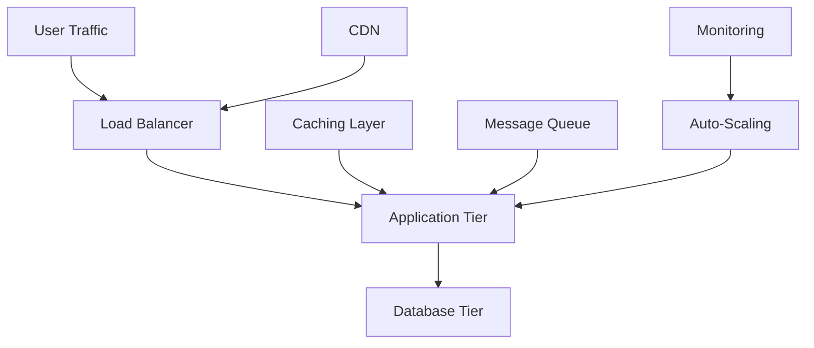

# Performance & Scalability - Optimalisatie voor Production

## Inhoudsopgave

1. [Introductie tot Scalability](#introductie-tot-scalability)
2. [Kubernetes Auto-Scaling](#kubernetes-auto-scaling)
3. [Load Testing Strategieën](#load-testing-strategieën)
4. [Performance Optimization](#performance-optimization)
5. [Resource Management](#resource-management)
6. [Multi-Cloud Strategieën](#multi-cloud-strategieën)
7. [Disaster Recovery](#disaster-recovery)
8. [Capacity Planning](#capacity-planning)
9. [Praktische Implementaties](#praktische-implementaties)

---

## Introductie tot Scalability

### Scaling Patronen

**Vertical Scaling (Scale Up):**
- Meer CPU, RAM, Storage aan bestaande machines
- Eenvoudig te implementeren
- Hardware limitaties
- Single point of failure

**Horizontal Scaling (Scale Out):**
- Meer machines/instances toevoegen
- Complexere architectuur
- Betere fault tolerance
- Lineaire schaalbaarheid mogelijk

### Cloud Native Scaling Principles

1. **Stateless Design** - Geen lokale state in applicaties
2. **Microservices** - Onafhankelijk schaalbare componenten  
3. **Event-Driven** - Asynchrone, loosely coupled communicatie
4. **Immutable Infrastructure** - Reproduceerbare environments
5. **DevOps Culture** - Automation en monitoring

### Scalability Challenges



---

## Kubernetes Auto-Scaling

### 1. Horizontal Pod Autoscaler (HPA)

**Basis HPA configuratie:**
```yaml
apiVersion: autoscaling/v2
kind: HorizontalPodAutoscaler
metadata:
  name: webapp-hpa
  namespace: production
spec:
  scaleTargetRef:
    apiVersion: apps/v1
    kind: Deployment
    name: webapp
  minReplicas: 3
  maxReplicas: 50
  metrics:
  - type: Resource
    resource:
      name: cpu
      target:
        type: Utilization
        averageUtilization: 70
  - type: Resource
    resource:
      name: memory
      target:
        type: Utilization
        averageUtilization: 80
  behavior:
    scaleDown:
      stabilizationWindowSeconds: 300
      policies:
      - type: Percent
        value: 10
        periodSeconds: 60
    scaleUp:
      stabilizationWindowSeconds: 0
      policies:
      - type: Percent
        value: 100
        periodSeconds: 15
      - type: Pods
        value: 4
        periodSeconds: 15
      selectPolicy: Max
```

**Custom Metrics HPA:**
```yaml
apiVersion: autoscaling/v2
kind: HorizontalPodAutoscaler
metadata:
  name: webapp-custom-hpa
spec:
  scaleTargetRef:
    apiVersion: apps/v1
    kind: Deployment
    name: webapp
  minReplicas: 2
  maxReplicas: 20
  metrics:
  - type: Pods
    pods:
      metric:
        name: http_requests_per_second
      target:
        type: AverageValue
        averageValue: "100"
  - type: Object
    object:
      metric:
        name: queue_length
        selector:
          matchLabels:
            queue: "processing"
      target:
        type: Value
        value: "50"
```

### 2. Vertical Pod Autoscaler (VPA)

**VPA Installation:**
```bash
# Clone VPA repository
git clone https://github.com/kubernetes/autoscaler.git
cd autoscaler/vertical-pod-autoscaler/

# Deploy VPA
kubectl apply -f deploy/vpa-v1-crd-gen.yaml
kubectl apply -f deploy/vpa-rbac.yaml
kubectl apply -f deploy/admission-controller-deployment.yaml
kubectl apply -f deploy/recommender-deployment.yaml
kubectl apply -f deploy/updater-deployment.yaml
```

**VPA Configuratie:**
```yaml
apiVersion: autoscaling.k8s.io/v1
kind: VerticalPodAutoscaler
metadata:
  name: webapp-vpa
spec:
  targetRef:
    apiVersion: apps/v1
    kind: Deployment
    name: webapp
  updatePolicy:
    updateMode: "Auto"  # Off, Initial, Recreation, Auto
  resourcePolicy:
    containerPolicies:
    - containerName: webapp
      minAllowed:
        cpu: 100m
        memory: 128Mi
      maxAllowed:
        cpu: 2
        memory: 4Gi
      controlledResources: ["cpu", "memory"]
      controlledValues: RequestsAndLimits
```

### 3. Cluster Autoscaler

**AWS EKS Cluster Autoscaler:**
```yaml
apiVersion: apps/v1
kind: Deployment
metadata:
  name: cluster-autoscaler
  namespace: kube-system
spec:
  replicas: 1
  selector:
    matchLabels:
      app: cluster-autoscaler
  template:
    metadata:
      labels:
        app: cluster-autoscaler
    spec:
      serviceAccountName: cluster-autoscaler
      containers:
      - name: cluster-autoscaler
        image: k8s.gcr.io/autoscaling/cluster-autoscaler:v1.21.0
        command:
        - ./cluster-autoscaler
        - --v=4
        - --stderrthreshold=info
        - --cloud-provider=aws
        - --skip-nodes-with-local-storage=false
        - --expander=least-waste
        - --node-group-auto-discovery=asg:tag=k8s.io/cluster-autoscaler/enabled,k8s.io/cluster-autoscaler/eks-cluster-name
        - --balance-similar-node-groups
        - --skip-nodes-with-system-pods=false
        env:
        - name: AWS_REGION
          value: us-west-2
        resources:
          limits:
            cpu: 100m
            memory: 300Mi
          requests:
            cpu: 100m
            memory: 300Mi
```

**Node Pool Configuration (GKE):**
```yaml
apiVersion: v1
kind: ConfigMap
metadata:
  name: cluster-autoscaler-status
  namespace: kube-system
data:
  nodes.max: "100"
  nodes.min: "3"
  scale-down-delay-after-add: "10m"
  scale-down-unneeded-time: "10m"
  scale-down-utilization-threshold: "0.5"
```

---

## Load Testing Strategieën

### 1. K6 Load Testing

**Installatie:**
```bash
# macOS
brew install k6

# Linux
sudo apt-key adv --keyserver hkp://keyserver.ubuntu.com:80 --recv-keys C5AD17C747E3415A3642D57D77C6C491D6AC1D69
echo "deb https://dl.k6.io/deb stable main" | sudo tee /etc/apt/sources.list.d/k6.list
sudo apt-get update
sudo apt-get install k6
```

**Basic Load Test:**
```javascript
// load-test.js
import http from 'k6/http';
import { check, sleep } from 'k6';
import { Rate } from 'k6/metrics';

// Custom metrics
export let errorRate = new Rate('errors');

export let options = {
  stages: [
    { duration: '2m', target: 10 },   // Ramp up
    { duration: '5m', target: 10 },   // Stay at 10 users
    { duration: '2m', target: 50 },   // Ramp up to 50
    { duration: '5m', target: 50 },   // Stay at 50
    { duration: '2m', target: 100 },  // Ramp up to 100
    { duration: '5m', target: 100 },  // Stay at 100
    { duration: '2m', target: 0 },    // Ramp down
  ],
  thresholds: {
    http_req_duration: ['p(95)<500'], // 95% of requests under 500ms
    http_req_failed: ['rate<0.1'],    // Error rate under 10%
    errors: ['rate<0.1'],
  },
};

export default function() {
  let response = http.get('https://api.example.com/users');
  
  let result = check(response, {
    'status is 200': (r) => r.status === 200,
    'response time < 500ms': (r) => r.timings.duration < 500,
    'body contains users': (r) => r.body.includes('users'),
  });
  
  errorRate.add(!result);
  sleep(1);
}

export function handleSummary(data) {
  return {
    'result.html': htmlReport(data),
    'result.json': JSON.stringify(data),
    stdout: textSummary(data, { indent: ' ', enableColors: true }),
  };
}
```

**Advanced Scenarios:**
```javascript
// advanced-test.js
import http from 'k6/http';
import { check } from 'k6';
import { SharedArray } from 'k6/data';
import { randomItem } from 'https://jslib.k6.io/k6-utils/1.2.0/index.js';

// Load test data
const users = new SharedArray('users', function () {
  return JSON.parse(open('./users.json'));
});

export let options = {
  scenarios: {
    // Constant load
    constant_load: {
      executor: 'constant-vus',
      vus: 20,
      duration: '5m',
      tags: { scenario: 'constant' },
    },
    // Spike test
    spike_test: {
      executor: 'ramping-vus',
      startTime: '5m',
      stages: [
        { duration: '30s', target: 0 },
        { duration: '30s', target: 100 },
        { duration: '30s', target: 0 },
      ],
      tags: { scenario: 'spike' },
    },
    // Stress test
    stress_test: {
      executor: 'ramping-arrival-rate',
      startTime: '7m',
      timeUnit: '1s',
      preAllocatedVUs: 50,
      maxVUs: 200,
      stages: [
        { duration: '2m', target: 10 },
        { duration: '2m', target: 50 },
        { duration: '2m', target: 100 },
        { duration: '2m', target: 200 },
        { duration: '2m', target: 0 },
      ],
      tags: { scenario: 'stress' },
    },
  },
};

export default function() {
  let user = randomItem(users);
  
  // Login
  let loginResponse = http.post('https://api.example.com/login', {
    username: user.username,
    password: user.password,
  });
  
  check(loginResponse, {
    'login successful': (r) => r.status === 200,
  });
  
  if (loginResponse.status === 200) {
    let token = loginResponse.json('token');
    
    // Authenticated request
    let headers = { Authorization: `Bearer ${token}` };
    let profileResponse = http.get('https://api.example.com/profile', { headers });
    
    check(profileResponse, {
      'profile loaded': (r) => r.status === 200,
    });
  }
}
```

### 2. Artillery Load Testing

**Installation en basic test:**
```bash
npm install -g artillery

# Basic test
artillery quick --duration 60 --rate 10 https://api.example.com
```

**Artillery Configuration:**
```yaml
# artillery-config.yml
config:
  target: 'https://api.example.com'
  phases:
    - duration: 120
      arrivalRate: 10
      name: "Warm up"
    - duration: 300
      arrivalRate: 50
      name: "Sustained load"
    - duration: 60
      arrivalRate: 100
      name: "Peak load"
  environments:
    production:
      target: 'https://api.production.com'
    staging:
      target: 'https://api.staging.com'
  plugins:
    metrics-by-endpoint:
      useOnlyRequestNames: true
    
scenarios:
  - name: "User Journey"
    weight: 70
    flow:
      - post:
          url: "/auth/login"
          json:
            username: "{{ $randomString() }}"
            password: "password123"
          capture:
            - json: "$.token"
              as: "token"
      - get:
          url: "/users/profile"
          headers:
            Authorization: "Bearer {{ token }}"
      - think: 2
      - get:
          url: "/users/dashboard"
          headers:
            Authorization: "Bearer {{ token }}"
            
  - name: "Anonymous Browsing"
    weight: 30
    flow:
      - get:
          url: "/"
      - think: 3
      - get:
          url: "/products"
      - think: 2
      - get:
          url: "/products/{{ $randomInt(1, 100) }}"
```

### 3. Kubernetes-based Load Testing

**K6 Operator voor distributed testing:**
```yaml
apiVersion: k6.io/v1alpha1
kind: K6
metadata:
  name: distributed-load-test
spec:
  parallelism: 4
  script:
    configMap:
      name: load-test-script
      file: test.js
  arguments: --out json=results.json
  separate: false
  runner:
    image: grafana/k6:latest
    resources:
      limits:
        cpu: 500m
        memory: 512Mi
      requests:
        cpu: 200m
        memory: 256Mi
    env:
    - name: TARGET_URL
      value: "https://api.example.com"
---
apiVersion: v1
kind: ConfigMap
metadata:
  name: load-test-script
data:
  test.js: |
    import http from 'k6/http';
    import { check } from 'k6';
    
    export let options = {
      vus: 50,
      duration: '5m',
    };
    
    export default function() {
      let response = http.get(__ENV.TARGET_URL);
      check(response, {
        'status is 200': (r) => r.status === 200,
      });
    }
```

---

## Performance Optimization

### 1. Application-Level Optimizations

**Caching Strategies:**
```javascript
// Redis caching middleware
const redis = require('redis');
const client = redis.createClient({
  host: process.env.REDIS_HOST,
  port: process.env.REDIS_PORT,
});

function cacheMiddleware(ttl = 300) {
  return async (req, res, next) => {
    const key = `cache:${req.originalUrl}`;
    
    try {
      const cached = await client.get(key);
      if (cached) {
        return res.json(JSON.parse(cached));
      }
    } catch (error) {
      console.error('Cache read error:', error);
    }
    
    // Override res.json to cache response
    const originalJson = res.json;
    res.json = function(data) {
      client.setex(key, ttl, JSON.stringify(data));
      return originalJson.call(this, data);
    };
    
    next();
  };
}

// Usage
app.get('/api/users', cacheMiddleware(300), async (req, res) => {
  const users = await getUsersFromDatabase();
  res.json(users);
});
```

**Database Optimization:**
```sql
-- Index optimization
CREATE INDEX CONCURRENTLY idx_users_email ON users(email);
CREATE INDEX CONCURRENTLY idx_orders_user_date ON orders(user_id, created_at);

-- Query optimization
EXPLAIN ANALYZE SELECT 
  u.name, 
  COUNT(o.id) as order_count
FROM users u
LEFT JOIN orders o ON u.id = o.user_id
WHERE u.created_at > '2024-01-01'
GROUP BY u.id, u.name
ORDER BY order_count DESC
LIMIT 10;

-- Connection pooling configuration
-- max_connections = 200
-- shared_buffers = 256MB
-- effective_cache_size = 1GB
-- work_mem = 4MB
-- maintenance_work_mem = 64MB
```

### 2. Container Optimization

**Multi-stage Docker builds:**
```dockerfile
# Build stage
FROM node:18-alpine AS builder
WORKDIR /app
COPY package*.json ./
RUN npm ci --only=production && npm cache clean --force
COPY . .
RUN npm run build

# Production stage
FROM node:18-alpine AS production
RUN addgroup -g 1001 -S nodejs && \
    adduser -S nextjs -u 1001

WORKDIR /app

# Copy built application
COPY --from=builder --chown=nextjs:nodejs /app/dist ./dist
COPY --from=builder --chown=nextjs:nodejs /app/node_modules ./node_modules
COPY --from=builder --chown=nextjs:nodejs /app/package.json ./package.json

USER nextjs
EXPOSE 3000

# Health check
HEALTHCHECK --interval=30s --timeout=3s --start-period=5s --retries=3 \
  CMD node healthcheck.js

CMD ["node", "dist/server.js"]
```

**Resource limits en JVM tuning:**
```yaml
apiVersion: apps/v1
kind: Deployment
metadata:
  name: java-app
spec:
  template:
    spec:
      containers:
      - name: java-app
        image: java-app:latest
        env:
        - name: JAVA_OPTS
          value: |
            -XX:+UseG1GC
            -XX:MaxGCPauseMillis=200
            -XX:+UseStringDeduplication
            -Xms512m
            -Xmx2g
            -XX:+HeapDumpOnOutOfMemoryError
            -XX:HeapDumpPath=/tmp/heapdump.hprof
        resources:
          requests:
            memory: "512Mi"
            cpu: "250m"
          limits:
            memory: "2Gi"
            cpu: "1000m"
        volumeMounts:
        - name: tmp
          mountPath: /tmp
      volumes:
      - name: tmp
        emptyDir:
          sizeLimit: 1Gi
```

### 3. Network Optimization

**CDN Configuration (CloudFlare):**
```yaml
apiVersion: networking.istio.io/v1alpha3
kind: VirtualService
metadata:
  name: webapp-vs
spec:
  hosts:
  - webapp.example.com
  http:
  - match:
    - uri:
        prefix: "/static/"
    headers:
      response:
        add:
          cache-control: "public, max-age=31536000"
    route:
    - destination:
        host: webapp
        port:
          number: 80
  - match:
    - uri:
        prefix: "/api/"
    headers:
      response:
        add:
          cache-control: "no-cache, no-store, must-revalidate"
    route:
    - destination:
        host: webapp
        port:
          number: 80
```

**Connection pooling en keepalive:**
```javascript
// HTTP client optimization
const http = require('http');
const https = require('https');

const httpAgent = new http.Agent({
  keepAlive: true,
  maxSockets: 50,
  maxFreeSockets: 10,
  timeout: 60000,
  keepAliveMsecs: 30000,
});

const httpsAgent = new https.Agent({
  keepAlive: true,
  maxSockets: 50,
  maxFreeSockets: 10,
  timeout: 60000,
  keepAliveMsecs: 30000,
});

// Database connection pooling
const { Pool } = require('pg');
const pool = new Pool({
  host: process.env.DB_HOST,
  port: process.env.DB_PORT,
  database: process.env.DB_NAME,
  user: process.env.DB_USER,
  password: process.env.DB_PASSWORD,
  min: 5,
  max: 20,
  acquireTimeoutMillis: 30000,
  createTimeoutMillis: 30000,
  destroyTimeoutMillis: 5000,
  idleTimeoutMillis: 30000,
  reapIntervalMillis: 1000,
  createRetryIntervalMillis: 100,
});
```

---

## Resource Management

### 1. Quality of Service Classes

**QoS Classes in Kubernetes:**
```yaml
# Guaranteed QoS
apiVersion: v1
kind: Pod
metadata:
  name: guaranteed-pod
spec:
  containers:
  - name: app
    image: app:latest
    resources:
      requests:
        memory: "512Mi"
        cpu: "500m"
      limits:
        memory: "512Mi"  # Same as requests
        cpu: "500m"      # Same as requests

---
# Burstable QoS
apiVersion: v1
kind: Pod
metadata:
  name: burstable-pod
spec:
  containers:
  - name: app
    image: app:latest
    resources:
      requests:
        memory: "256Mi"
        cpu: "250m"
      limits:
        memory: "1Gi"    # Higher than requests
        cpu: "1000m"     # Higher than requests

---
# BestEffort QoS (geen resource requests/limits)
apiVersion: v1
kind: Pod
metadata:
  name: besteffort-pod
spec:
  containers:
  - name: app
    image: app:latest
    # No resource constraints
```

### 2. Resource Quotas en Limits

**Namespace Resource Quota:**
```yaml
apiVersion: v1
kind: ResourceQuota
metadata:
  name: compute-quota
  namespace: production
spec:
  hard:
    requests.cpu: "10"
    requests.memory: 20Gi
    limits.cpu: "20"
    limits.memory: 40Gi
    persistentvolumeclaims: "10"
    pods: "50"
    replicationcontrollers: "20"
    resourcequotas: "1"
    secrets: "10"
    services: "5"
    services.loadbalancers: "2"
    count/deployments.apps: "20"
    count/jobs.batch: "5"

---
apiVersion: v1
kind: LimitRange
metadata:
  name: limit-range
  namespace: production
spec:
  limits:
  - default:
      memory: "512Mi"
      cpu: "500m"
    defaultRequest:
      memory: "256Mi"
      cpu: "250m"
    type: Container
  - max:
      memory: "4Gi"
      cpu: "2000m"
    min:
      memory: "128Mi"
      cpu: "100m"
    type: Container
  - max:
      storage: "10Gi"
    type: PersistentVolumeClaim
```

### 3. Node Affinity en Taints

**Node scheduling optimization:**
```yaml
apiVersion: apps/v1
kind: Deployment
metadata:
  name: compute-intensive-app
spec:
  template:
    spec:
      nodeSelector:
        workload-type: compute-intensive
      affinity:
        nodeAffinity:
          requiredDuringSchedulingIgnoredDuringExecution:
            nodeSelectorTerms:
            - matchExpressions:
              - key: kubernetes.io/arch
                operator: In
                values:
                - amd64
          preferredDuringSchedulingIgnoredDuringExecution:
          - weight: 100
            preference:
              matchExpressions:
              - key: instance-type
                operator: In
                values:
                - c5.2xlarge
                - c5.4xlarge
        podAntiAffinity:
          preferredDuringSchedulingIgnoredDuringExecution:
          - weight: 100
            podAffinityTerm:
              labelSelector:
                matchExpressions:
                - key: app
                  operator: In
                  values:
                  - compute-intensive-app
              topologyKey: kubernetes.io/hostname
      tolerations:
      - key: "workload-type"
        operator: "Equal"
        value: "compute-intensive"
        effect: "NoSchedule"
```

**Node taints voor dedicated nodes:**
```bash
# Taint nodes voor specifieke workloads
kubectl taint nodes node1 workload-type=compute-intensive:NoSchedule
kubectl taint nodes node2 workload-type=memory-intensive:NoSchedule

# Label nodes
kubectl label nodes node1 workload-type=compute-intensive
kubectl label nodes node2 workload-type=memory-intensive
```

---

## Multi-Cloud Strategieën

### 1. Multi-Cloud Architecture

**Terraform multi-cloud setup:**
```hcl
# providers.tf
terraform {
  required_providers {
    aws = {
      source  = "hashicorp/aws"
      version = "~> 5.0"
    }
    google = {
      source  = "hashicorp/google"
      version = "~> 4.0"
    }
    azurerm = {
      source  = "hashicorp/azurerm"
      version = "~> 3.0"
    }
  }
}

provider "aws" {
  region = var.aws_region
}

provider "google" {
  project = var.gcp_project
  region  = var.gcp_region
}

provider "azurerm" {
  features {}
  subscription_id = var.azure_subscription_id
}

# AWS EKS Cluster
module "aws_eks" {
  source = "./modules/aws-eks"
  
  cluster_name = "production-aws"
  region       = var.aws_region
  node_groups = {
    general = {
      desired_capacity = 3
      max_capacity     = 10
      min_capacity     = 1
      instance_types   = ["t3.medium"]
    }
  }
}

# GKE Cluster
module "gcp_gke" {
  source = "./modules/gcp-gke"
  
  cluster_name = "production-gcp"
  region       = var.gcp_region
  node_pools = {
    general = {
      node_count     = 3
      machine_type   = "e2-standard-2"
      min_node_count = 1
      max_node_count = 10
    }
  }
}

# AKS Cluster
module "azure_aks" {
  source = "./modules/azure-aks"
  
  cluster_name        = "production-azure"
  location            = var.azure_location
  resource_group_name = azurerm_resource_group.main.name
  
  default_node_pool = {
    node_count   = 3
    vm_size      = "Standard_D2s_v3"
    min_count    = 1
    max_count    = 10
  }
}
```

### 2. Cross-Cloud Networking

**Istio Multi-Cluster Setup:**
```yaml
# Primary cluster (AWS)
apiVersion: install.istio.io/v1alpha1
kind: IstioOperator
metadata:
  name: primary
spec:
  values:
    pilot:
      env:
        EXTERNAL_ISTIOD: true
        CROSS_NETWORK_MODE: true
    global:
      meshID: mesh1
      clusterName: cluster1
      network: network1

---
# Remote cluster (GCP)
apiVersion: install.istio.io/v1alpha1
kind: IstioOperator
metadata:
  name: remote
spec:
  values:
    istiodRemote:
      enabled: true
    pilot:
      env:
        EXTERNAL_ISTIOD: true
        CROSS_NETWORK_MODE: true
    global:
      meshID: mesh1
      clusterName: cluster2
      network: network2
      remotePilotAddress: ${DISCOVERY_ADDRESS}
```

### 3. Data Synchronization

**Multi-region database setup:**
```yaml
# PostgreSQL with read replicas
apiVersion: postgresql.cnpg.io/v1
kind: Cluster
metadata:
  name: postgres-primary
  namespace: database
spec:
  instances: 3
  primaryUpdateStrategy: unsupervised
  
  postgresql:
    parameters:
      max_connections: "200"
      shared_buffers: "256MB"
      effective_cache_size: "1GB"
      
  bootstrap:
    initdb:
      database: myapp
      owner: myapp
      secret:
        name: postgres-credentials
        
  storage:
    size: 100Gi
    storageClass: fast-ssd
    
  monitoring:
    enabled: true
    
  backup:
    retentionPolicy: "30d"
    barmanObjectStore:
      destinationPath: "s3://backup-bucket/postgres"
      s3Credentials:
        accessKeyId:
          name: backup-credentials
          key: ACCESS_KEY_ID
        secretAccessKey:
          name: backup-credentials
          key: SECRET_ACCESS_KEY
      wal:
        retention: "7d"
      data:
        retention: "30d"

---
# Read replica in different region
apiVersion: postgresql.cnpg.io/v1
kind: Cluster
metadata:
  name: postgres-replica
  namespace: database
spec:
  instances: 2
  
  bootstrap:
    pg_basebackup:
      source: postgres-primary
      
  externalClusters:
  - name: postgres-primary
    connectionParameters:
      host: postgres-primary-rw.database.svc.cluster.local
      user: streaming_replica
      dbname: postgres
      sslmode: require
    password:
      name: postgres-replica-credentials
      key: password
```

---

## Disaster Recovery

### 1. Backup Strategies

**Velero Kubernetes Backup:**
```bash
# Install Velero
kubectl apply -f https://github.com/vmware-tanzu/velero/releases/download/v1.12.0/velero-v1.12.0-linux-amd64.tar.gz

# Configure AWS S3 backend
velero install \
    --provider aws \
    --plugins velero/velero-plugin-for-aws:v1.8.0 \
    --bucket velero-backup-bucket \
    --backup-location-config region=us-west-2 \
    --snapshot-location-config region=us-west-2 \
    --secret-file ./credentials-velero

# Create backup
velero backup create full-cluster-backup --include-namespaces production,staging

# Schedule automatic backups
velero schedule create daily-backup --schedule="0 2 * * *" --include-namespaces production
```

**Velero Backup Configuration:**
```yaml
apiVersion: velero.io/v1
kind: Backup
metadata:
  name: full-application-backup
spec:
  includedNamespaces:
  - production
  - staging
  excludedResources:
  - events
  - events.events.k8s.io
  - metrics.k8s.io
  labelSelector:
    matchLabels:
      backup: "true"
  storageLocation: aws-s3
  volumeSnapshotLocations:
  - aws-ebs
  ttl: 720h0m0s  # 30 days
  hooks:
    resources:
    - name: database-backup-hook
      includedNamespaces:
      - production
      labelSelector:
        matchLabels:
          app: postgres
      pre:
      - exec:
          container: postgres
          command:
          - /bin/bash
          - -c
          - "pg_dump -U postgres myapp > /tmp/backup.sql"
      post:
      - exec:
          container: postgres
          command:
          - /bin/bash
          - -c
          - "rm -f /tmp/backup.sql"
```

### 2. High Availability Setup

**Multi-zone deployment:**
```yaml
apiVersion: apps/v1
kind: Deployment
metadata:
  name: webapp-ha
spec:
  replicas: 6
  strategy:
    type: RollingUpdate
    rollingUpdate:
      maxSurge: 1
      maxUnavailable: 1
  selector:
    matchLabels:
      app: webapp
  template:
    metadata:
      labels:
        app: webapp
    spec:
      affinity:
        podAntiAffinity:
          preferredDuringSchedulingIgnoredDuringExecution:
          - weight: 100
            podAffinityTerm:
              labelSelector:
                matchExpressions:
                - key: app
                  operator: In
                  values:
                  - webapp
              topologyKey: kubernetes.io/hostname
          - weight: 50
            podAffinityTerm:
              labelSelector:
                matchExpressions:
                - key: app
                  operator: In
                  values:
                  - webapp
              topologyKey: topology.kubernetes.io/zone
      containers:
      - name: webapp
        image: webapp:latest
        ports:
        - containerPort: 8080
        readinessProbe:
          httpGet:
            path: /health
            port: 8080
          initialDelaySeconds: 5
          periodSeconds: 10
        livenessProbe:
          httpGet:
            path: /health
            port: 8080
          initialDelaySeconds: 30
          periodSeconds: 30
        resources:
          requests:
            memory: "256Mi"
            cpu: "250m"
          limits:
            memory: "512Mi"
            cpu: "500m"
```

### 3. Chaos Engineering

**Chaos Monkey for Kubernetes:**
```yaml
apiVersion: apps/v1
kind: Deployment
metadata:
  name: chaoskube
spec:
  replicas: 1
  selector:
    matchLabels:
      app: chaoskube
  template:
    metadata:
      labels:
        app: chaoskube
    spec:
      containers:
      - name: chaoskube
        image: quay.io/linki/chaoskube:v0.21.0
        args:
        - --interval=10m
        - --dry-run=false
        - --metrics-addr=0.0.0.0:8080
        - --log-level=info
        - --annotation-selector=chaos.alpha.kubernetes.io/enabled=true
        - --timezone=UTC
        env:
        - name: CHAOSKUBE_SLACK_WEBHOOK
          valueFrom:
            secretKeyRef:
              name: chaoskube-secret
              key: slack-webhook-url
        resources:
          limits:
            memory: 128Mi
            cpu: 100m
          requests:
            memory: 64Mi
            cpu: 50m
```

**Litmus Chaos Experiments:**
```yaml
apiVersion: litmuschaos.io/v1alpha1
kind: ChaosEngine
metadata:
  name: pod-delete-chaos
  namespace: production
spec:
  engineState: 'active'
  appinfo:
    appns: 'production'
    applabel: 'app=webapp'
    appkind: 'deployment'
  chaosServiceAccount: litmus-admin
  experiments:
  - name: pod-delete
    spec:
      components:
        env:
        - name: TOTAL_CHAOS_DURATION
          value: '30'
        - name: CHAOS_INTERVAL
          value: '10'
        - name: FORCE
          value: 'false'
        - name: PODS_AFFECTED_PERC
          value: '50'
      probe:
      - name: webapp-availability-probe
        type: httpProbe
        mode: Continuous
        runProperties:
          probeTimeout: 5
          retry: 3
          interval: 2
        httpProbe/inputs:
          url: http://webapp-service:8080/health
          insecureSkipTLS: true
          method:
            get:
              criteria: ==
              responseCode: "200"
```

---

## Capacity Planning

### 1. Resource Forecasting

**Prometheus queries voor capacity planning:**
```promql
# CPU growth trend (30 days)
predict_linear(
  avg_over_time(
    cluster:cpu_usage_cores:sum[30d]
  )[30d:1h], 
  30*24*3600  # 30 days in seconds
)

# Memory growth trend
predict_linear(
  avg_over_time(
    cluster:memory_usage_bytes:sum[30d]
  )[30d:1h], 
  30*24*3600
)

# Node capacity utilization
(
  sum(kube_node_status_capacity{resource="cpu"}) -
  sum(kube_node_status_allocatable{resource="cpu"})
) / sum(kube_node_status_capacity{resource="cpu"}) * 100

# Storage growth rate
deriv(
  sum(kubelet_volume_stats_used_bytes)[7d:]
)
```

### 2. Cost Optimization

**Resource rightsizing script:**
```python
#!/usr/bin/env python3

import json
import subprocess
from datetime import datetime, timedelta

def get_pod_metrics():
    """Get pod resource usage metrics from Prometheus"""
    query = """
    sum by (pod, namespace) (
        rate(container_cpu_usage_seconds_total[7d])
    )
    """
    # Execute prometheus query and parse results
    # Implementation depends on your Prometheus setup
    pass

def get_resource_requests():
    """Get current resource requests for all pods"""
    cmd = ["kubectl", "get", "pods", "-A", "-o", "json"]
    result = subprocess.run(cmd, capture_output=True, text=True)
    pods_data = json.loads(result.stdout)
    
    recommendations = []
    
    for pod in pods_data['items']:
        for container in pod['spec']['containers']:
            if 'resources' in container and 'requests' in container['resources']:
                current_cpu = container['resources']['requests'].get('cpu', '0')
                current_memory = container['resources']['requests'].get('memory', '0')
                
                # Compare with actual usage and generate recommendations
                recommendations.append({
                    'namespace': pod['metadata']['namespace'],
                    'pod': pod['metadata']['name'],
                    'container': container['name'],
                    'current_cpu': current_cpu,
                    'current_memory': current_memory,
                    'recommended_cpu': calculate_recommended_cpu(pod, container),
                    'recommended_memory': calculate_recommended_memory(pod, container)
                })
    
    return recommendations

def calculate_recommended_cpu(pod, container):
    # Logic to calculate optimal CPU based on usage patterns
    # Consider peak usage, safety margins, etc.
    pass

def calculate_recommended_memory(pod, container):
    # Logic to calculate optimal memory based on usage patterns
    pass

if __name__ == "__main__":
    recommendations = get_resource_requests()
    for rec in recommendations:
        print(f"Pod: {rec['namespace']}/{rec['pod']}")
        print(f"  Current CPU: {rec['current_cpu']} -> Recommended: {rec['recommended_cpu']}")
        print(f"  Current Memory: {rec['current_memory']} -> Recommended: {rec['recommended_memory']}")
```

### 3. Automated Scaling Policies

**KEDA für event-driven scaling:**
```yaml
apiVersion: keda.sh/v1alpha1
kind: ScaledObject
metadata:
  name: queue-processor-scaler
spec:
  scaleTargetRef:
    name: queue-processor
  minReplicaCount: 1
  maxReplicaCount: 50
  triggers:
  - type: rabbitmq
    metadata:
      protocol: amqp
      queueName: processing-queue
      mode: QueueLength
      value: "10"
    authenticationRef:
      name: rabbitmq-auth
  - type: prometheus
    metadata:
      serverAddress: http://prometheus:9090
      metricName: queue_processing_time
      threshold: '5'
      query: avg(queue_processing_duration_seconds)
  behavior:
    scaleDown:
      stabilizationWindowSeconds: 300
      policies:
      - type: Percent
        value: 50
        periodSeconds: 60
    scaleUp:
      stabilizationWindowSeconds: 0
      policies:
      - type: Percent
        value: 100
        periodSeconds: 15
      - type: Pods
        value: 5
        periodSeconds: 15
      selectPolicy: Max
```

---

## Praktische Implementaties

### 1. Complete Auto-Scaling Setup

**Monitoring en auto-scaling pipeline:**
```bash
#!/bin/bash

# Deploy monitoring stack
helm repo add prometheus-community https://prometheus-community.github.io/helm-charts
helm install prometheus prometheus-community/kube-prometheus-stack \
  --namespace monitoring \
  --create-namespace \
  --values monitoring-values.yaml

# Deploy metrics server
kubectl apply -f https://github.com/kubernetes-sigs/metrics-server/releases/latest/download/components.yaml

# Deploy KEDA
helm repo add kedacore https://kedacore.github.io/charts
helm install keda kedacore/keda --namespace keda-system --create-namespace

# Deploy Cluster Autoscaler
kubectl apply -f cluster-autoscaler.yaml

# Configure HPA
kubectl apply -f hpa-config.yaml

# Setup VPA
git clone https://github.com/kubernetes/autoscaler.git
cd autoscaler/vertical-pod-autoscaler/
./hack/vpa-up.sh
```

### 2. Load Testing Pipeline

**Continuous load testing met GitHub Actions:**
```yaml
name: Performance Testing
on:
  schedule:
    - cron: '0 2 * * *'  # Daily at 2 AM
  workflow_dispatch:

jobs:
  load-test:
    runs-on: ubuntu-latest
    steps:
    - uses: actions/checkout@v3
    
    - name: Install K6
      run: |
        sudo apt-key adv --keyserver hkp://keyserver.ubuntu.com:80 --recv-keys C5AD17C747E3415A3642D57D77C6C491D6AC1D69
        echo "deb https://dl.k6.io/deb stable main" | sudo tee /etc/apt/sources.list.d/k6.list
        sudo apt-get update
        sudo apt-get install k6
    
    - name: Run Load Test
      run: |
        k6 run \
          --out json=results.json \
          --out cloud \
          tests/load-test.js
      env:
        K6_CLOUD_TOKEN: ${{ secrets.K6_CLOUD_TOKEN }}
        TARGET_URL: ${{ secrets.TARGET_URL }}
    
    - name: Upload Results
      uses: actions/upload-artifact@v3
      with:
        name: load-test-results
        path: results.json
    
    - name: Performance Gate
      run: |
        # Parse results and fail if thresholds exceeded
        python scripts/check-performance-thresholds.py results.json
```

### 3. Multi-Cloud Deployment

**GitOps deployment naar multiple clusters:**
```yaml
# ArgoCD Application voor multi-cluster
apiVersion: argoproj.io/v1alpha1
kind: ApplicationSet
metadata:
  name: webapp-multicloud
spec:
  generators:
  - clusters:
      selector:
        matchLabels:
          environment: production
  template:
    metadata:
      name: 'webapp-{{name}}'
    spec:
      project: default
      source:
        repoURL: https://github.com/company/webapp
        targetRevision: HEAD
        path: k8s/overlays/{{metadata.labels.provider}}
      destination:
        server: '{{server}}'
        namespace: production
      syncPolicy:
        automated:
          prune: true
          selfHeal: true
        syncOptions:
        - CreateNamespace=true
```

---

## Conclusie

Performance en scalability zijn fundamenteel voor succesvolle cloud-native applicaties. Door de juiste combinatie van auto-scaling, load testing, performance optimization en capacity planning kun je:

**Bereiken:**
- **Elastische infrastructuur** die meegroeit met je workload
- **Optimale resource utilization** voor kostenbeheersing
- **Hoge beschikbaarheid** met disaster recovery planning
- **Predictable performance** onder verschillende load condities

**Key Technologies:**
- **Kubernetes Auto-scaling** (HPA, VPA, Cluster Autoscaler)
- **Load Testing** (K6, Artillery) voor performance validation
- **Multi-cloud strategieën** voor vendor independence
- **Chaos Engineering** voor resilience testing

**Best Practices:**
- Monitor en alert op key performance indicators
- Implementeer graduated auto-scaling policies
- Test regelmatig met realistic load patterns
- Plan capaciteit gebaseerd op growth projections
- Gebruik multi-zone deployments voor high availability

**Volgende stappen:**
- Setup complete monitoring en auto-scaling stack
- Implementeer continuous load testing pipeline
- Design disaster recovery en backup procedures
- Experiment met chaos engineering practices
- Optimaliseer kosten door rightsizing en spot instances

---

*Deze cursus is onderdeel van de DevOps & Cloud Native training door Milan Dima (milan.dima@vives.be)*